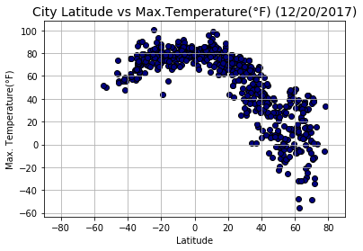
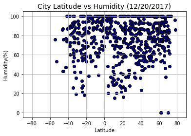
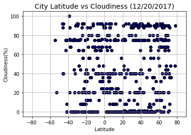
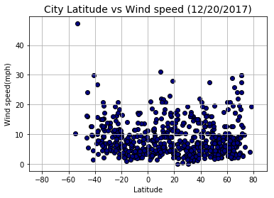

# WeatherPY

### Analysis on WeatherPY
-  The plot on Latitude vs Temperature shows that the temperature is highest at the equator and lowest at the poles.
-  The humidity at the equator is in the range from 50%-100%. Howeever, the trends does not change based on the latitude.
-  There seems to be no co-relation of cloudliness with respect to the latitude.
-  The windspeed for most cities fall under 20mph and there seems to be no trend on the windspeed with respect to the latitude.


```python
# Dependencies
import random
import requests as req

import pandas as pd
import numpy as np

import matplotlib.pyplot as plt

from citipy import citipy
import openweathermapy as owm

#To get the current date
import datetime
now = datetime.datetime.now()
```


```python
# Create a settings object with your API key and preferred units
api_key = "4af76c79df8d11f6295bc8323877e2e5"
#Setting the units to imperial to get Fahrenheit reading
settings = {"units": "imperial", "appid": api_key}
```

## Generate Cities List


```python

# Latitude ranges from -90 to 90 and Longitude ranges from -180 to 180
lat = list(np.arange(-90,90.01,0.01))
long = list(np.arange(-180,180.01,0.01))

# Setting Latitude and Longitude to ramdomly pick co-ordinates.
lat_samples=random.sample(lat,2000)
long_samples=random.sample(long,2000)

# Creating a dataframe from the randomly sample Latitude and Longitude
cities_DF=pd.DataFrame({"Latitude":lat_samples,"Longitude":long_samples})

#Creating new columns City and Country for storing the details corresponding to the co-ordinates
cities_DF["City"]=""
cities_DF["Country"]=""

# Finding the city and the country code corresponding to the Latitude and Longitude
for index,row in cities_DF.iterrows():
    city=citipy.nearest_city(row["Latitude"], row["Longitude"])
    cities_DF.set_value(index, "City", city.city_name)
    cities_DF.set_value(index, "Country", city.country_code)

# Dropping the Latitude and Longitude as they are values of the nearest city and not the excat co-ordinates of the city
cities_DF=cities_DF.drop(cities_DF.columns[[0, 1]], axis=1)

# Deleting duplicate values from the list of cities and keeping only the first
cities_DF=cities_DF.drop_duplicates(['City'], keep='first')

# Randomly sampling a list of 700 cities 
cities_DF=cities_DF.sample(n=700)

# Resetting the index of the cities list
cities_DF=cities_DF.reset_index(drop=True)

cities_DF.head()
```


<div>
<style>
    .dataframe thead tr:only-child th {
        text-align: right;
    }

    .dataframe thead th {
        text-align: left;
    }

    .dataframe tbody tr th {
        vertical-align: top;
    }
</style>
<table border="1" class="dataframe">
  <thead>
    <tr style="text-align: right;">
      <th></th>
      <th>City</th>
      <th>Country</th>
    </tr>
  </thead>
  <tbody>
    <tr>
      <th>0</th>
      <td>wageningen</td>
      <td>sr</td>
    </tr>
    <tr>
      <th>1</th>
      <td>westport</td>
      <td>nz</td>
    </tr>
    <tr>
      <th>2</th>
      <td>puerto escondido</td>
      <td>co</td>
    </tr>
    <tr>
      <th>3</th>
      <td>chalmette</td>
      <td>us</td>
    </tr>
    <tr>
      <th>4</th>
      <td>gurskoye</td>
      <td>ru</td>
    </tr>
  </tbody>
</table>
</div>


## Perform API Calls


```python
# Get data for each city in cities_DF
weather_data = []

url="https://api.openweathermap.org/data/2.5/weather?appid=" + api_key + "&units=imperial&q="

print("\nBeginning Data Retrieval\n-----------------------------")
#Get the response from OpenWeatherMapY and storing the response into weather_data if response is found
for index,row in cities_DF.iterrows():  
    print("\nProcessing record %s|%s,%s"%((index+1),row["City"],row["Country"]))
    print("\n"+url+"%s,%s"%(row["City"].replace(" ","+"),row["Country"]))
    try:
        response = owm.get_current("%s,%s"%(row["City"],row["Country"]), **settings)
        # Appending the response to the weather_Data
        weather_data.append(response)
    except:
        print("\n\033[1;31mCity not found. Skipping...\033[1;30m")

print("\n-----------------------------\nData Retrieval Complete\n-----------------------------")
```

    
    Beginning Data Retrieval
    -----------------------------
    
    Processing record 1|wageningen,sr
    
    https://api.openweathermap.org/data/2.5/weather?appid=4af76c79df8d11f6295bc8323877e2e5&units=imperial&q=wageningen,sr
    
    Processing record 2|westport,nz
    
    https://api.openweathermap.org/data/2.5/weather?appid=4af76c79df8d11f6295bc8323877e2e5&units=imperial&q=westport,nz
    
    Processing record 3|puerto escondido,co
    
    https://api.openweathermap.org/data/2.5/weather?appid=4af76c79df8d11f6295bc8323877e2e5&units=imperial&q=puerto+escondido,co
    
    Processing record 4|chalmette,us
    
    https://api.openweathermap.org/data/2.5/weather?appid=4af76c79df8d11f6295bc8323877e2e5&units=imperial&q=chalmette,us
    
    Processing record 5|gurskoye,ru
    
    https://api.openweathermap.org/data/2.5/weather?appid=4af76c79df8d11f6295bc8323877e2e5&units=imperial&q=gurskoye,ru
    
    City not found. Skipping...
    
    Processing record 6|imbituba,br
    
    https://api.openweathermap.org/data/2.5/weather?appid=4af76c79df8d11f6295bc8323877e2e5&units=imperial&q=imbituba,br
    
    Processing record 7|north bend,us
    
    https://api.openweathermap.org/data/2.5/weather?appid=4af76c79df8d11f6295bc8323877e2e5&units=imperial&q=north+bend,us
    
    Processing record 8|sao filipe,cv
    
    https://api.openweathermap.org/data/2.5/weather?appid=4af76c79df8d11f6295bc8323877e2e5&units=imperial&q=sao+filipe,cv
    
    Processing record 9|derzhavinsk,kz
    
    https://api.openweathermap.org/data/2.5/weather?appid=4af76c79df8d11f6295bc8323877e2e5&units=imperial&q=derzhavinsk,kz
    
    Processing record 10|leua,ao
    
    https://api.openweathermap.org/data/2.5/weather?appid=4af76c79df8d11f6295bc8323877e2e5&units=imperial&q=leua,ao
    
    Processing record 11|fevralsk,ru
    
    https://api.openweathermap.org/data/2.5/weather?appid=4af76c79df8d11f6295bc8323877e2e5&units=imperial&q=fevralsk,ru
    
    City not found. Skipping...
    
    Processing record 12|richards bay,za
    
    https://api.openweathermap.org/data/2.5/weather?appid=4af76c79df8d11f6295bc8323877e2e5&units=imperial&q=richards+bay,za
    
    Processing record 13|tchamba,tg
    
    https://api.openweathermap.org/data/2.5/weather?appid=4af76c79df8d11f6295bc8323877e2e5&units=imperial&q=tchamba,tg
    
    Processing record 14|grindavik,is
    
    https://api.openweathermap.org/data/2.5/weather?appid=4af76c79df8d11f6295bc8323877e2e5&units=imperial&q=grindavik,is
    
    Processing record 15|vostok,ru
    
    https://api.openweathermap.org/data/2.5/weather?appid=4af76c79df8d11f6295bc8323877e2e5&units=imperial&q=vostok,ru
    
    Processing record 16|puerto ayora,ec
    
    https://api.openweathermap.org/data/2.5/weather?appid=4af76c79df8d11f6295bc8323877e2e5&units=imperial&q=puerto+ayora,ec
    
    Processing record 17|dolgoprudnyy,ru
    
    https://api.openweathermap.org/data/2.5/weather?appid=4af76c79df8d11f6295bc8323877e2e5&units=imperial&q=dolgoprudnyy,ru
    
    Processing record 18|mizan teferi,et
    
    https://api.openweathermap.org/data/2.5/weather?appid=4af76c79df8d11f6295bc8323877e2e5&units=imperial&q=mizan+teferi,et
    
    Processing record 19|sao joao da barra,br
    
    https://api.openweathermap.org/data/2.5/weather?appid=4af76c79df8d11f6295bc8323877e2e5&units=imperial&q=sao+joao+da+barra,br
    
    Processing record 20|guerrero negro,mx
    
    https://api.openweathermap.org/data/2.5/weather?appid=4af76c79df8d11f6295bc8323877e2e5&units=imperial&q=guerrero+negro,mx
    
    Processing record 21|san roque,co
    
    https://api.openweathermap.org/data/2.5/weather?appid=4af76c79df8d11f6295bc8323877e2e5&units=imperial&q=san+roque,co
    
    Processing record 22|sobolevo,ru
    
    https://api.openweathermap.org/data/2.5/weather?appid=4af76c79df8d11f6295bc8323877e2e5&units=imperial&q=sobolevo,ru
    
    City not found. Skipping...
    
    Processing record 23|bowen,au
    
    https://api.openweathermap.org/data/2.5/weather?appid=4af76c79df8d11f6295bc8323877e2e5&units=imperial&q=bowen,au
    
    Processing record 24|kartaly,ru
    
    https://api.openweathermap.org/data/2.5/weather?appid=4af76c79df8d11f6295bc8323877e2e5&units=imperial&q=kartaly,ru
    
    Processing record 25|raudeberg,no
    
    https://api.openweathermap.org/data/2.5/weather?appid=4af76c79df8d11f6295bc8323877e2e5&units=imperial&q=raudeberg,no
    
    City not found. Skipping...
    
    Processing record 26|ambilobe,mg
    
    https://api.openweathermap.org/data/2.5/weather?appid=4af76c79df8d11f6295bc8323877e2e5&units=imperial&q=ambilobe,mg
    
    Processing record 27|am timan,td
    
    https://api.openweathermap.org/data/2.5/weather?appid=4af76c79df8d11f6295bc8323877e2e5&units=imperial&q=am+timan,td
    
    Processing record 28|porohy,ua
    
    https://api.openweathermap.org/data/2.5/weather?appid=4af76c79df8d11f6295bc8323877e2e5&units=imperial&q=porohy,ua
    
    Processing record 29|alexandria,eg
    
    https://api.openweathermap.org/data/2.5/weather?appid=4af76c79df8d11f6295bc8323877e2e5&units=imperial&q=alexandria,eg
    
    Processing record 30|asau,tv
    
    https://api.openweathermap.org/data/2.5/weather?appid=4af76c79df8d11f6295bc8323877e2e5&units=imperial&q=asau,tv
    
    City not found. Skipping...
    
    Processing record 31|forbes,au
    
    https://api.openweathermap.org/data/2.5/weather?appid=4af76c79df8d11f6295bc8323877e2e5&units=imperial&q=forbes,au
    
    Processing record 32|temaraia,ki
    
    https://api.openweathermap.org/data/2.5/weather?appid=4af76c79df8d11f6295bc8323877e2e5&units=imperial&q=temaraia,ki
    
    City not found. Skipping...
    
    Processing record 33|ribeira grande,pt
    
    https://api.openweathermap.org/data/2.5/weather?appid=4af76c79df8d11f6295bc8323877e2e5&units=imperial&q=ribeira+grande,pt
    
    Processing record 34|kovdor,ru
    
    https://api.openweathermap.org/data/2.5/weather?appid=4af76c79df8d11f6295bc8323877e2e5&units=imperial&q=kovdor,ru
    
    Processing record 35|placerville,us
    
    https://api.openweathermap.org/data/2.5/weather?appid=4af76c79df8d11f6295bc8323877e2e5&units=imperial&q=placerville,us
    
    Processing record 36|bilma,ne
    
    https://api.openweathermap.org/data/2.5/weather?appid=4af76c79df8d11f6295bc8323877e2e5&units=imperial&q=bilma,ne
    
    Processing record 37|bambous virieux,mu
    
    https://api.openweathermap.org/data/2.5/weather?appid=4af76c79df8d11f6295bc8323877e2e5&units=imperial&q=bambous+virieux,mu
    
    Processing record 38|rungata,ki
    
    https://api.openweathermap.org/data/2.5/weather?appid=4af76c79df8d11f6295bc8323877e2e5&units=imperial&q=rungata,ki
    
    City not found. Skipping...
    
    Processing record 39|qaanaaq,gl
    
    https://api.openweathermap.org/data/2.5/weather?appid=4af76c79df8d11f6295bc8323877e2e5&units=imperial&q=qaanaaq,gl
    
    Processing record 40|nara,ml
    
    https://api.openweathermap.org/data/2.5/weather?appid=4af76c79df8d11f6295bc8323877e2e5&units=imperial&q=nara,ml
    
    City not found. Skipping...
    
    Processing record 41|vodnyy,ru
    
    https://api.openweathermap.org/data/2.5/weather?appid=4af76c79df8d11f6295bc8323877e2e5&units=imperial&q=vodnyy,ru
    
    Processing record 42|avarua,ck
    
    https://api.openweathermap.org/data/2.5/weather?appid=4af76c79df8d11f6295bc8323877e2e5&units=imperial&q=avarua,ck
    
    Processing record 43|erenhot,cn
    
    https://api.openweathermap.org/data/2.5/weather?appid=4af76c79df8d11f6295bc8323877e2e5&units=imperial&q=erenhot,cn
    
    City not found. Skipping...
    
    Processing record 44|high prairie,ca
    
    https://api.openweathermap.org/data/2.5/weather?appid=4af76c79df8d11f6295bc8323877e2e5&units=imperial&q=high+prairie,ca
    
    Processing record 45|kyzyl-suu,kg
    
    https://api.openweathermap.org/data/2.5/weather?appid=4af76c79df8d11f6295bc8323877e2e5&units=imperial&q=kyzyl-suu,kg
    
    City not found. Skipping...
    
    Processing record 46|beringovskiy,ru
    
    https://api.openweathermap.org/data/2.5/weather?appid=4af76c79df8d11f6295bc8323877e2e5&units=imperial&q=beringovskiy,ru
    
    Processing record 47|tazovskiy,ru
    
    https://api.openweathermap.org/data/2.5/weather?appid=4af76c79df8d11f6295bc8323877e2e5&units=imperial&q=tazovskiy,ru
    
    Processing record 48|asyut,eg
    
    https://api.openweathermap.org/data/2.5/weather?appid=4af76c79df8d11f6295bc8323877e2e5&units=imperial&q=asyut,eg
    
    Processing record 49|arlit,ne
    
    https://api.openweathermap.org/data/2.5/weather?appid=4af76c79df8d11f6295bc8323877e2e5&units=imperial&q=arlit,ne
    
    Processing record 50|ancud,cl
    
    https://api.openweathermap.org/data/2.5/weather?appid=4af76c79df8d11f6295bc8323877e2e5&units=imperial&q=ancud,cl
    
    Processing record 51|aklavik,ca
    
    https://api.openweathermap.org/data/2.5/weather?appid=4af76c79df8d11f6295bc8323877e2e5&units=imperial&q=aklavik,ca
    
    Processing record 52|montepuez,mz
    
    https://api.openweathermap.org/data/2.5/weather?appid=4af76c79df8d11f6295bc8323877e2e5&units=imperial&q=montepuez,mz
    
    Processing record 53|misratah,ly
    
    https://api.openweathermap.org/data/2.5/weather?appid=4af76c79df8d11f6295bc8323877e2e5&units=imperial&q=misratah,ly
    
    Processing record 54|galle,lk
    
    https://api.openweathermap.org/data/2.5/weather?appid=4af76c79df8d11f6295bc8323877e2e5&units=imperial&q=galle,lk
    
    Processing record 55|saldanha,za
    
    https://api.openweathermap.org/data/2.5/weather?appid=4af76c79df8d11f6295bc8323877e2e5&units=imperial&q=saldanha,za
    
    Processing record 56|ucluelet,ca
    
    https://api.openweathermap.org/data/2.5/weather?appid=4af76c79df8d11f6295bc8323877e2e5&units=imperial&q=ucluelet,ca
    
    Processing record 57|garsten,at
    
    https://api.openweathermap.org/data/2.5/weather?appid=4af76c79df8d11f6295bc8323877e2e5&units=imperial&q=garsten,at
    
    Processing record 58|chunhuhub,mx
    
    https://api.openweathermap.org/data/2.5/weather?appid=4af76c79df8d11f6295bc8323877e2e5&units=imperial&q=chunhuhub,mx
    
    Processing record 59|porto murtinho,br
    
    https://api.openweathermap.org/data/2.5/weather?appid=4af76c79df8d11f6295bc8323877e2e5&units=imperial&q=porto+murtinho,br
    
    Processing record 60|artyk,ru
    
    https://api.openweathermap.org/data/2.5/weather?appid=4af76c79df8d11f6295bc8323877e2e5&units=imperial&q=artyk,ru
    
    City not found. Skipping...
    
    Processing record 61|yarada,in
    
    https://api.openweathermap.org/data/2.5/weather?appid=4af76c79df8d11f6295bc8323877e2e5&units=imperial&q=yarada,in
    
    Processing record 62|marcona,pe
    
    https://api.openweathermap.org/data/2.5/weather?appid=4af76c79df8d11f6295bc8323877e2e5&units=imperial&q=marcona,pe
    
    City not found. Skipping...
    
    Processing record 63|boddam,gb
    
    https://api.openweathermap.org/data/2.5/weather?appid=4af76c79df8d11f6295bc8323877e2e5&units=imperial&q=boddam,gb
    
    Processing record 64|lerwick,gb
    
    https://api.openweathermap.org/data/2.5/weather?appid=4af76c79df8d11f6295bc8323877e2e5&units=imperial&q=lerwick,gb
    
    Processing record 65|leningradskiy,ru
    
    https://api.openweathermap.org/data/2.5/weather?appid=4af76c79df8d11f6295bc8323877e2e5&units=imperial&q=leningradskiy,ru
    
    Processing record 66|utete,tz
    
    https://api.openweathermap.org/data/2.5/weather?appid=4af76c79df8d11f6295bc8323877e2e5&units=imperial&q=utete,tz
    
    Processing record 67|adrar,dz
    
    https://api.openweathermap.org/data/2.5/weather?appid=4af76c79df8d11f6295bc8323877e2e5&units=imperial&q=adrar,dz
    
    Processing record 68|torbay,ca
    
    https://api.openweathermap.org/data/2.5/weather?appid=4af76c79df8d11f6295bc8323877e2e5&units=imperial&q=torbay,ca
    
    Processing record 69|tocopilla,cl
    
    https://api.openweathermap.org/data/2.5/weather?appid=4af76c79df8d11f6295bc8323877e2e5&units=imperial&q=tocopilla,cl
    
    Processing record 70|banda aceh,id
    
    https://api.openweathermap.org/data/2.5/weather?appid=4af76c79df8d11f6295bc8323877e2e5&units=imperial&q=banda+aceh,id
    
    Processing record 71|pangkalanbuun,id
    
    https://api.openweathermap.org/data/2.5/weather?appid=4af76c79df8d11f6295bc8323877e2e5&units=imperial&q=pangkalanbuun,id
    
    Processing record 72|berdigestyakh,ru
    
    https://api.openweathermap.org/data/2.5/weather?appid=4af76c79df8d11f6295bc8323877e2e5&units=imperial&q=berdigestyakh,ru
    
    Processing record 73|wuan,cn
    
    https://api.openweathermap.org/data/2.5/weather?appid=4af76c79df8d11f6295bc8323877e2e5&units=imperial&q=wuan,cn
    
    Processing record 74|svetlogorsk,ru
    
    https://api.openweathermap.org/data/2.5/weather?appid=4af76c79df8d11f6295bc8323877e2e5&units=imperial&q=svetlogorsk,ru
    
    Processing record 75|pemangkat,id
    
    https://api.openweathermap.org/data/2.5/weather?appid=4af76c79df8d11f6295bc8323877e2e5&units=imperial&q=pemangkat,id
    
    Processing record 76|alotau,pg
    
    https://api.openweathermap.org/data/2.5/weather?appid=4af76c79df8d11f6295bc8323877e2e5&units=imperial&q=alotau,pg
    
    City not found. Skipping...
    
    Processing record 77|genhe,cn
    
    https://api.openweathermap.org/data/2.5/weather?appid=4af76c79df8d11f6295bc8323877e2e5&units=imperial&q=genhe,cn
    
    Processing record 78|evensk,ru
    
    https://api.openweathermap.org/data/2.5/weather?appid=4af76c79df8d11f6295bc8323877e2e5&units=imperial&q=evensk,ru
    
    Processing record 79|hasaki,jp
    
    https://api.openweathermap.org/data/2.5/weather?appid=4af76c79df8d11f6295bc8323877e2e5&units=imperial&q=hasaki,jp
    
    Processing record 80|churapcha,ru
    
    https://api.openweathermap.org/data/2.5/weather?appid=4af76c79df8d11f6295bc8323877e2e5&units=imperial&q=churapcha,ru
    
    Processing record 81|bubaque,gw
    
    https://api.openweathermap.org/data/2.5/weather?appid=4af76c79df8d11f6295bc8323877e2e5&units=imperial&q=bubaque,gw
    
    Processing record 82|bathsheba,bb
    
    https://api.openweathermap.org/data/2.5/weather?appid=4af76c79df8d11f6295bc8323877e2e5&units=imperial&q=bathsheba,bb
    
    Processing record 83|valparaiso,cl
    
    https://api.openweathermap.org/data/2.5/weather?appid=4af76c79df8d11f6295bc8323877e2e5&units=imperial&q=valparaiso,cl
    
    Processing record 84|goderich,sl
    
    https://api.openweathermap.org/data/2.5/weather?appid=4af76c79df8d11f6295bc8323877e2e5&units=imperial&q=goderich,sl
    
    City not found. Skipping...
    
    Processing record 85|meulaboh,id
    
    https://api.openweathermap.org/data/2.5/weather?appid=4af76c79df8d11f6295bc8323877e2e5&units=imperial&q=meulaboh,id
    
    Processing record 86|kiama,au
    
    https://api.openweathermap.org/data/2.5/weather?appid=4af76c79df8d11f6295bc8323877e2e5&units=imperial&q=kiama,au
    
    Processing record 87|hithadhoo,mv
    
    https://api.openweathermap.org/data/2.5/weather?appid=4af76c79df8d11f6295bc8323877e2e5&units=imperial&q=hithadhoo,mv
    
    Processing record 88|roma,au
    
    https://api.openweathermap.org/data/2.5/weather?appid=4af76c79df8d11f6295bc8323877e2e5&units=imperial&q=roma,au
    
    Processing record 89|vao,nc
    
    https://api.openweathermap.org/data/2.5/weather?appid=4af76c79df8d11f6295bc8323877e2e5&units=imperial&q=vao,nc
    
    Processing record 90|tumannyy,ru
    
    https://api.openweathermap.org/data/2.5/weather?appid=4af76c79df8d11f6295bc8323877e2e5&units=imperial&q=tumannyy,ru
    
    City not found. Skipping...
    
    Processing record 91|yerbogachen,ru
    
    https://api.openweathermap.org/data/2.5/weather?appid=4af76c79df8d11f6295bc8323877e2e5&units=imperial&q=yerbogachen,ru
    
    Processing record 92|dalvik,is
    
    https://api.openweathermap.org/data/2.5/weather?appid=4af76c79df8d11f6295bc8323877e2e5&units=imperial&q=dalvik,is
    
    Processing record 93|saleaula,ws
    
    https://api.openweathermap.org/data/2.5/weather?appid=4af76c79df8d11f6295bc8323877e2e5&units=imperial&q=saleaula,ws
    
    City not found. Skipping...
    
    Processing record 94|ostrovnoy,ru
    
    https://api.openweathermap.org/data/2.5/weather?appid=4af76c79df8d11f6295bc8323877e2e5&units=imperial&q=ostrovnoy,ru
    
    Processing record 95|jabinyanah,tn
    
    https://api.openweathermap.org/data/2.5/weather?appid=4af76c79df8d11f6295bc8323877e2e5&units=imperial&q=jabinyanah,tn
    
    Processing record 96|pisco,pe
    
    https://api.openweathermap.org/data/2.5/weather?appid=4af76c79df8d11f6295bc8323877e2e5&units=imperial&q=pisco,pe
    
    Processing record 97|carnarvon,au
    
    https://api.openweathermap.org/data/2.5/weather?appid=4af76c79df8d11f6295bc8323877e2e5&units=imperial&q=carnarvon,au
    
    Processing record 98|katherine,au
    
    https://api.openweathermap.org/data/2.5/weather?appid=4af76c79df8d11f6295bc8323877e2e5&units=imperial&q=katherine,au
    
    Processing record 99|toba,jp
    
    https://api.openweathermap.org/data/2.5/weather?appid=4af76c79df8d11f6295bc8323877e2e5&units=imperial&q=toba,jp
    
    Processing record 100|vila franca do campo,pt
    
    https://api.openweathermap.org/data/2.5/weather?appid=4af76c79df8d11f6295bc8323877e2e5&units=imperial&q=vila+franca+do+campo,pt
    
    Processing record 101|tabukiniberu,ki
    
    https://api.openweathermap.org/data/2.5/weather?appid=4af76c79df8d11f6295bc8323877e2e5&units=imperial&q=tabukiniberu,ki
    
    City not found. Skipping...
    
    Processing record 102|fort saint john,ca
    
    https://api.openweathermap.org/data/2.5/weather?appid=4af76c79df8d11f6295bc8323877e2e5&units=imperial&q=fort+saint+john,ca
    
    City not found. Skipping...
    
    Processing record 103|cayenne,gf
    
    https://api.openweathermap.org/data/2.5/weather?appid=4af76c79df8d11f6295bc8323877e2e5&units=imperial&q=cayenne,gf
    
    Processing record 104|yelahanka,in
    
    https://api.openweathermap.org/data/2.5/weather?appid=4af76c79df8d11f6295bc8323877e2e5&units=imperial&q=yelahanka,in
    
    Processing record 105|udachnyy,ru
    
    https://api.openweathermap.org/data/2.5/weather?appid=4af76c79df8d11f6295bc8323877e2e5&units=imperial&q=udachnyy,ru
    
    Processing record 106|rantoul,us
    
    https://api.openweathermap.org/data/2.5/weather?appid=4af76c79df8d11f6295bc8323877e2e5&units=imperial&q=rantoul,us
    
    Processing record 107|tabulbah,tn
    
    https://api.openweathermap.org/data/2.5/weather?appid=4af76c79df8d11f6295bc8323877e2e5&units=imperial&q=tabulbah,tn
    
    City not found. Skipping...
    
    Processing record 108|husavik,is
    
    https://api.openweathermap.org/data/2.5/weather?appid=4af76c79df8d11f6295bc8323877e2e5&units=imperial&q=husavik,is
    
    Processing record 109|lokosovo,ru
    
    https://api.openweathermap.org/data/2.5/weather?appid=4af76c79df8d11f6295bc8323877e2e5&units=imperial&q=lokosovo,ru
    
    Processing record 110|le vauclin,mq
    
    https://api.openweathermap.org/data/2.5/weather?appid=4af76c79df8d11f6295bc8323877e2e5&units=imperial&q=le+vauclin,mq
    
    Processing record 111|okha,ru
    
    https://api.openweathermap.org/data/2.5/weather?appid=4af76c79df8d11f6295bc8323877e2e5&units=imperial&q=okha,ru
    
    Processing record 112|boundiali,ci
    
    https://api.openweathermap.org/data/2.5/weather?appid=4af76c79df8d11f6295bc8323877e2e5&units=imperial&q=boundiali,ci
    
    Processing record 113|cody,us
    
    https://api.openweathermap.org/data/2.5/weather?appid=4af76c79df8d11f6295bc8323877e2e5&units=imperial&q=cody,us
    
    Processing record 114|jamestown,sh
    
    https://api.openweathermap.org/data/2.5/weather?appid=4af76c79df8d11f6295bc8323877e2e5&units=imperial&q=jamestown,sh
    
    Processing record 115|kiunga,pg
    
    https://api.openweathermap.org/data/2.5/weather?appid=4af76c79df8d11f6295bc8323877e2e5&units=imperial&q=kiunga,pg
    
    Processing record 116|tsihombe,mg
    
    https://api.openweathermap.org/data/2.5/weather?appid=4af76c79df8d11f6295bc8323877e2e5&units=imperial&q=tsihombe,mg
    
    City not found. Skipping...
    
    Processing record 117|oranjestad,aw
    
    https://api.openweathermap.org/data/2.5/weather?appid=4af76c79df8d11f6295bc8323877e2e5&units=imperial&q=oranjestad,aw
    
    Processing record 118|brasileia,br
    
    https://api.openweathermap.org/data/2.5/weather?appid=4af76c79df8d11f6295bc8323877e2e5&units=imperial&q=brasileia,br
    
    Processing record 119|tuktoyaktuk,ca
    
    https://api.openweathermap.org/data/2.5/weather?appid=4af76c79df8d11f6295bc8323877e2e5&units=imperial&q=tuktoyaktuk,ca
    
    Processing record 120|byron bay,au
    
    https://api.openweathermap.org/data/2.5/weather?appid=4af76c79df8d11f6295bc8323877e2e5&units=imperial&q=byron+bay,au
    
    Processing record 121|otaru,jp
    
    https://api.openweathermap.org/data/2.5/weather?appid=4af76c79df8d11f6295bc8323877e2e5&units=imperial&q=otaru,jp
    
    Processing record 122|yerofey pavlovich,ru
    
    https://api.openweathermap.org/data/2.5/weather?appid=4af76c79df8d11f6295bc8323877e2e5&units=imperial&q=yerofey+pavlovich,ru
    
    Processing record 123|qianan,cn
    
    https://api.openweathermap.org/data/2.5/weather?appid=4af76c79df8d11f6295bc8323877e2e5&units=imperial&q=qianan,cn
    
    Processing record 124|taree,au
    
    https://api.openweathermap.org/data/2.5/weather?appid=4af76c79df8d11f6295bc8323877e2e5&units=imperial&q=taree,au
    
    Processing record 125|samusu,ws
    
    https://api.openweathermap.org/data/2.5/weather?appid=4af76c79df8d11f6295bc8323877e2e5&units=imperial&q=samusu,ws
    
    City not found. Skipping...
    
    Processing record 126|virginia beach,us
    
    https://api.openweathermap.org/data/2.5/weather?appid=4af76c79df8d11f6295bc8323877e2e5&units=imperial&q=virginia+beach,us
    
    Processing record 127|nyzhni sirohozy,ua
    
    https://api.openweathermap.org/data/2.5/weather?appid=4af76c79df8d11f6295bc8323877e2e5&units=imperial&q=nyzhni+sirohozy,ua
    
    Processing record 128|constitucion,mx
    
    https://api.openweathermap.org/data/2.5/weather?appid=4af76c79df8d11f6295bc8323877e2e5&units=imperial&q=constitucion,mx
    
    City not found. Skipping...
    
    Processing record 129|dongsheng,cn
    
    https://api.openweathermap.org/data/2.5/weather?appid=4af76c79df8d11f6295bc8323877e2e5&units=imperial&q=dongsheng,cn
    
    Processing record 130|puerto maldonado,pe
    
    https://api.openweathermap.org/data/2.5/weather?appid=4af76c79df8d11f6295bc8323877e2e5&units=imperial&q=puerto+maldonado,pe
    
    Processing record 131|lagoa,pt
    
    https://api.openweathermap.org/data/2.5/weather?appid=4af76c79df8d11f6295bc8323877e2e5&units=imperial&q=lagoa,pt
    
    Processing record 132|sinnamary,gf
    
    https://api.openweathermap.org/data/2.5/weather?appid=4af76c79df8d11f6295bc8323877e2e5&units=imperial&q=sinnamary,gf
    
    Processing record 133|havoysund,no
    
    https://api.openweathermap.org/data/2.5/weather?appid=4af76c79df8d11f6295bc8323877e2e5&units=imperial&q=havoysund,no
    
    Processing record 134|yichang,cn
    
    https://api.openweathermap.org/data/2.5/weather?appid=4af76c79df8d11f6295bc8323877e2e5&units=imperial&q=yichang,cn
    
    Processing record 135|gizo,sb
    
    https://api.openweathermap.org/data/2.5/weather?appid=4af76c79df8d11f6295bc8323877e2e5&units=imperial&q=gizo,sb
    
    Processing record 136|chandler,ca
    
    https://api.openweathermap.org/data/2.5/weather?appid=4af76c79df8d11f6295bc8323877e2e5&units=imperial&q=chandler,ca
    
    Processing record 137|bairiki,ki
    
    https://api.openweathermap.org/data/2.5/weather?appid=4af76c79df8d11f6295bc8323877e2e5&units=imperial&q=bairiki,ki
    
    City not found. Skipping...
    
    Processing record 138|san antero,co
    
    https://api.openweathermap.org/data/2.5/weather?appid=4af76c79df8d11f6295bc8323877e2e5&units=imperial&q=san+antero,co
    
    Processing record 139|fort nelson,ca
    
    https://api.openweathermap.org/data/2.5/weather?appid=4af76c79df8d11f6295bc8323877e2e5&units=imperial&q=fort+nelson,ca
    
    Processing record 140|shahrud,ir
    
    https://api.openweathermap.org/data/2.5/weather?appid=4af76c79df8d11f6295bc8323877e2e5&units=imperial&q=shahrud,ir
    
    Processing record 141|yar-sale,ru
    
    https://api.openweathermap.org/data/2.5/weather?appid=4af76c79df8d11f6295bc8323877e2e5&units=imperial&q=yar-sale,ru
    
    Processing record 142|nata,bw
    
    https://api.openweathermap.org/data/2.5/weather?appid=4af76c79df8d11f6295bc8323877e2e5&units=imperial&q=nata,bw
    
    Processing record 143|salalah,om
    
    https://api.openweathermap.org/data/2.5/weather?appid=4af76c79df8d11f6295bc8323877e2e5&units=imperial&q=salalah,om
    
    Processing record 144|kaduna,ng
    
    https://api.openweathermap.org/data/2.5/weather?appid=4af76c79df8d11f6295bc8323877e2e5&units=imperial&q=kaduna,ng
    
    Processing record 145|saskylakh,ru
    
    https://api.openweathermap.org/data/2.5/weather?appid=4af76c79df8d11f6295bc8323877e2e5&units=imperial&q=saskylakh,ru
    
    Processing record 146|mana,gf
    
    https://api.openweathermap.org/data/2.5/weather?appid=4af76c79df8d11f6295bc8323877e2e5&units=imperial&q=mana,gf
    
    Processing record 147|nizhneyansk,ru
    
    https://api.openweathermap.org/data/2.5/weather?appid=4af76c79df8d11f6295bc8323877e2e5&units=imperial&q=nizhneyansk,ru
    
    City not found. Skipping...
    
    Processing record 148|palabuhanratu,id
    
    https://api.openweathermap.org/data/2.5/weather?appid=4af76c79df8d11f6295bc8323877e2e5&units=imperial&q=palabuhanratu,id
    
    City not found. Skipping...
    
    Processing record 149|duobao,cn
    
    https://api.openweathermap.org/data/2.5/weather?appid=4af76c79df8d11f6295bc8323877e2e5&units=imperial&q=duobao,cn
    
    Processing record 150|kirakira,sb
    
    https://api.openweathermap.org/data/2.5/weather?appid=4af76c79df8d11f6295bc8323877e2e5&units=imperial&q=kirakira,sb
    
    Processing record 151|hay river,ca
    
    https://api.openweathermap.org/data/2.5/weather?appid=4af76c79df8d11f6295bc8323877e2e5&units=imperial&q=hay+river,ca
    
    Processing record 152|chara,ru
    
    https://api.openweathermap.org/data/2.5/weather?appid=4af76c79df8d11f6295bc8323877e2e5&units=imperial&q=chara,ru
    
    Processing record 153|waipawa,nz
    
    https://api.openweathermap.org/data/2.5/weather?appid=4af76c79df8d11f6295bc8323877e2e5&units=imperial&q=waipawa,nz
    
    Processing record 154|san patricio,mx
    
    https://api.openweathermap.org/data/2.5/weather?appid=4af76c79df8d11f6295bc8323877e2e5&units=imperial&q=san+patricio,mx
    
    Processing record 155|eenhana,na
    
    https://api.openweathermap.org/data/2.5/weather?appid=4af76c79df8d11f6295bc8323877e2e5&units=imperial&q=eenhana,na
    
    Processing record 156|mantua,cu
    
    https://api.openweathermap.org/data/2.5/weather?appid=4af76c79df8d11f6295bc8323877e2e5&units=imperial&q=mantua,cu
    
    Processing record 157|marsh harbour,bs
    
    https://api.openweathermap.org/data/2.5/weather?appid=4af76c79df8d11f6295bc8323877e2e5&units=imperial&q=marsh+harbour,bs
    
    Processing record 158|bontang,id
    
    https://api.openweathermap.org/data/2.5/weather?appid=4af76c79df8d11f6295bc8323877e2e5&units=imperial&q=bontang,id
    
    Processing record 159|besikduzu,tr
    
    https://api.openweathermap.org/data/2.5/weather?appid=4af76c79df8d11f6295bc8323877e2e5&units=imperial&q=besikduzu,tr
    
    Processing record 160|cheuskiny,ru
    
    https://api.openweathermap.org/data/2.5/weather?appid=4af76c79df8d11f6295bc8323877e2e5&units=imperial&q=cheuskiny,ru
    
    City not found. Skipping...
    
    Processing record 161|chagda,ru
    
    https://api.openweathermap.org/data/2.5/weather?appid=4af76c79df8d11f6295bc8323877e2e5&units=imperial&q=chagda,ru
    
    City not found. Skipping...
    
    Processing record 162|aripuana,br
    
    https://api.openweathermap.org/data/2.5/weather?appid=4af76c79df8d11f6295bc8323877e2e5&units=imperial&q=aripuana,br
    
    Processing record 163|odweyne,so
    
    https://api.openweathermap.org/data/2.5/weather?appid=4af76c79df8d11f6295bc8323877e2e5&units=imperial&q=odweyne,so
    
    City not found. Skipping...
    
    Processing record 164|kapaa,us
    
    https://api.openweathermap.org/data/2.5/weather?appid=4af76c79df8d11f6295bc8323877e2e5&units=imperial&q=kapaa,us
    
    Processing record 165|ballina,au
    
    https://api.openweathermap.org/data/2.5/weather?appid=4af76c79df8d11f6295bc8323877e2e5&units=imperial&q=ballina,au
    
    Processing record 166|xam nua,la
    
    https://api.openweathermap.org/data/2.5/weather?appid=4af76c79df8d11f6295bc8323877e2e5&units=imperial&q=xam+nua,la
    
    Processing record 167|darhan,mn
    
    https://api.openweathermap.org/data/2.5/weather?appid=4af76c79df8d11f6295bc8323877e2e5&units=imperial&q=darhan,mn
    
    Processing record 168|baruun-urt,mn
    
    https://api.openweathermap.org/data/2.5/weather?appid=4af76c79df8d11f6295bc8323877e2e5&units=imperial&q=baruun-urt,mn
    
    Processing record 169|gunnedah,au
    
    https://api.openweathermap.org/data/2.5/weather?appid=4af76c79df8d11f6295bc8323877e2e5&units=imperial&q=gunnedah,au
    
    Processing record 170|lebu,cl
    
    https://api.openweathermap.org/data/2.5/weather?appid=4af76c79df8d11f6295bc8323877e2e5&units=imperial&q=lebu,cl
    
    Processing record 171|guasdualito,ve
    
    https://api.openweathermap.org/data/2.5/weather?appid=4af76c79df8d11f6295bc8323877e2e5&units=imperial&q=guasdualito,ve
    
    City not found. Skipping...
    
    Processing record 172|khanpur,pk
    
    https://api.openweathermap.org/data/2.5/weather?appid=4af76c79df8d11f6295bc8323877e2e5&units=imperial&q=khanpur,pk
    
    Processing record 173|san carlos de bariloche,ar
    
    https://api.openweathermap.org/data/2.5/weather?appid=4af76c79df8d11f6295bc8323877e2e5&units=imperial&q=san+carlos+de+bariloche,ar
    
    Processing record 174|kabelvag,no
    
    https://api.openweathermap.org/data/2.5/weather?appid=4af76c79df8d11f6295bc8323877e2e5&units=imperial&q=kabelvag,no
    
    Processing record 175|palmer,us
    
    https://api.openweathermap.org/data/2.5/weather?appid=4af76c79df8d11f6295bc8323877e2e5&units=imperial&q=palmer,us
    
    Processing record 176|rome,us
    
    https://api.openweathermap.org/data/2.5/weather?appid=4af76c79df8d11f6295bc8323877e2e5&units=imperial&q=rome,us
    
    Processing record 177|karkaralinsk,kz
    
    https://api.openweathermap.org/data/2.5/weather?appid=4af76c79df8d11f6295bc8323877e2e5&units=imperial&q=karkaralinsk,kz
    
    City not found. Skipping...
    
    Processing record 178|rawah,iq
    
    https://api.openweathermap.org/data/2.5/weather?appid=4af76c79df8d11f6295bc8323877e2e5&units=imperial&q=rawah,iq
    
    Processing record 179|solnechnyy,ru
    
    https://api.openweathermap.org/data/2.5/weather?appid=4af76c79df8d11f6295bc8323877e2e5&units=imperial&q=solnechnyy,ru
    
    Processing record 180|jaggayyapeta,in
    
    https://api.openweathermap.org/data/2.5/weather?appid=4af76c79df8d11f6295bc8323877e2e5&units=imperial&q=jaggayyapeta,in
    
    Processing record 181|sisimiut,gl
    
    https://api.openweathermap.org/data/2.5/weather?appid=4af76c79df8d11f6295bc8323877e2e5&units=imperial&q=sisimiut,gl
    
    Processing record 182|falkoping,se
    
    https://api.openweathermap.org/data/2.5/weather?appid=4af76c79df8d11f6295bc8323877e2e5&units=imperial&q=falkoping,se
    
    City not found. Skipping...
    
    Processing record 183|grand river south east,mu
    
    https://api.openweathermap.org/data/2.5/weather?appid=4af76c79df8d11f6295bc8323877e2e5&units=imperial&q=grand+river+south+east,mu
    
    City not found. Skipping...
    
    Processing record 184|hihifo,to
    
    https://api.openweathermap.org/data/2.5/weather?appid=4af76c79df8d11f6295bc8323877e2e5&units=imperial&q=hihifo,to
    
    City not found. Skipping...
    
    Processing record 185|sibu,my
    
    https://api.openweathermap.org/data/2.5/weather?appid=4af76c79df8d11f6295bc8323877e2e5&units=imperial&q=sibu,my
    
    Processing record 186|kihei,us
    
    https://api.openweathermap.org/data/2.5/weather?appid=4af76c79df8d11f6295bc8323877e2e5&units=imperial&q=kihei,us
    
    Processing record 187|siilinjarvi,fi
    
    https://api.openweathermap.org/data/2.5/weather?appid=4af76c79df8d11f6295bc8323877e2e5&units=imperial&q=siilinjarvi,fi
    
    Processing record 188|leh,in
    
    https://api.openweathermap.org/data/2.5/weather?appid=4af76c79df8d11f6295bc8323877e2e5&units=imperial&q=leh,in
    
    Processing record 189|kaitangata,nz
    
    https://api.openweathermap.org/data/2.5/weather?appid=4af76c79df8d11f6295bc8323877e2e5&units=imperial&q=kaitangata,nz
    
    City not found. Skipping...
    
    Processing record 190|pacific grove,us
    
    https://api.openweathermap.org/data/2.5/weather?appid=4af76c79df8d11f6295bc8323877e2e5&units=imperial&q=pacific+grove,us
    
    Processing record 191|cidreira,br
    
    https://api.openweathermap.org/data/2.5/weather?appid=4af76c79df8d11f6295bc8323877e2e5&units=imperial&q=cidreira,br
    
    Processing record 192|aflu,dz
    
    https://api.openweathermap.org/data/2.5/weather?appid=4af76c79df8d11f6295bc8323877e2e5&units=imperial&q=aflu,dz
    
    City not found. Skipping...
    
    Processing record 193|pinar del rio,cu
    
    https://api.openweathermap.org/data/2.5/weather?appid=4af76c79df8d11f6295bc8323877e2e5&units=imperial&q=pinar+del+rio,cu
    
    Processing record 194|koungou,yt
    
    https://api.openweathermap.org/data/2.5/weather?appid=4af76c79df8d11f6295bc8323877e2e5&units=imperial&q=koungou,yt
    
    Processing record 195|massakory,td
    
    https://api.openweathermap.org/data/2.5/weather?appid=4af76c79df8d11f6295bc8323877e2e5&units=imperial&q=massakory,td
    
    Processing record 196|kon tum,vn
    
    https://api.openweathermap.org/data/2.5/weather?appid=4af76c79df8d11f6295bc8323877e2e5&units=imperial&q=kon+tum,vn
    
    Processing record 197|priargunsk,ru
    
    https://api.openweathermap.org/data/2.5/weather?appid=4af76c79df8d11f6295bc8323877e2e5&units=imperial&q=priargunsk,ru
    
    Processing record 198|baykit,ru
    
    https://api.openweathermap.org/data/2.5/weather?appid=4af76c79df8d11f6295bc8323877e2e5&units=imperial&q=baykit,ru
    
    Processing record 199|metsovon,gr
    
    https://api.openweathermap.org/data/2.5/weather?appid=4af76c79df8d11f6295bc8323877e2e5&units=imperial&q=metsovon,gr
    
    City not found. Skipping...
    
    Processing record 200|comodoro rivadavia,ar
    
    https://api.openweathermap.org/data/2.5/weather?appid=4af76c79df8d11f6295bc8323877e2e5&units=imperial&q=comodoro+rivadavia,ar
    
    Processing record 201|lasa,cn
    
    https://api.openweathermap.org/data/2.5/weather?appid=4af76c79df8d11f6295bc8323877e2e5&units=imperial&q=lasa,cn
    
    City not found. Skipping...
    
    Processing record 202|atar,mr
    
    https://api.openweathermap.org/data/2.5/weather?appid=4af76c79df8d11f6295bc8323877e2e5&units=imperial&q=atar,mr
    
    Processing record 203|klimovsk,ru
    
    https://api.openweathermap.org/data/2.5/weather?appid=4af76c79df8d11f6295bc8323877e2e5&units=imperial&q=klimovsk,ru
    
    Processing record 204|manaure,co
    
    https://api.openweathermap.org/data/2.5/weather?appid=4af76c79df8d11f6295bc8323877e2e5&units=imperial&q=manaure,co
    
    Processing record 205|karratha,au
    
    https://api.openweathermap.org/data/2.5/weather?appid=4af76c79df8d11f6295bc8323877e2e5&units=imperial&q=karratha,au
    
    Processing record 206|sibolga,id
    
    https://api.openweathermap.org/data/2.5/weather?appid=4af76c79df8d11f6295bc8323877e2e5&units=imperial&q=sibolga,id
    
    Processing record 207|ewa beach,us
    
    https://api.openweathermap.org/data/2.5/weather?appid=4af76c79df8d11f6295bc8323877e2e5&units=imperial&q=ewa+beach,us
    
    Processing record 208|zhigansk,ru
    
    https://api.openweathermap.org/data/2.5/weather?appid=4af76c79df8d11f6295bc8323877e2e5&units=imperial&q=zhigansk,ru
    
    Processing record 209|fortuna,us
    
    https://api.openweathermap.org/data/2.5/weather?appid=4af76c79df8d11f6295bc8323877e2e5&units=imperial&q=fortuna,us
    
    Processing record 210|illoqqortoormiut,gl
    
    https://api.openweathermap.org/data/2.5/weather?appid=4af76c79df8d11f6295bc8323877e2e5&units=imperial&q=illoqqortoormiut,gl
    
    City not found. Skipping...
    
    Processing record 211|nikolskoye,ru
    
    https://api.openweathermap.org/data/2.5/weather?appid=4af76c79df8d11f6295bc8323877e2e5&units=imperial&q=nikolskoye,ru
    
    City not found. Skipping...
    
    Processing record 212|mogadishu,so
    
    https://api.openweathermap.org/data/2.5/weather?appid=4af76c79df8d11f6295bc8323877e2e5&units=imperial&q=mogadishu,so
    
    Processing record 213|turbat,pk
    
    https://api.openweathermap.org/data/2.5/weather?appid=4af76c79df8d11f6295bc8323877e2e5&units=imperial&q=turbat,pk
    
    Processing record 214|buala,sb
    
    https://api.openweathermap.org/data/2.5/weather?appid=4af76c79df8d11f6295bc8323877e2e5&units=imperial&q=buala,sb
    
    Processing record 215|bulgan,mn
    
    https://api.openweathermap.org/data/2.5/weather?appid=4af76c79df8d11f6295bc8323877e2e5&units=imperial&q=bulgan,mn
    
    Processing record 216|sur,om
    
    https://api.openweathermap.org/data/2.5/weather?appid=4af76c79df8d11f6295bc8323877e2e5&units=imperial&q=sur,om
    
    Processing record 217|cherskiy,ru
    
    https://api.openweathermap.org/data/2.5/weather?appid=4af76c79df8d11f6295bc8323877e2e5&units=imperial&q=cherskiy,ru
    
    Processing record 218|los llanos de aridane,es
    
    https://api.openweathermap.org/data/2.5/weather?appid=4af76c79df8d11f6295bc8323877e2e5&units=imperial&q=los+llanos+de+aridane,es
    
    Processing record 219|petropavlovsk-kamchatskiy,ru
    
    https://api.openweathermap.org/data/2.5/weather?appid=4af76c79df8d11f6295bc8323877e2e5&units=imperial&q=petropavlovsk-kamchatskiy,ru
    
    Processing record 220|hambantota,lk
    
    https://api.openweathermap.org/data/2.5/weather?appid=4af76c79df8d11f6295bc8323877e2e5&units=imperial&q=hambantota,lk
    
    Processing record 221|collie,au
    
    https://api.openweathermap.org/data/2.5/weather?appid=4af76c79df8d11f6295bc8323877e2e5&units=imperial&q=collie,au
    
    Processing record 222|clyde river,ca
    
    https://api.openweathermap.org/data/2.5/weather?appid=4af76c79df8d11f6295bc8323877e2e5&units=imperial&q=clyde+river,ca
    
    Processing record 223|santa cruz,cr
    
    https://api.openweathermap.org/data/2.5/weather?appid=4af76c79df8d11f6295bc8323877e2e5&units=imperial&q=santa+cruz,cr
    
    Processing record 224|albany,au
    
    https://api.openweathermap.org/data/2.5/weather?appid=4af76c79df8d11f6295bc8323877e2e5&units=imperial&q=albany,au
    
    Processing record 225|maltahohe,na
    
    https://api.openweathermap.org/data/2.5/weather?appid=4af76c79df8d11f6295bc8323877e2e5&units=imperial&q=maltahohe,na
    
    Processing record 226|poronaysk,ru
    
    https://api.openweathermap.org/data/2.5/weather?appid=4af76c79df8d11f6295bc8323877e2e5&units=imperial&q=poronaysk,ru
    
    Processing record 227|nelson bay,au
    
    https://api.openweathermap.org/data/2.5/weather?appid=4af76c79df8d11f6295bc8323877e2e5&units=imperial&q=nelson+bay,au
    
    Processing record 228|karaul,ru
    
    https://api.openweathermap.org/data/2.5/weather?appid=4af76c79df8d11f6295bc8323877e2e5&units=imperial&q=karaul,ru
    
    City not found. Skipping...
    
    Processing record 229|laguna de perlas,ni
    
    https://api.openweathermap.org/data/2.5/weather?appid=4af76c79df8d11f6295bc8323877e2e5&units=imperial&q=laguna+de+perlas,ni
    
    Processing record 230|luwuk,id
    
    https://api.openweathermap.org/data/2.5/weather?appid=4af76c79df8d11f6295bc8323877e2e5&units=imperial&q=luwuk,id
    
    Processing record 231|prainha,br
    
    https://api.openweathermap.org/data/2.5/weather?appid=4af76c79df8d11f6295bc8323877e2e5&units=imperial&q=prainha,br
    
    Processing record 232|kupang,id
    
    https://api.openweathermap.org/data/2.5/weather?appid=4af76c79df8d11f6295bc8323877e2e5&units=imperial&q=kupang,id
    
    Processing record 233|jalu,ly
    
    https://api.openweathermap.org/data/2.5/weather?appid=4af76c79df8d11f6295bc8323877e2e5&units=imperial&q=jalu,ly
    
    City not found. Skipping...
    
    Processing record 234|hajiganj,bd
    
    https://api.openweathermap.org/data/2.5/weather?appid=4af76c79df8d11f6295bc8323877e2e5&units=imperial&q=hajiganj,bd
    
    Processing record 235|hervey bay,au
    
    https://api.openweathermap.org/data/2.5/weather?appid=4af76c79df8d11f6295bc8323877e2e5&units=imperial&q=hervey+bay,au
    
    City not found. Skipping...
    
    Processing record 236|honiara,sb
    
    https://api.openweathermap.org/data/2.5/weather?appid=4af76c79df8d11f6295bc8323877e2e5&units=imperial&q=honiara,sb
    
    Processing record 237|pangnirtung,ca
    
    https://api.openweathermap.org/data/2.5/weather?appid=4af76c79df8d11f6295bc8323877e2e5&units=imperial&q=pangnirtung,ca
    
    Processing record 238|punta arenas,cl
    
    https://api.openweathermap.org/data/2.5/weather?appid=4af76c79df8d11f6295bc8323877e2e5&units=imperial&q=punta+arenas,cl
    
    Processing record 239|la crosse,us
    
    https://api.openweathermap.org/data/2.5/weather?appid=4af76c79df8d11f6295bc8323877e2e5&units=imperial&q=la+crosse,us
    
    Processing record 240|glendora,us
    
    https://api.openweathermap.org/data/2.5/weather?appid=4af76c79df8d11f6295bc8323877e2e5&units=imperial&q=glendora,us
    
    Processing record 241|bahsuma,in
    
    https://api.openweathermap.org/data/2.5/weather?appid=4af76c79df8d11f6295bc8323877e2e5&units=imperial&q=bahsuma,in
    
    Processing record 242|alta floresta,br
    
    https://api.openweathermap.org/data/2.5/weather?appid=4af76c79df8d11f6295bc8323877e2e5&units=imperial&q=alta+floresta,br
    
    Processing record 243|peleduy,ru
    
    https://api.openweathermap.org/data/2.5/weather?appid=4af76c79df8d11f6295bc8323877e2e5&units=imperial&q=peleduy,ru
    
    Processing record 244|mataura,pf
    
    https://api.openweathermap.org/data/2.5/weather?appid=4af76c79df8d11f6295bc8323877e2e5&units=imperial&q=mataura,pf
    
    City not found. Skipping...
    
    Processing record 245|tuljapur,in
    
    https://api.openweathermap.org/data/2.5/weather?appid=4af76c79df8d11f6295bc8323877e2e5&units=imperial&q=tuljapur,in
    
    Processing record 246|alice springs,au
    
    https://api.openweathermap.org/data/2.5/weather?appid=4af76c79df8d11f6295bc8323877e2e5&units=imperial&q=alice+springs,au
    
    Processing record 247|palpa,pe
    
    https://api.openweathermap.org/data/2.5/weather?appid=4af76c79df8d11f6295bc8323877e2e5&units=imperial&q=palpa,pe
    
    Processing record 248|kita,ml
    
    https://api.openweathermap.org/data/2.5/weather?appid=4af76c79df8d11f6295bc8323877e2e5&units=imperial&q=kita,ml
    
    Processing record 249|chicama,pe
    
    https://api.openweathermap.org/data/2.5/weather?appid=4af76c79df8d11f6295bc8323877e2e5&units=imperial&q=chicama,pe
    
    Processing record 250|ust-kuyga,ru
    
    https://api.openweathermap.org/data/2.5/weather?appid=4af76c79df8d11f6295bc8323877e2e5&units=imperial&q=ust-kuyga,ru
    
    Processing record 251|bethel,us
    
    https://api.openweathermap.org/data/2.5/weather?appid=4af76c79df8d11f6295bc8323877e2e5&units=imperial&q=bethel,us
    
    Processing record 252|amapa,br
    
    https://api.openweathermap.org/data/2.5/weather?appid=4af76c79df8d11f6295bc8323877e2e5&units=imperial&q=amapa,br
    
    City not found. Skipping...
    
    Processing record 253|kavieng,pg
    
    https://api.openweathermap.org/data/2.5/weather?appid=4af76c79df8d11f6295bc8323877e2e5&units=imperial&q=kavieng,pg
    
    Processing record 254|puerto baquerizo moreno,ec
    
    https://api.openweathermap.org/data/2.5/weather?appid=4af76c79df8d11f6295bc8323877e2e5&units=imperial&q=puerto+baquerizo+moreno,ec
    
    Processing record 255|dauphin,ca
    
    https://api.openweathermap.org/data/2.5/weather?appid=4af76c79df8d11f6295bc8323877e2e5&units=imperial&q=dauphin,ca
    
    Processing record 256|xining,cn
    
    https://api.openweathermap.org/data/2.5/weather?appid=4af76c79df8d11f6295bc8323877e2e5&units=imperial&q=xining,cn
    
    Processing record 257|kilindoni,tz
    
    https://api.openweathermap.org/data/2.5/weather?appid=4af76c79df8d11f6295bc8323877e2e5&units=imperial&q=kilindoni,tz
    
    Processing record 258|taltal,cl
    
    https://api.openweathermap.org/data/2.5/weather?appid=4af76c79df8d11f6295bc8323877e2e5&units=imperial&q=taltal,cl
    
    Processing record 259|koslan,ru
    
    https://api.openweathermap.org/data/2.5/weather?appid=4af76c79df8d11f6295bc8323877e2e5&units=imperial&q=koslan,ru
    
    Processing record 260|narsaq,gl
    
    https://api.openweathermap.org/data/2.5/weather?appid=4af76c79df8d11f6295bc8323877e2e5&units=imperial&q=narsaq,gl
    
    Processing record 261|dikson,ru
    
    https://api.openweathermap.org/data/2.5/weather?appid=4af76c79df8d11f6295bc8323877e2e5&units=imperial&q=dikson,ru
    
    Processing record 262|sao sebastiao,br
    
    https://api.openweathermap.org/data/2.5/weather?appid=4af76c79df8d11f6295bc8323877e2e5&units=imperial&q=sao+sebastiao,br
    
    Processing record 263|taman,id
    
    https://api.openweathermap.org/data/2.5/weather?appid=4af76c79df8d11f6295bc8323877e2e5&units=imperial&q=taman,id
    
    Processing record 264|zyryanka,ru
    
    https://api.openweathermap.org/data/2.5/weather?appid=4af76c79df8d11f6295bc8323877e2e5&units=imperial&q=zyryanka,ru
    
    Processing record 265|faanui,pf
    
    https://api.openweathermap.org/data/2.5/weather?appid=4af76c79df8d11f6295bc8323877e2e5&units=imperial&q=faanui,pf
    
    Processing record 266|fenyi,cn
    
    https://api.openweathermap.org/data/2.5/weather?appid=4af76c79df8d11f6295bc8323877e2e5&units=imperial&q=fenyi,cn
    
    Processing record 267|pangody,ru
    
    https://api.openweathermap.org/data/2.5/weather?appid=4af76c79df8d11f6295bc8323877e2e5&units=imperial&q=pangody,ru
    
    Processing record 268|walvis bay,na
    
    https://api.openweathermap.org/data/2.5/weather?appid=4af76c79df8d11f6295bc8323877e2e5&units=imperial&q=walvis+bay,na
    
    Processing record 269|parati,br
    
    https://api.openweathermap.org/data/2.5/weather?appid=4af76c79df8d11f6295bc8323877e2e5&units=imperial&q=parati,br
    
    Processing record 270|hualmay,pe
    
    https://api.openweathermap.org/data/2.5/weather?appid=4af76c79df8d11f6295bc8323877e2e5&units=imperial&q=hualmay,pe
    
    Processing record 271|camacha,pt
    
    https://api.openweathermap.org/data/2.5/weather?appid=4af76c79df8d11f6295bc8323877e2e5&units=imperial&q=camacha,pt
    
    Processing record 272|taoudenni,ml
    
    https://api.openweathermap.org/data/2.5/weather?appid=4af76c79df8d11f6295bc8323877e2e5&units=imperial&q=taoudenni,ml
    
    Processing record 273|navahrudak,by
    
    https://api.openweathermap.org/data/2.5/weather?appid=4af76c79df8d11f6295bc8323877e2e5&units=imperial&q=navahrudak,by
    
    Processing record 274|amguri,in
    
    https://api.openweathermap.org/data/2.5/weather?appid=4af76c79df8d11f6295bc8323877e2e5&units=imperial&q=amguri,in
    
    Processing record 275|sirjan,ir
    
    https://api.openweathermap.org/data/2.5/weather?appid=4af76c79df8d11f6295bc8323877e2e5&units=imperial&q=sirjan,ir
    
    Processing record 276|augustow,pl
    
    https://api.openweathermap.org/data/2.5/weather?appid=4af76c79df8d11f6295bc8323877e2e5&units=imperial&q=augustow,pl
    
    Processing record 277|stornoway,gb
    
    https://api.openweathermap.org/data/2.5/weather?appid=4af76c79df8d11f6295bc8323877e2e5&units=imperial&q=stornoway,gb
    
    Processing record 278|chokwe,mz
    
    https://api.openweathermap.org/data/2.5/weather?appid=4af76c79df8d11f6295bc8323877e2e5&units=imperial&q=chokwe,mz
    
    Processing record 279|mitchell,us
    
    https://api.openweathermap.org/data/2.5/weather?appid=4af76c79df8d11f6295bc8323877e2e5&units=imperial&q=mitchell,us
    
    Processing record 280|bordighera,it
    
    https://api.openweathermap.org/data/2.5/weather?appid=4af76c79df8d11f6295bc8323877e2e5&units=imperial&q=bordighera,it
    
    Processing record 281|tiarei,pf
    
    https://api.openweathermap.org/data/2.5/weather?appid=4af76c79df8d11f6295bc8323877e2e5&units=imperial&q=tiarei,pf
    
    Processing record 282|nauchnyy gorodok,ru
    
    https://api.openweathermap.org/data/2.5/weather?appid=4af76c79df8d11f6295bc8323877e2e5&units=imperial&q=nauchnyy+gorodok,ru
    
    Processing record 283|chimbote,pe
    
    https://api.openweathermap.org/data/2.5/weather?appid=4af76c79df8d11f6295bc8323877e2e5&units=imperial&q=chimbote,pe
    
    Processing record 284|lardos,gr
    
    https://api.openweathermap.org/data/2.5/weather?appid=4af76c79df8d11f6295bc8323877e2e5&units=imperial&q=lardos,gr
    
    Processing record 285|ust-ilimsk,ru
    
    https://api.openweathermap.org/data/2.5/weather?appid=4af76c79df8d11f6295bc8323877e2e5&units=imperial&q=ust-ilimsk,ru
    
    Processing record 286|san policarpo,ph
    
    https://api.openweathermap.org/data/2.5/weather?appid=4af76c79df8d11f6295bc8323877e2e5&units=imperial&q=san+policarpo,ph
    
    Processing record 287|ukiah,us
    
    https://api.openweathermap.org/data/2.5/weather?appid=4af76c79df8d11f6295bc8323877e2e5&units=imperial&q=ukiah,us
    
    Processing record 288|anakapalle,in
    
    https://api.openweathermap.org/data/2.5/weather?appid=4af76c79df8d11f6295bc8323877e2e5&units=imperial&q=anakapalle,in
    
    Processing record 289|orkhomenos,gr
    
    https://api.openweathermap.org/data/2.5/weather?appid=4af76c79df8d11f6295bc8323877e2e5&units=imperial&q=orkhomenos,gr
    
    City not found. Skipping...
    
    Processing record 290|tiksi,ru
    
    https://api.openweathermap.org/data/2.5/weather?appid=4af76c79df8d11f6295bc8323877e2e5&units=imperial&q=tiksi,ru
    
    Processing record 291|ambon,id
    
    https://api.openweathermap.org/data/2.5/weather?appid=4af76c79df8d11f6295bc8323877e2e5&units=imperial&q=ambon,id
    
    Processing record 292|vieste,it
    
    https://api.openweathermap.org/data/2.5/weather?appid=4af76c79df8d11f6295bc8323877e2e5&units=imperial&q=vieste,it
    
    Processing record 293|morondava,mg
    
    https://api.openweathermap.org/data/2.5/weather?appid=4af76c79df8d11f6295bc8323877e2e5&units=imperial&q=morondava,mg
    
    Processing record 294|codrington,ag
    
    https://api.openweathermap.org/data/2.5/weather?appid=4af76c79df8d11f6295bc8323877e2e5&units=imperial&q=codrington,ag
    
    City not found. Skipping...
    
    Processing record 295|sabla,bg
    
    https://api.openweathermap.org/data/2.5/weather?appid=4af76c79df8d11f6295bc8323877e2e5&units=imperial&q=sabla,bg
    
    City not found. Skipping...
    
    Processing record 296|assiniboia,ca
    
    https://api.openweathermap.org/data/2.5/weather?appid=4af76c79df8d11f6295bc8323877e2e5&units=imperial&q=assiniboia,ca
    
    Processing record 297|rindal,no
    
    https://api.openweathermap.org/data/2.5/weather?appid=4af76c79df8d11f6295bc8323877e2e5&units=imperial&q=rindal,no
    
    Processing record 298|maxixe,mz
    
    https://api.openweathermap.org/data/2.5/weather?appid=4af76c79df8d11f6295bc8323877e2e5&units=imperial&q=maxixe,mz
    
    Processing record 299|prince rupert,ca
    
    https://api.openweathermap.org/data/2.5/weather?appid=4af76c79df8d11f6295bc8323877e2e5&units=imperial&q=prince+rupert,ca
    
    Processing record 300|coihaique,cl
    
    https://api.openweathermap.org/data/2.5/weather?appid=4af76c79df8d11f6295bc8323877e2e5&units=imperial&q=coihaique,cl
    
    Processing record 301|boyarka,ua
    
    https://api.openweathermap.org/data/2.5/weather?appid=4af76c79df8d11f6295bc8323877e2e5&units=imperial&q=boyarka,ua
    
    Processing record 302|rikitea,pf
    
    https://api.openweathermap.org/data/2.5/weather?appid=4af76c79df8d11f6295bc8323877e2e5&units=imperial&q=rikitea,pf
    
    Processing record 303|rabo de peixe,pt
    
    https://api.openweathermap.org/data/2.5/weather?appid=4af76c79df8d11f6295bc8323877e2e5&units=imperial&q=rabo+de+peixe,pt
    
    Processing record 304|geraldton,au
    
    https://api.openweathermap.org/data/2.5/weather?appid=4af76c79df8d11f6295bc8323877e2e5&units=imperial&q=geraldton,au
    
    Processing record 305|barwadih,in
    
    https://api.openweathermap.org/data/2.5/weather?appid=4af76c79df8d11f6295bc8323877e2e5&units=imperial&q=barwadih,in
    
    Processing record 306|tabou,ci
    
    https://api.openweathermap.org/data/2.5/weather?appid=4af76c79df8d11f6295bc8323877e2e5&units=imperial&q=tabou,ci
    
    Processing record 307|thinadhoo,mv
    
    https://api.openweathermap.org/data/2.5/weather?appid=4af76c79df8d11f6295bc8323877e2e5&units=imperial&q=thinadhoo,mv
    
    Processing record 308|berlevag,no
    
    https://api.openweathermap.org/data/2.5/weather?appid=4af76c79df8d11f6295bc8323877e2e5&units=imperial&q=berlevag,no
    
    Processing record 309|lima,pe
    
    https://api.openweathermap.org/data/2.5/weather?appid=4af76c79df8d11f6295bc8323877e2e5&units=imperial&q=lima,pe
    
    Processing record 310|karaton,kz
    
    https://api.openweathermap.org/data/2.5/weather?appid=4af76c79df8d11f6295bc8323877e2e5&units=imperial&q=karaton,kz
    
    City not found. Skipping...
    
    Processing record 311|san quintin,mx
    
    https://api.openweathermap.org/data/2.5/weather?appid=4af76c79df8d11f6295bc8323877e2e5&units=imperial&q=san+quintin,mx
    
    Processing record 312|kikwit,cd
    
    https://api.openweathermap.org/data/2.5/weather?appid=4af76c79df8d11f6295bc8323877e2e5&units=imperial&q=kikwit,cd
    
    Processing record 313|maddur,in
    
    https://api.openweathermap.org/data/2.5/weather?appid=4af76c79df8d11f6295bc8323877e2e5&units=imperial&q=maddur,in
    
    Processing record 314|kailua,us
    
    https://api.openweathermap.org/data/2.5/weather?appid=4af76c79df8d11f6295bc8323877e2e5&units=imperial&q=kailua,us
    
    Processing record 315|kahului,us
    
    https://api.openweathermap.org/data/2.5/weather?appid=4af76c79df8d11f6295bc8323877e2e5&units=imperial&q=kahului,us
    
    Processing record 316|tasiilaq,gl
    
    https://api.openweathermap.org/data/2.5/weather?appid=4af76c79df8d11f6295bc8323877e2e5&units=imperial&q=tasiilaq,gl
    
    Processing record 317|brae,gb
    
    https://api.openweathermap.org/data/2.5/weather?appid=4af76c79df8d11f6295bc8323877e2e5&units=imperial&q=brae,gb
    
    Processing record 318|bonthe,sl
    
    https://api.openweathermap.org/data/2.5/weather?appid=4af76c79df8d11f6295bc8323877e2e5&units=imperial&q=bonthe,sl
    
    Processing record 319|tongling,cn
    
    https://api.openweathermap.org/data/2.5/weather?appid=4af76c79df8d11f6295bc8323877e2e5&units=imperial&q=tongling,cn
    
    Processing record 320|sinkat,sd
    
    https://api.openweathermap.org/data/2.5/weather?appid=4af76c79df8d11f6295bc8323877e2e5&units=imperial&q=sinkat,sd
    
    City not found. Skipping...
    
    Processing record 321|airai,pw
    
    https://api.openweathermap.org/data/2.5/weather?appid=4af76c79df8d11f6295bc8323877e2e5&units=imperial&q=airai,pw
    
    City not found. Skipping...
    
    Processing record 322|lulea,se
    
    https://api.openweathermap.org/data/2.5/weather?appid=4af76c79df8d11f6295bc8323877e2e5&units=imperial&q=lulea,se
    
    Processing record 323|jiddah,sa
    
    https://api.openweathermap.org/data/2.5/weather?appid=4af76c79df8d11f6295bc8323877e2e5&units=imperial&q=jiddah,sa
    
    City not found. Skipping...
    
    Processing record 324|varzob,tj
    
    https://api.openweathermap.org/data/2.5/weather?appid=4af76c79df8d11f6295bc8323877e2e5&units=imperial&q=varzob,tj
    
    Processing record 325|batemans bay,au
    
    https://api.openweathermap.org/data/2.5/weather?appid=4af76c79df8d11f6295bc8323877e2e5&units=imperial&q=batemans+bay,au
    
    Processing record 326|lincoln,ar
    
    https://api.openweathermap.org/data/2.5/weather?appid=4af76c79df8d11f6295bc8323877e2e5&units=imperial&q=lincoln,ar
    
    Processing record 327|vila,vu
    
    https://api.openweathermap.org/data/2.5/weather?appid=4af76c79df8d11f6295bc8323877e2e5&units=imperial&q=vila,vu
    
    City not found. Skipping...
    
    Processing record 328|saint-philippe,re
    
    https://api.openweathermap.org/data/2.5/weather?appid=4af76c79df8d11f6295bc8323877e2e5&units=imperial&q=saint-philippe,re
    
    Processing record 329|santa ana,pe
    
    https://api.openweathermap.org/data/2.5/weather?appid=4af76c79df8d11f6295bc8323877e2e5&units=imperial&q=santa+ana,pe
    
    Processing record 330|satitoa,ws
    
    https://api.openweathermap.org/data/2.5/weather?appid=4af76c79df8d11f6295bc8323877e2e5&units=imperial&q=satitoa,ws
    
    City not found. Skipping...
    
    Processing record 331|mariental,na
    
    https://api.openweathermap.org/data/2.5/weather?appid=4af76c79df8d11f6295bc8323877e2e5&units=imperial&q=mariental,na
    
    Processing record 332|surgut,ru
    
    https://api.openweathermap.org/data/2.5/weather?appid=4af76c79df8d11f6295bc8323877e2e5&units=imperial&q=surgut,ru
    
    Processing record 333|lompoc,us
    
    https://api.openweathermap.org/data/2.5/weather?appid=4af76c79df8d11f6295bc8323877e2e5&units=imperial&q=lompoc,us
    
    Processing record 334|vite,in
    
    https://api.openweathermap.org/data/2.5/weather?appid=4af76c79df8d11f6295bc8323877e2e5&units=imperial&q=vite,in
    
    Processing record 335|nalut,ly
    
    https://api.openweathermap.org/data/2.5/weather?appid=4af76c79df8d11f6295bc8323877e2e5&units=imperial&q=nalut,ly
    
    Processing record 336|tuatapere,nz
    
    https://api.openweathermap.org/data/2.5/weather?appid=4af76c79df8d11f6295bc8323877e2e5&units=imperial&q=tuatapere,nz
    
    Processing record 337|chuy,uy
    
    https://api.openweathermap.org/data/2.5/weather?appid=4af76c79df8d11f6295bc8323877e2e5&units=imperial&q=chuy,uy
    
    Processing record 338|hofn,is
    
    https://api.openweathermap.org/data/2.5/weather?appid=4af76c79df8d11f6295bc8323877e2e5&units=imperial&q=hofn,is
    
    Processing record 339|kisaran,id
    
    https://api.openweathermap.org/data/2.5/weather?appid=4af76c79df8d11f6295bc8323877e2e5&units=imperial&q=kisaran,id
    
    Processing record 340|souillac,mu
    
    https://api.openweathermap.org/data/2.5/weather?appid=4af76c79df8d11f6295bc8323877e2e5&units=imperial&q=souillac,mu
    
    Processing record 341|visnes,no
    
    https://api.openweathermap.org/data/2.5/weather?appid=4af76c79df8d11f6295bc8323877e2e5&units=imperial&q=visnes,no
    
    Processing record 342|bredasdorp,za
    
    https://api.openweathermap.org/data/2.5/weather?appid=4af76c79df8d11f6295bc8323877e2e5&units=imperial&q=bredasdorp,za
    
    Processing record 343|wajima,jp
    
    https://api.openweathermap.org/data/2.5/weather?appid=4af76c79df8d11f6295bc8323877e2e5&units=imperial&q=wajima,jp
    
    Processing record 344|gat,ly
    
    https://api.openweathermap.org/data/2.5/weather?appid=4af76c79df8d11f6295bc8323877e2e5&units=imperial&q=gat,ly
    
    City not found. Skipping...
    
    Processing record 345|isangel,vu
    
    https://api.openweathermap.org/data/2.5/weather?appid=4af76c79df8d11f6295bc8323877e2e5&units=imperial&q=isangel,vu
    
    Processing record 346|vanavara,ru
    
    https://api.openweathermap.org/data/2.5/weather?appid=4af76c79df8d11f6295bc8323877e2e5&units=imperial&q=vanavara,ru
    
    Processing record 347|lake jackson,us
    
    https://api.openweathermap.org/data/2.5/weather?appid=4af76c79df8d11f6295bc8323877e2e5&units=imperial&q=lake+jackson,us
    
    Processing record 348|puerto colombia,co
    
    https://api.openweathermap.org/data/2.5/weather?appid=4af76c79df8d11f6295bc8323877e2e5&units=imperial&q=puerto+colombia,co
    
    Processing record 349|netivot,il
    
    https://api.openweathermap.org/data/2.5/weather?appid=4af76c79df8d11f6295bc8323877e2e5&units=imperial&q=netivot,il
    
    Processing record 350|norman wells,ca
    
    https://api.openweathermap.org/data/2.5/weather?appid=4af76c79df8d11f6295bc8323877e2e5&units=imperial&q=norman+wells,ca
    
    Processing record 351|sitka,us
    
    https://api.openweathermap.org/data/2.5/weather?appid=4af76c79df8d11f6295bc8323877e2e5&units=imperial&q=sitka,us
    
    Processing record 352|esperance,au
    
    https://api.openweathermap.org/data/2.5/weather?appid=4af76c79df8d11f6295bc8323877e2e5&units=imperial&q=esperance,au
    
    Processing record 353|lekoni,ga
    
    https://api.openweathermap.org/data/2.5/weather?appid=4af76c79df8d11f6295bc8323877e2e5&units=imperial&q=lekoni,ga
    
    Processing record 354|santa maria,cv
    
    https://api.openweathermap.org/data/2.5/weather?appid=4af76c79df8d11f6295bc8323877e2e5&units=imperial&q=santa+maria,cv
    
    Processing record 355|mega,et
    
    https://api.openweathermap.org/data/2.5/weather?appid=4af76c79df8d11f6295bc8323877e2e5&units=imperial&q=mega,et
    
    Processing record 356|sao gabriel da cachoeira,br
    
    https://api.openweathermap.org/data/2.5/weather?appid=4af76c79df8d11f6295bc8323877e2e5&units=imperial&q=sao+gabriel+da+cachoeira,br
    
    Processing record 357|pombal,br
    
    https://api.openweathermap.org/data/2.5/weather?appid=4af76c79df8d11f6295bc8323877e2e5&units=imperial&q=pombal,br
    
    Processing record 358|chingola,zm
    
    https://api.openweathermap.org/data/2.5/weather?appid=4af76c79df8d11f6295bc8323877e2e5&units=imperial&q=chingola,zm
    
    Processing record 359|la ronge,ca
    
    https://api.openweathermap.org/data/2.5/weather?appid=4af76c79df8d11f6295bc8323877e2e5&units=imperial&q=la+ronge,ca
    
    Processing record 360|mahebourg,mu
    
    https://api.openweathermap.org/data/2.5/weather?appid=4af76c79df8d11f6295bc8323877e2e5&units=imperial&q=mahebourg,mu
    
    Processing record 361|wanning,cn
    
    https://api.openweathermap.org/data/2.5/weather?appid=4af76c79df8d11f6295bc8323877e2e5&units=imperial&q=wanning,cn
    
    Processing record 362|naliya,in
    
    https://api.openweathermap.org/data/2.5/weather?appid=4af76c79df8d11f6295bc8323877e2e5&units=imperial&q=naliya,in
    
    Processing record 363|lavrentiya,ru
    
    https://api.openweathermap.org/data/2.5/weather?appid=4af76c79df8d11f6295bc8323877e2e5&units=imperial&q=lavrentiya,ru
    
    Processing record 364|gedo,et
    
    https://api.openweathermap.org/data/2.5/weather?appid=4af76c79df8d11f6295bc8323877e2e5&units=imperial&q=gedo,et
    
    Processing record 365|ponnani,in
    
    https://api.openweathermap.org/data/2.5/weather?appid=4af76c79df8d11f6295bc8323877e2e5&units=imperial&q=ponnani,in
    
    Processing record 366|barentsburg,sj
    
    https://api.openweathermap.org/data/2.5/weather?appid=4af76c79df8d11f6295bc8323877e2e5&units=imperial&q=barentsburg,sj
    
    City not found. Skipping...
    
    Processing record 367|harboore,dk
    
    https://api.openweathermap.org/data/2.5/weather?appid=4af76c79df8d11f6295bc8323877e2e5&units=imperial&q=harboore,dk
    
    Processing record 368|xuddur,so
    
    https://api.openweathermap.org/data/2.5/weather?appid=4af76c79df8d11f6295bc8323877e2e5&units=imperial&q=xuddur,so
    
    Processing record 369|pitimbu,br
    
    https://api.openweathermap.org/data/2.5/weather?appid=4af76c79df8d11f6295bc8323877e2e5&units=imperial&q=pitimbu,br
    
    Processing record 370|bilibino,ru
    
    https://api.openweathermap.org/data/2.5/weather?appid=4af76c79df8d11f6295bc8323877e2e5&units=imperial&q=bilibino,ru
    
    Processing record 371|longyearbyen,sj
    
    https://api.openweathermap.org/data/2.5/weather?appid=4af76c79df8d11f6295bc8323877e2e5&units=imperial&q=longyearbyen,sj
    
    Processing record 372|te anau,nz
    
    https://api.openweathermap.org/data/2.5/weather?appid=4af76c79df8d11f6295bc8323877e2e5&units=imperial&q=te+anau,nz
    
    Processing record 373|belushya guba,ru
    
    https://api.openweathermap.org/data/2.5/weather?appid=4af76c79df8d11f6295bc8323877e2e5&units=imperial&q=belushya+guba,ru
    
    City not found. Skipping...
    
    Processing record 374|nuuk,gl
    
    https://api.openweathermap.org/data/2.5/weather?appid=4af76c79df8d11f6295bc8323877e2e5&units=imperial&q=nuuk,gl
    
    Processing record 375|haines junction,ca
    
    https://api.openweathermap.org/data/2.5/weather?appid=4af76c79df8d11f6295bc8323877e2e5&units=imperial&q=haines+junction,ca
    
    Processing record 376|plettenberg bay,za
    
    https://api.openweathermap.org/data/2.5/weather?appid=4af76c79df8d11f6295bc8323877e2e5&units=imperial&q=plettenberg+bay,za
    
    Processing record 377|khani,ru
    
    https://api.openweathermap.org/data/2.5/weather?appid=4af76c79df8d11f6295bc8323877e2e5&units=imperial&q=khani,ru
    
    City not found. Skipping...
    
    Processing record 378|khuzhir,ru
    
    https://api.openweathermap.org/data/2.5/weather?appid=4af76c79df8d11f6295bc8323877e2e5&units=imperial&q=khuzhir,ru
    
    Processing record 379|pho thong,th
    
    https://api.openweathermap.org/data/2.5/weather?appid=4af76c79df8d11f6295bc8323877e2e5&units=imperial&q=pho+thong,th
    
    Processing record 380|acarau,br
    
    https://api.openweathermap.org/data/2.5/weather?appid=4af76c79df8d11f6295bc8323877e2e5&units=imperial&q=acarau,br
    
    Processing record 381|nueva imperial,cl
    
    https://api.openweathermap.org/data/2.5/weather?appid=4af76c79df8d11f6295bc8323877e2e5&units=imperial&q=nueva+imperial,cl
    
    Processing record 382|sabya,sa
    
    https://api.openweathermap.org/data/2.5/weather?appid=4af76c79df8d11f6295bc8323877e2e5&units=imperial&q=sabya,sa
    
    Processing record 383|igrim,ru
    
    https://api.openweathermap.org/data/2.5/weather?appid=4af76c79df8d11f6295bc8323877e2e5&units=imperial&q=igrim,ru
    
    Processing record 384|mandalgovi,mn
    
    https://api.openweathermap.org/data/2.5/weather?appid=4af76c79df8d11f6295bc8323877e2e5&units=imperial&q=mandalgovi,mn
    
    Processing record 385|poltavka,ru
    
    https://api.openweathermap.org/data/2.5/weather?appid=4af76c79df8d11f6295bc8323877e2e5&units=imperial&q=poltavka,ru
    
    Processing record 386|kaka,tm
    
    https://api.openweathermap.org/data/2.5/weather?appid=4af76c79df8d11f6295bc8323877e2e5&units=imperial&q=kaka,tm
    
    Processing record 387|bengkulu,id
    
    https://api.openweathermap.org/data/2.5/weather?appid=4af76c79df8d11f6295bc8323877e2e5&units=imperial&q=bengkulu,id
    
    Processing record 388|kamenskoye,ru
    
    https://api.openweathermap.org/data/2.5/weather?appid=4af76c79df8d11f6295bc8323877e2e5&units=imperial&q=kamenskoye,ru
    
    City not found. Skipping...
    
    Processing record 389|marzuq,ly
    
    https://api.openweathermap.org/data/2.5/weather?appid=4af76c79df8d11f6295bc8323877e2e5&units=imperial&q=marzuq,ly
    
    City not found. Skipping...
    
    Processing record 390|lithgow,au
    
    https://api.openweathermap.org/data/2.5/weather?appid=4af76c79df8d11f6295bc8323877e2e5&units=imperial&q=lithgow,au
    
    Processing record 391|champerico,gt
    
    https://api.openweathermap.org/data/2.5/weather?appid=4af76c79df8d11f6295bc8323877e2e5&units=imperial&q=champerico,gt
    
    Processing record 392|nisia floresta,br
    
    https://api.openweathermap.org/data/2.5/weather?appid=4af76c79df8d11f6295bc8323877e2e5&units=imperial&q=nisia+floresta,br
    
    Processing record 393|atuona,pf
    
    https://api.openweathermap.org/data/2.5/weather?appid=4af76c79df8d11f6295bc8323877e2e5&units=imperial&q=atuona,pf
    
    Processing record 394|inuvik,ca
    
    https://api.openweathermap.org/data/2.5/weather?appid=4af76c79df8d11f6295bc8323877e2e5&units=imperial&q=inuvik,ca
    
    Processing record 395|thompson,ca
    
    https://api.openweathermap.org/data/2.5/weather?appid=4af76c79df8d11f6295bc8323877e2e5&units=imperial&q=thompson,ca
    
    Processing record 396|oussouye,sn
    
    https://api.openweathermap.org/data/2.5/weather?appid=4af76c79df8d11f6295bc8323877e2e5&units=imperial&q=oussouye,sn
    
    Processing record 397|san martin,co
    
    https://api.openweathermap.org/data/2.5/weather?appid=4af76c79df8d11f6295bc8323877e2e5&units=imperial&q=san+martin,co
    
    Processing record 398|haibowan,cn
    
    https://api.openweathermap.org/data/2.5/weather?appid=4af76c79df8d11f6295bc8323877e2e5&units=imperial&q=haibowan,cn
    
    City not found. Skipping...
    
    Processing record 399|lakatoro,vu
    
    https://api.openweathermap.org/data/2.5/weather?appid=4af76c79df8d11f6295bc8323877e2e5&units=imperial&q=lakatoro,vu
    
    Processing record 400|tilichiki,ru
    
    https://api.openweathermap.org/data/2.5/weather?appid=4af76c79df8d11f6295bc8323877e2e5&units=imperial&q=tilichiki,ru
    
    Processing record 401|monrovia,lr
    
    https://api.openweathermap.org/data/2.5/weather?appid=4af76c79df8d11f6295bc8323877e2e5&units=imperial&q=monrovia,lr
    
    Processing record 402|emmett,us
    
    https://api.openweathermap.org/data/2.5/weather?appid=4af76c79df8d11f6295bc8323877e2e5&units=imperial&q=emmett,us
    
    Processing record 403|ilulissat,gl
    
    https://api.openweathermap.org/data/2.5/weather?appid=4af76c79df8d11f6295bc8323877e2e5&units=imperial&q=ilulissat,gl
    
    Processing record 404|katsiveli,ua
    
    https://api.openweathermap.org/data/2.5/weather?appid=4af76c79df8d11f6295bc8323877e2e5&units=imperial&q=katsiveli,ua
    
    City not found. Skipping...
    
    Processing record 405|coquimbo,cl
    
    https://api.openweathermap.org/data/2.5/weather?appid=4af76c79df8d11f6295bc8323877e2e5&units=imperial&q=coquimbo,cl
    
    Processing record 406|gazanjyk,tm
    
    https://api.openweathermap.org/data/2.5/weather?appid=4af76c79df8d11f6295bc8323877e2e5&units=imperial&q=gazanjyk,tm
    
    Processing record 407|galesong,id
    
    https://api.openweathermap.org/data/2.5/weather?appid=4af76c79df8d11f6295bc8323877e2e5&units=imperial&q=galesong,id
    
    Processing record 408|gilbues,br
    
    https://api.openweathermap.org/data/2.5/weather?appid=4af76c79df8d11f6295bc8323877e2e5&units=imperial&q=gilbues,br
    
    Processing record 409|dzilam gonzalez,mx
    
    https://api.openweathermap.org/data/2.5/weather?appid=4af76c79df8d11f6295bc8323877e2e5&units=imperial&q=dzilam+gonzalez,mx
    
    Processing record 410|calama,cl
    
    https://api.openweathermap.org/data/2.5/weather?appid=4af76c79df8d11f6295bc8323877e2e5&units=imperial&q=calama,cl
    
    Processing record 411|ixtapa,mx
    
    https://api.openweathermap.org/data/2.5/weather?appid=4af76c79df8d11f6295bc8323877e2e5&units=imperial&q=ixtapa,mx
    
    Processing record 412|manzhouli,cn
    
    https://api.openweathermap.org/data/2.5/weather?appid=4af76c79df8d11f6295bc8323877e2e5&units=imperial&q=manzhouli,cn
    
    Processing record 413|balezino,ru
    
    https://api.openweathermap.org/data/2.5/weather?appid=4af76c79df8d11f6295bc8323877e2e5&units=imperial&q=balezino,ru
    
    Processing record 414|cubuk,tr
    
    https://api.openweathermap.org/data/2.5/weather?appid=4af76c79df8d11f6295bc8323877e2e5&units=imperial&q=cubuk,tr
    
    Processing record 415|liverpool,ca
    
    https://api.openweathermap.org/data/2.5/weather?appid=4af76c79df8d11f6295bc8323877e2e5&units=imperial&q=liverpool,ca
    
    Processing record 416|arani,bo
    
    https://api.openweathermap.org/data/2.5/weather?appid=4af76c79df8d11f6295bc8323877e2e5&units=imperial&q=arani,bo
    
    Processing record 417|lolua,tv
    
    https://api.openweathermap.org/data/2.5/weather?appid=4af76c79df8d11f6295bc8323877e2e5&units=imperial&q=lolua,tv
    
    City not found. Skipping...
    
    Processing record 418|butaritari,ki
    
    https://api.openweathermap.org/data/2.5/weather?appid=4af76c79df8d11f6295bc8323877e2e5&units=imperial&q=butaritari,ki
    
    Processing record 419|mys shmidta,ru
    
    https://api.openweathermap.org/data/2.5/weather?appid=4af76c79df8d11f6295bc8323877e2e5&units=imperial&q=mys+shmidta,ru
    
    City not found. Skipping...
    
    Processing record 420|bonfim,br
    
    https://api.openweathermap.org/data/2.5/weather?appid=4af76c79df8d11f6295bc8323877e2e5&units=imperial&q=bonfim,br
    
    Processing record 421|bizhbulyak,ru
    
    https://api.openweathermap.org/data/2.5/weather?appid=4af76c79df8d11f6295bc8323877e2e5&units=imperial&q=bizhbulyak,ru
    
    Processing record 422|east london,za
    
    https://api.openweathermap.org/data/2.5/weather?appid=4af76c79df8d11f6295bc8323877e2e5&units=imperial&q=east+london,za
    
    Processing record 423|tank,pk
    
    https://api.openweathermap.org/data/2.5/weather?appid=4af76c79df8d11f6295bc8323877e2e5&units=imperial&q=tank,pk
    
    Processing record 424|mackay,au
    
    https://api.openweathermap.org/data/2.5/weather?appid=4af76c79df8d11f6295bc8323877e2e5&units=imperial&q=mackay,au
    
    Processing record 425|qinggang,cn
    
    https://api.openweathermap.org/data/2.5/weather?appid=4af76c79df8d11f6295bc8323877e2e5&units=imperial&q=qinggang,cn
    
    Processing record 426|otradinskiy,ru
    
    https://api.openweathermap.org/data/2.5/weather?appid=4af76c79df8d11f6295bc8323877e2e5&units=imperial&q=otradinskiy,ru
    
    City not found. Skipping...
    
    Processing record 427|the valley,ai
    
    https://api.openweathermap.org/data/2.5/weather?appid=4af76c79df8d11f6295bc8323877e2e5&units=imperial&q=the+valley,ai
    
    Processing record 428|elko,us
    
    https://api.openweathermap.org/data/2.5/weather?appid=4af76c79df8d11f6295bc8323877e2e5&units=imperial&q=elko,us
    
    Processing record 429|florianopolis,br
    
    https://api.openweathermap.org/data/2.5/weather?appid=4af76c79df8d11f6295bc8323877e2e5&units=imperial&q=florianopolis,br
    
    Processing record 430|svetlyy,ru
    
    https://api.openweathermap.org/data/2.5/weather?appid=4af76c79df8d11f6295bc8323877e2e5&units=imperial&q=svetlyy,ru
    
    Processing record 431|cuamba,mz
    
    https://api.openweathermap.org/data/2.5/weather?appid=4af76c79df8d11f6295bc8323877e2e5&units=imperial&q=cuamba,mz
    
    Processing record 432|college,us
    
    https://api.openweathermap.org/data/2.5/weather?appid=4af76c79df8d11f6295bc8323877e2e5&units=imperial&q=college,us
    
    Processing record 433|molteno,za
    
    https://api.openweathermap.org/data/2.5/weather?appid=4af76c79df8d11f6295bc8323877e2e5&units=imperial&q=molteno,za
    
    Processing record 434|alofi,nu
    
    https://api.openweathermap.org/data/2.5/weather?appid=4af76c79df8d11f6295bc8323877e2e5&units=imperial&q=alofi,nu
    
    Processing record 435|kalevala,ru
    
    https://api.openweathermap.org/data/2.5/weather?appid=4af76c79df8d11f6295bc8323877e2e5&units=imperial&q=kalevala,ru
    
    Processing record 436|jacareacanga,br
    
    https://api.openweathermap.org/data/2.5/weather?appid=4af76c79df8d11f6295bc8323877e2e5&units=imperial&q=jacareacanga,br
    
    Processing record 437|kenai,us
    
    https://api.openweathermap.org/data/2.5/weather?appid=4af76c79df8d11f6295bc8323877e2e5&units=imperial&q=kenai,us
    
    Processing record 438|kabanjahe,id
    
    https://api.openweathermap.org/data/2.5/weather?appid=4af76c79df8d11f6295bc8323877e2e5&units=imperial&q=kabanjahe,id
    
    Processing record 439|tahta,eg
    
    https://api.openweathermap.org/data/2.5/weather?appid=4af76c79df8d11f6295bc8323877e2e5&units=imperial&q=tahta,eg
    
    Processing record 440|taolanaro,mg
    
    https://api.openweathermap.org/data/2.5/weather?appid=4af76c79df8d11f6295bc8323877e2e5&units=imperial&q=taolanaro,mg
    
    City not found. Skipping...
    
    Processing record 441|katangli,ru
    
    https://api.openweathermap.org/data/2.5/weather?appid=4af76c79df8d11f6295bc8323877e2e5&units=imperial&q=katangli,ru
    
    City not found. Skipping...
    
    Processing record 442|kremnica,sk
    
    https://api.openweathermap.org/data/2.5/weather?appid=4af76c79df8d11f6295bc8323877e2e5&units=imperial&q=kremnica,sk
    
    Processing record 443|zonguldak,tr
    
    https://api.openweathermap.org/data/2.5/weather?appid=4af76c79df8d11f6295bc8323877e2e5&units=imperial&q=zonguldak,tr
    
    Processing record 444|viligili,mv
    
    https://api.openweathermap.org/data/2.5/weather?appid=4af76c79df8d11f6295bc8323877e2e5&units=imperial&q=viligili,mv
    
    City not found. Skipping...
    
    Processing record 445|port hedland,au
    
    https://api.openweathermap.org/data/2.5/weather?appid=4af76c79df8d11f6295bc8323877e2e5&units=imperial&q=port+hedland,au
    
    Processing record 446|bela,pk
    
    https://api.openweathermap.org/data/2.5/weather?appid=4af76c79df8d11f6295bc8323877e2e5&units=imperial&q=bela,pk
    
    Processing record 447|calabar,ng
    
    https://api.openweathermap.org/data/2.5/weather?appid=4af76c79df8d11f6295bc8323877e2e5&units=imperial&q=calabar,ng
    
    Processing record 448|touros,br
    
    https://api.openweathermap.org/data/2.5/weather?appid=4af76c79df8d11f6295bc8323877e2e5&units=imperial&q=touros,br
    
    Processing record 449|ginda,er
    
    https://api.openweathermap.org/data/2.5/weather?appid=4af76c79df8d11f6295bc8323877e2e5&units=imperial&q=ginda,er
    
    City not found. Skipping...
    
    Processing record 450|tessalit,ml
    
    https://api.openweathermap.org/data/2.5/weather?appid=4af76c79df8d11f6295bc8323877e2e5&units=imperial&q=tessalit,ml
    
    Processing record 451|pevek,ru
    
    https://api.openweathermap.org/data/2.5/weather?appid=4af76c79df8d11f6295bc8323877e2e5&units=imperial&q=pevek,ru
    
    Processing record 452|saint george,bm
    
    https://api.openweathermap.org/data/2.5/weather?appid=4af76c79df8d11f6295bc8323877e2e5&units=imperial&q=saint+george,bm
    
    Processing record 453|wewak,pg
    
    https://api.openweathermap.org/data/2.5/weather?appid=4af76c79df8d11f6295bc8323877e2e5&units=imperial&q=wewak,pg
    
    Processing record 454|dalbandin,pk
    
    https://api.openweathermap.org/data/2.5/weather?appid=4af76c79df8d11f6295bc8323877e2e5&units=imperial&q=dalbandin,pk
    
    Processing record 455|akyab,mm
    
    https://api.openweathermap.org/data/2.5/weather?appid=4af76c79df8d11f6295bc8323877e2e5&units=imperial&q=akyab,mm
    
    City not found. Skipping...
    
    Processing record 456|port blair,in
    
    https://api.openweathermap.org/data/2.5/weather?appid=4af76c79df8d11f6295bc8323877e2e5&units=imperial&q=port+blair,in
    
    Processing record 457|dillon,us
    
    https://api.openweathermap.org/data/2.5/weather?appid=4af76c79df8d11f6295bc8323877e2e5&units=imperial&q=dillon,us
    
    Processing record 458|kamaishi,jp
    
    https://api.openweathermap.org/data/2.5/weather?appid=4af76c79df8d11f6295bc8323877e2e5&units=imperial&q=kamaishi,jp
    
    Processing record 459|fukue,jp
    
    https://api.openweathermap.org/data/2.5/weather?appid=4af76c79df8d11f6295bc8323877e2e5&units=imperial&q=fukue,jp
    
    Processing record 460|arraial do cabo,br
    
    https://api.openweathermap.org/data/2.5/weather?appid=4af76c79df8d11f6295bc8323877e2e5&units=imperial&q=arraial+do+cabo,br
    
    Processing record 461|mandera,ke
    
    https://api.openweathermap.org/data/2.5/weather?appid=4af76c79df8d11f6295bc8323877e2e5&units=imperial&q=mandera,ke
    
    Processing record 462|egvekinot,ru
    
    https://api.openweathermap.org/data/2.5/weather?appid=4af76c79df8d11f6295bc8323877e2e5&units=imperial&q=egvekinot,ru
    
    Processing record 463|ponta do sol,cv
    
    https://api.openweathermap.org/data/2.5/weather?appid=4af76c79df8d11f6295bc8323877e2e5&units=imperial&q=ponta+do+sol,cv
    
    Processing record 464|upernavik,gl
    
    https://api.openweathermap.org/data/2.5/weather?appid=4af76c79df8d11f6295bc8323877e2e5&units=imperial&q=upernavik,gl
    
    Processing record 465|koumac,nc
    
    https://api.openweathermap.org/data/2.5/weather?appid=4af76c79df8d11f6295bc8323877e2e5&units=imperial&q=koumac,nc
    
    Processing record 466|ruidoso,us
    
    https://api.openweathermap.org/data/2.5/weather?appid=4af76c79df8d11f6295bc8323877e2e5&units=imperial&q=ruidoso,us
    
    Processing record 467|pathein,mm
    
    https://api.openweathermap.org/data/2.5/weather?appid=4af76c79df8d11f6295bc8323877e2e5&units=imperial&q=pathein,mm
    
    Processing record 468|satuk,th
    
    https://api.openweathermap.org/data/2.5/weather?appid=4af76c79df8d11f6295bc8323877e2e5&units=imperial&q=satuk,th
    
    City not found. Skipping...
    
    Processing record 469|iqaluit,ca
    
    https://api.openweathermap.org/data/2.5/weather?appid=4af76c79df8d11f6295bc8323877e2e5&units=imperial&q=iqaluit,ca
    
    Processing record 470|meyungs,pw
    
    https://api.openweathermap.org/data/2.5/weather?appid=4af76c79df8d11f6295bc8323877e2e5&units=imperial&q=meyungs,pw
    
    City not found. Skipping...
    
    Processing record 471|busselton,au
    
    https://api.openweathermap.org/data/2.5/weather?appid=4af76c79df8d11f6295bc8323877e2e5&units=imperial&q=busselton,au
    
    Processing record 472|tafresh,ir
    
    https://api.openweathermap.org/data/2.5/weather?appid=4af76c79df8d11f6295bc8323877e2e5&units=imperial&q=tafresh,ir
    
    Processing record 473|puerto del rosario,es
    
    https://api.openweathermap.org/data/2.5/weather?appid=4af76c79df8d11f6295bc8323877e2e5&units=imperial&q=puerto+del+rosario,es
    
    Processing record 474|aboisso,ci
    
    https://api.openweathermap.org/data/2.5/weather?appid=4af76c79df8d11f6295bc8323877e2e5&units=imperial&q=aboisso,ci
    
    Processing record 475|noumea,nc
    
    https://api.openweathermap.org/data/2.5/weather?appid=4af76c79df8d11f6295bc8323877e2e5&units=imperial&q=noumea,nc
    
    Processing record 476|ayagoz,kz
    
    https://api.openweathermap.org/data/2.5/weather?appid=4af76c79df8d11f6295bc8323877e2e5&units=imperial&q=ayagoz,kz
    
    Processing record 477|lashio,mm
    
    https://api.openweathermap.org/data/2.5/weather?appid=4af76c79df8d11f6295bc8323877e2e5&units=imperial&q=lashio,mm
    
    Processing record 478|samalaeulu,ws
    
    https://api.openweathermap.org/data/2.5/weather?appid=4af76c79df8d11f6295bc8323877e2e5&units=imperial&q=samalaeulu,ws
    
    City not found. Skipping...
    
    Processing record 479|saurimo,ao
    
    https://api.openweathermap.org/data/2.5/weather?appid=4af76c79df8d11f6295bc8323877e2e5&units=imperial&q=saurimo,ao
    
    Processing record 480|burica,pa
    
    https://api.openweathermap.org/data/2.5/weather?appid=4af76c79df8d11f6295bc8323877e2e5&units=imperial&q=burica,pa
    
    City not found. Skipping...
    
    Processing record 481|jinji,cn
    
    https://api.openweathermap.org/data/2.5/weather?appid=4af76c79df8d11f6295bc8323877e2e5&units=imperial&q=jinji,cn
    
    Processing record 482|nouadhibou,mr
    
    https://api.openweathermap.org/data/2.5/weather?appid=4af76c79df8d11f6295bc8323877e2e5&units=imperial&q=nouadhibou,mr
    
    Processing record 483|cape town,za
    
    https://api.openweathermap.org/data/2.5/weather?appid=4af76c79df8d11f6295bc8323877e2e5&units=imperial&q=cape+town,za
    
    Processing record 484|busayra,jo
    
    https://api.openweathermap.org/data/2.5/weather?appid=4af76c79df8d11f6295bc8323877e2e5&units=imperial&q=busayra,jo
    
    Processing record 485|koutsouras,gr
    
    https://api.openweathermap.org/data/2.5/weather?appid=4af76c79df8d11f6295bc8323877e2e5&units=imperial&q=koutsouras,gr
    
    City not found. Skipping...
    
    Processing record 486|saint-pierre,pm
    
    https://api.openweathermap.org/data/2.5/weather?appid=4af76c79df8d11f6295bc8323877e2e5&units=imperial&q=saint-pierre,pm
    
    Processing record 487|mondlo,za
    
    https://api.openweathermap.org/data/2.5/weather?appid=4af76c79df8d11f6295bc8323877e2e5&units=imperial&q=mondlo,za
    
    Processing record 488|cockburn town,tc
    
    https://api.openweathermap.org/data/2.5/weather?appid=4af76c79df8d11f6295bc8323877e2e5&units=imperial&q=cockburn+town,tc
    
    Processing record 489|deh rawud,af
    
    https://api.openweathermap.org/data/2.5/weather?appid=4af76c79df8d11f6295bc8323877e2e5&units=imperial&q=deh+rawud,af
    
    City not found. Skipping...
    
    Processing record 490|ushuaia,ar
    
    https://api.openweathermap.org/data/2.5/weather?appid=4af76c79df8d11f6295bc8323877e2e5&units=imperial&q=ushuaia,ar
    
    Processing record 491|oktyabrskoye,ru
    
    https://api.openweathermap.org/data/2.5/weather?appid=4af76c79df8d11f6295bc8323877e2e5&units=imperial&q=oktyabrskoye,ru
    
    Processing record 492|tsiroanomandidy,mg
    
    https://api.openweathermap.org/data/2.5/weather?appid=4af76c79df8d11f6295bc8323877e2e5&units=imperial&q=tsiroanomandidy,mg
    
    Processing record 493|save,bj
    
    https://api.openweathermap.org/data/2.5/weather?appid=4af76c79df8d11f6295bc8323877e2e5&units=imperial&q=save,bj
    
    Processing record 494|yulara,au
    
    https://api.openweathermap.org/data/2.5/weather?appid=4af76c79df8d11f6295bc8323877e2e5&units=imperial&q=yulara,au
    
    Processing record 495|sentyabrskiy,ru
    
    https://api.openweathermap.org/data/2.5/weather?appid=4af76c79df8d11f6295bc8323877e2e5&units=imperial&q=sentyabrskiy,ru
    
    City not found. Skipping...
    
    Processing record 496|lar gerd,af
    
    https://api.openweathermap.org/data/2.5/weather?appid=4af76c79df8d11f6295bc8323877e2e5&units=imperial&q=lar+gerd,af
    
    City not found. Skipping...
    
    Processing record 497|presidencia roque saenz pena,ar
    
    https://api.openweathermap.org/data/2.5/weather?appid=4af76c79df8d11f6295bc8323877e2e5&units=imperial&q=presidencia+roque+saenz+pena,ar
    
    Processing record 498|cabo san lucas,mx
    
    https://api.openweathermap.org/data/2.5/weather?appid=4af76c79df8d11f6295bc8323877e2e5&units=imperial&q=cabo+san+lucas,mx
    
    Processing record 499|necochea,ar
    
    https://api.openweathermap.org/data/2.5/weather?appid=4af76c79df8d11f6295bc8323877e2e5&units=imperial&q=necochea,ar
    
    Processing record 500|mar del plata,ar
    
    https://api.openweathermap.org/data/2.5/weather?appid=4af76c79df8d11f6295bc8323877e2e5&units=imperial&q=mar+del+plata,ar
    
    Processing record 501|zhitikara,kz
    
    https://api.openweathermap.org/data/2.5/weather?appid=4af76c79df8d11f6295bc8323877e2e5&units=imperial&q=zhitikara,kz
    
    City not found. Skipping...
    
    Processing record 502|shaoyang,cn
    
    https://api.openweathermap.org/data/2.5/weather?appid=4af76c79df8d11f6295bc8323877e2e5&units=imperial&q=shaoyang,cn
    
    City not found. Skipping...
    
    Processing record 503|talnakh,ru
    
    https://api.openweathermap.org/data/2.5/weather?appid=4af76c79df8d11f6295bc8323877e2e5&units=imperial&q=talnakh,ru
    
    Processing record 504|havre-saint-pierre,ca
    
    https://api.openweathermap.org/data/2.5/weather?appid=4af76c79df8d11f6295bc8323877e2e5&units=imperial&q=havre-saint-pierre,ca
    
    Processing record 505|dharchula,in
    
    https://api.openweathermap.org/data/2.5/weather?appid=4af76c79df8d11f6295bc8323877e2e5&units=imperial&q=dharchula,in
    
    Processing record 506|yuzhnyy,ru
    
    https://api.openweathermap.org/data/2.5/weather?appid=4af76c79df8d11f6295bc8323877e2e5&units=imperial&q=yuzhnyy,ru
    
    Processing record 507|san cristobal,ec
    
    https://api.openweathermap.org/data/2.5/weather?appid=4af76c79df8d11f6295bc8323877e2e5&units=imperial&q=san+cristobal,ec
    
    Processing record 508|hobart,au
    
    https://api.openweathermap.org/data/2.5/weather?appid=4af76c79df8d11f6295bc8323877e2e5&units=imperial&q=hobart,au
    
    Processing record 509|valledupar,co
    
    https://api.openweathermap.org/data/2.5/weather?appid=4af76c79df8d11f6295bc8323877e2e5&units=imperial&q=valledupar,co
    
    Processing record 510|montrose,us
    
    https://api.openweathermap.org/data/2.5/weather?appid=4af76c79df8d11f6295bc8323877e2e5&units=imperial&q=montrose,us
    
    Processing record 511|hilo,us
    
    https://api.openweathermap.org/data/2.5/weather?appid=4af76c79df8d11f6295bc8323877e2e5&units=imperial&q=hilo,us
    
    Processing record 512|ankazobe,mg
    
    https://api.openweathermap.org/data/2.5/weather?appid=4af76c79df8d11f6295bc8323877e2e5&units=imperial&q=ankazobe,mg
    
    Processing record 513|kalmunai,lk
    
    https://api.openweathermap.org/data/2.5/weather?appid=4af76c79df8d11f6295bc8323877e2e5&units=imperial&q=kalmunai,lk
    
    Processing record 514|malartic,ca
    
    https://api.openweathermap.org/data/2.5/weather?appid=4af76c79df8d11f6295bc8323877e2e5&units=imperial&q=malartic,ca
    
    Processing record 515|new norfolk,au
    
    https://api.openweathermap.org/data/2.5/weather?appid=4af76c79df8d11f6295bc8323877e2e5&units=imperial&q=new+norfolk,au
    
    Processing record 516|pihuamo,mx
    
    https://api.openweathermap.org/data/2.5/weather?appid=4af76c79df8d11f6295bc8323877e2e5&units=imperial&q=pihuamo,mx
    
    Processing record 517|srednekolymsk,ru
    
    https://api.openweathermap.org/data/2.5/weather?appid=4af76c79df8d11f6295bc8323877e2e5&units=imperial&q=srednekolymsk,ru
    
    Processing record 518|mentok,id
    
    https://api.openweathermap.org/data/2.5/weather?appid=4af76c79df8d11f6295bc8323877e2e5&units=imperial&q=mentok,id
    
    City not found. Skipping...
    
    Processing record 519|barrow,us
    
    https://api.openweathermap.org/data/2.5/weather?appid=4af76c79df8d11f6295bc8323877e2e5&units=imperial&q=barrow,us
    
    Processing record 520|warri,ng
    
    https://api.openweathermap.org/data/2.5/weather?appid=4af76c79df8d11f6295bc8323877e2e5&units=imperial&q=warri,ng
    
    Processing record 521|ulladulla,au
    
    https://api.openweathermap.org/data/2.5/weather?appid=4af76c79df8d11f6295bc8323877e2e5&units=imperial&q=ulladulla,au
    
    Processing record 522|beyneu,kz
    
    https://api.openweathermap.org/data/2.5/weather?appid=4af76c79df8d11f6295bc8323877e2e5&units=imperial&q=beyneu,kz
    
    Processing record 523|formoso do araguaia,br
    
    https://api.openweathermap.org/data/2.5/weather?appid=4af76c79df8d11f6295bc8323877e2e5&units=imperial&q=formoso+do+araguaia,br
    
    City not found. Skipping...
    
    Processing record 524|masaba,ph
    
    https://api.openweathermap.org/data/2.5/weather?appid=4af76c79df8d11f6295bc8323877e2e5&units=imperial&q=masaba,ph
    
    Processing record 525|vaini,to
    
    https://api.openweathermap.org/data/2.5/weather?appid=4af76c79df8d11f6295bc8323877e2e5&units=imperial&q=vaini,to
    
    Processing record 526|enumclaw,us
    
    https://api.openweathermap.org/data/2.5/weather?appid=4af76c79df8d11f6295bc8323877e2e5&units=imperial&q=enumclaw,us
    
    Processing record 527|dwarka,in
    
    https://api.openweathermap.org/data/2.5/weather?appid=4af76c79df8d11f6295bc8323877e2e5&units=imperial&q=dwarka,in
    
    Processing record 528|kadykchan,ru
    
    https://api.openweathermap.org/data/2.5/weather?appid=4af76c79df8d11f6295bc8323877e2e5&units=imperial&q=kadykchan,ru
    
    City not found. Skipping...
    
    Processing record 529|abbeville,us
    
    https://api.openweathermap.org/data/2.5/weather?appid=4af76c79df8d11f6295bc8323877e2e5&units=imperial&q=abbeville,us
    
    Processing record 530|yellowknife,ca
    
    https://api.openweathermap.org/data/2.5/weather?appid=4af76c79df8d11f6295bc8323877e2e5&units=imperial&q=yellowknife,ca
    
    Processing record 531|anadyr,ru
    
    https://api.openweathermap.org/data/2.5/weather?appid=4af76c79df8d11f6295bc8323877e2e5&units=imperial&q=anadyr,ru
    
    Processing record 532|erbaa,tr
    
    https://api.openweathermap.org/data/2.5/weather?appid=4af76c79df8d11f6295bc8323877e2e5&units=imperial&q=erbaa,tr
    
    Processing record 533|la rioja,ar
    
    https://api.openweathermap.org/data/2.5/weather?appid=4af76c79df8d11f6295bc8323877e2e5&units=imperial&q=la+rioja,ar
    
    Processing record 534|baghdad,iq
    
    https://api.openweathermap.org/data/2.5/weather?appid=4af76c79df8d11f6295bc8323877e2e5&units=imperial&q=baghdad,iq
    
    Processing record 535|alyangula,au
    
    https://api.openweathermap.org/data/2.5/weather?appid=4af76c79df8d11f6295bc8323877e2e5&units=imperial&q=alyangula,au
    
    Processing record 536|amderma,ru
    
    https://api.openweathermap.org/data/2.5/weather?appid=4af76c79df8d11f6295bc8323877e2e5&units=imperial&q=amderma,ru
    
    City not found. Skipping...
    
    Processing record 537|khatanga,ru
    
    https://api.openweathermap.org/data/2.5/weather?appid=4af76c79df8d11f6295bc8323877e2e5&units=imperial&q=khatanga,ru
    
    Processing record 538|axim,gh
    
    https://api.openweathermap.org/data/2.5/weather?appid=4af76c79df8d11f6295bc8323877e2e5&units=imperial&q=axim,gh
    
    Processing record 539|sept-iles,ca
    
    https://api.openweathermap.org/data/2.5/weather?appid=4af76c79df8d11f6295bc8323877e2e5&units=imperial&q=sept-iles,ca
    
    Processing record 540|erzin,ru
    
    https://api.openweathermap.org/data/2.5/weather?appid=4af76c79df8d11f6295bc8323877e2e5&units=imperial&q=erzin,ru
    
    Processing record 541|umzimvubu,za
    
    https://api.openweathermap.org/data/2.5/weather?appid=4af76c79df8d11f6295bc8323877e2e5&units=imperial&q=umzimvubu,za
    
    City not found. Skipping...
    
    Processing record 542|challapata,bo
    
    https://api.openweathermap.org/data/2.5/weather?appid=4af76c79df8d11f6295bc8323877e2e5&units=imperial&q=challapata,bo
    
    Processing record 543|fafe,pt
    
    https://api.openweathermap.org/data/2.5/weather?appid=4af76c79df8d11f6295bc8323877e2e5&units=imperial&q=fafe,pt
    
    Processing record 544|eyrarbakki,is
    
    https://api.openweathermap.org/data/2.5/weather?appid=4af76c79df8d11f6295bc8323877e2e5&units=imperial&q=eyrarbakki,is
    
    City not found. Skipping...
    
    Processing record 545|samarai,pg
    
    https://api.openweathermap.org/data/2.5/weather?appid=4af76c79df8d11f6295bc8323877e2e5&units=imperial&q=samarai,pg
    
    Processing record 546|warrnambool,au
    
    https://api.openweathermap.org/data/2.5/weather?appid=4af76c79df8d11f6295bc8323877e2e5&units=imperial&q=warrnambool,au
    
    Processing record 547|kalmar,se
    
    https://api.openweathermap.org/data/2.5/weather?appid=4af76c79df8d11f6295bc8323877e2e5&units=imperial&q=kalmar,se
    
    Processing record 548|rauma,fi
    
    https://api.openweathermap.org/data/2.5/weather?appid=4af76c79df8d11f6295bc8323877e2e5&units=imperial&q=rauma,fi
    
    Processing record 549|hammerfest,no
    
    https://api.openweathermap.org/data/2.5/weather?appid=4af76c79df8d11f6295bc8323877e2e5&units=imperial&q=hammerfest,no
    
    Processing record 550|costa rica,br
    
    https://api.openweathermap.org/data/2.5/weather?appid=4af76c79df8d11f6295bc8323877e2e5&units=imperial&q=costa+rica,br
    
    Processing record 551|rock sound,bs
    
    https://api.openweathermap.org/data/2.5/weather?appid=4af76c79df8d11f6295bc8323877e2e5&units=imperial&q=rock+sound,bs
    
    Processing record 552|bermeo,es
    
    https://api.openweathermap.org/data/2.5/weather?appid=4af76c79df8d11f6295bc8323877e2e5&units=imperial&q=bermeo,es
    
    Processing record 553|san juan,ar
    
    https://api.openweathermap.org/data/2.5/weather?appid=4af76c79df8d11f6295bc8323877e2e5&units=imperial&q=san+juan,ar
    
    Processing record 554|nantucket,us
    
    https://api.openweathermap.org/data/2.5/weather?appid=4af76c79df8d11f6295bc8323877e2e5&units=imperial&q=nantucket,us
    
    Processing record 555|provideniya,ru
    
    https://api.openweathermap.org/data/2.5/weather?appid=4af76c79df8d11f6295bc8323877e2e5&units=imperial&q=provideniya,ru
    
    Processing record 556|umarkot,pk
    
    https://api.openweathermap.org/data/2.5/weather?appid=4af76c79df8d11f6295bc8323877e2e5&units=imperial&q=umarkot,pk
    
    Processing record 557|portland,au
    
    https://api.openweathermap.org/data/2.5/weather?appid=4af76c79df8d11f6295bc8323877e2e5&units=imperial&q=portland,au
    
    Processing record 558|truth or consequences,us
    
    https://api.openweathermap.org/data/2.5/weather?appid=4af76c79df8d11f6295bc8323877e2e5&units=imperial&q=truth+or+consequences,us
    
    Processing record 559|ossora,ru
    
    https://api.openweathermap.org/data/2.5/weather?appid=4af76c79df8d11f6295bc8323877e2e5&units=imperial&q=ossora,ru
    
    Processing record 560|tautira,pf
    
    https://api.openweathermap.org/data/2.5/weather?appid=4af76c79df8d11f6295bc8323877e2e5&units=imperial&q=tautira,pf
    
    Processing record 561|port arthur,us
    
    https://api.openweathermap.org/data/2.5/weather?appid=4af76c79df8d11f6295bc8323877e2e5&units=imperial&q=port+arthur,us
    
    Processing record 562|oktyabrskiy,ru
    
    https://api.openweathermap.org/data/2.5/weather?appid=4af76c79df8d11f6295bc8323877e2e5&units=imperial&q=oktyabrskiy,ru
    
    Processing record 563|matagami,ca
    
    https://api.openweathermap.org/data/2.5/weather?appid=4af76c79df8d11f6295bc8323877e2e5&units=imperial&q=matagami,ca
    
    Processing record 564|vaitupu,wf
    
    https://api.openweathermap.org/data/2.5/weather?appid=4af76c79df8d11f6295bc8323877e2e5&units=imperial&q=vaitupu,wf
    
    City not found. Skipping...
    
    Processing record 565|labrea,br
    
    https://api.openweathermap.org/data/2.5/weather?appid=4af76c79df8d11f6295bc8323877e2e5&units=imperial&q=labrea,br
    
    City not found. Skipping...
    
    Processing record 566|ignatovka,ru
    
    https://api.openweathermap.org/data/2.5/weather?appid=4af76c79df8d11f6295bc8323877e2e5&units=imperial&q=ignatovka,ru
    
    Processing record 567|tuggurt,dz
    
    https://api.openweathermap.org/data/2.5/weather?appid=4af76c79df8d11f6295bc8323877e2e5&units=imperial&q=tuggurt,dz
    
    City not found. Skipping...
    
    Processing record 568|latung,ph
    
    https://api.openweathermap.org/data/2.5/weather?appid=4af76c79df8d11f6295bc8323877e2e5&units=imperial&q=latung,ph
    
    Processing record 569|chazuta,pe
    
    https://api.openweathermap.org/data/2.5/weather?appid=4af76c79df8d11f6295bc8323877e2e5&units=imperial&q=chazuta,pe
    
    Processing record 570|suzu,jp
    
    https://api.openweathermap.org/data/2.5/weather?appid=4af76c79df8d11f6295bc8323877e2e5&units=imperial&q=suzu,jp
    
    City not found. Skipping...
    
    Processing record 571|port hardy,ca
    
    https://api.openweathermap.org/data/2.5/weather?appid=4af76c79df8d11f6295bc8323877e2e5&units=imperial&q=port+hardy,ca
    
    Processing record 572|marawi,sd
    
    https://api.openweathermap.org/data/2.5/weather?appid=4af76c79df8d11f6295bc8323877e2e5&units=imperial&q=marawi,sd
    
    Processing record 573|khandyga,ru
    
    https://api.openweathermap.org/data/2.5/weather?appid=4af76c79df8d11f6295bc8323877e2e5&units=imperial&q=khandyga,ru
    
    Processing record 574|mareeba,au
    
    https://api.openweathermap.org/data/2.5/weather?appid=4af76c79df8d11f6295bc8323877e2e5&units=imperial&q=mareeba,au
    
    Processing record 575|luderitz,na
    
    https://api.openweathermap.org/data/2.5/weather?appid=4af76c79df8d11f6295bc8323877e2e5&units=imperial&q=luderitz,na
    
    Processing record 576|mahanoro,mg
    
    https://api.openweathermap.org/data/2.5/weather?appid=4af76c79df8d11f6295bc8323877e2e5&units=imperial&q=mahanoro,mg
    
    Processing record 577|tolaga bay,nz
    
    https://api.openweathermap.org/data/2.5/weather?appid=4af76c79df8d11f6295bc8323877e2e5&units=imperial&q=tolaga+bay,nz
    
    Processing record 578|pathalgaon,in
    
    https://api.openweathermap.org/data/2.5/weather?appid=4af76c79df8d11f6295bc8323877e2e5&units=imperial&q=pathalgaon,in
    
    Processing record 579|lamar,us
    
    https://api.openweathermap.org/data/2.5/weather?appid=4af76c79df8d11f6295bc8323877e2e5&units=imperial&q=lamar,us
    
    Processing record 580|achacachi,bo
    
    https://api.openweathermap.org/data/2.5/weather?appid=4af76c79df8d11f6295bc8323877e2e5&units=imperial&q=achacachi,bo
    
    Processing record 581|makakilo city,us
    
    https://api.openweathermap.org/data/2.5/weather?appid=4af76c79df8d11f6295bc8323877e2e5&units=imperial&q=makakilo+city,us
    
    Processing record 582|kruisfontein,za
    
    https://api.openweathermap.org/data/2.5/weather?appid=4af76c79df8d11f6295bc8323877e2e5&units=imperial&q=kruisfontein,za
    
    Processing record 583|faya,td
    
    https://api.openweathermap.org/data/2.5/weather?appid=4af76c79df8d11f6295bc8323877e2e5&units=imperial&q=faya,td
    
    City not found. Skipping...
    
    Processing record 584|bluff,nz
    
    https://api.openweathermap.org/data/2.5/weather?appid=4af76c79df8d11f6295bc8323877e2e5&units=imperial&q=bluff,nz
    
    Processing record 585|ellensburg,us
    
    https://api.openweathermap.org/data/2.5/weather?appid=4af76c79df8d11f6295bc8323877e2e5&units=imperial&q=ellensburg,us
    
    Processing record 586|catamarca,ar
    
    https://api.openweathermap.org/data/2.5/weather?appid=4af76c79df8d11f6295bc8323877e2e5&units=imperial&q=catamarca,ar
    
    City not found. Skipping...
    
    Processing record 587|bushehr,ir
    
    https://api.openweathermap.org/data/2.5/weather?appid=4af76c79df8d11f6295bc8323877e2e5&units=imperial&q=bushehr,ir
    
    City not found. Skipping...
    
    Processing record 588|port elizabeth,za
    
    https://api.openweathermap.org/data/2.5/weather?appid=4af76c79df8d11f6295bc8323877e2e5&units=imperial&q=port+elizabeth,za
    
    Processing record 589|severo-kurilsk,ru
    
    https://api.openweathermap.org/data/2.5/weather?appid=4af76c79df8d11f6295bc8323877e2e5&units=imperial&q=severo-kurilsk,ru
    
    Processing record 590|bundaberg,au
    
    https://api.openweathermap.org/data/2.5/weather?appid=4af76c79df8d11f6295bc8323877e2e5&units=imperial&q=bundaberg,au
    
    Processing record 591|capaci,it
    
    https://api.openweathermap.org/data/2.5/weather?appid=4af76c79df8d11f6295bc8323877e2e5&units=imperial&q=capaci,it
    
    Processing record 592|hamilton,bm
    
    https://api.openweathermap.org/data/2.5/weather?appid=4af76c79df8d11f6295bc8323877e2e5&units=imperial&q=hamilton,bm
    
    Processing record 593|peravurani,in
    
    https://api.openweathermap.org/data/2.5/weather?appid=4af76c79df8d11f6295bc8323877e2e5&units=imperial&q=peravurani,in
    
    Processing record 594|namibe,ao
    
    https://api.openweathermap.org/data/2.5/weather?appid=4af76c79df8d11f6295bc8323877e2e5&units=imperial&q=namibe,ao
    
    Processing record 595|labuhan,id
    
    https://api.openweathermap.org/data/2.5/weather?appid=4af76c79df8d11f6295bc8323877e2e5&units=imperial&q=labuhan,id
    
    Processing record 596|maku,ir
    
    https://api.openweathermap.org/data/2.5/weather?appid=4af76c79df8d11f6295bc8323877e2e5&units=imperial&q=maku,ir
    
    City not found. Skipping...
    
    Processing record 597|kysyl-syr,ru
    
    https://api.openweathermap.org/data/2.5/weather?appid=4af76c79df8d11f6295bc8323877e2e5&units=imperial&q=kysyl-syr,ru
    
    Processing record 598|sunbury,au
    
    https://api.openweathermap.org/data/2.5/weather?appid=4af76c79df8d11f6295bc8323877e2e5&units=imperial&q=sunbury,au
    
    Processing record 599|klaksvik,fo
    
    https://api.openweathermap.org/data/2.5/weather?appid=4af76c79df8d11f6295bc8323877e2e5&units=imperial&q=klaksvik,fo
    
    Processing record 600|qandala,so
    
    https://api.openweathermap.org/data/2.5/weather?appid=4af76c79df8d11f6295bc8323877e2e5&units=imperial&q=qandala,so
    
    Processing record 601|victoria,sc
    
    https://api.openweathermap.org/data/2.5/weather?appid=4af76c79df8d11f6295bc8323877e2e5&units=imperial&q=victoria,sc
    
    Processing record 602|zhuhai,cn
    
    https://api.openweathermap.org/data/2.5/weather?appid=4af76c79df8d11f6295bc8323877e2e5&units=imperial&q=zhuhai,cn
    
    Processing record 603|yumen,cn
    
    https://api.openweathermap.org/data/2.5/weather?appid=4af76c79df8d11f6295bc8323877e2e5&units=imperial&q=yumen,cn
    
    Processing record 604|dutlwe,bw
    
    https://api.openweathermap.org/data/2.5/weather?appid=4af76c79df8d11f6295bc8323877e2e5&units=imperial&q=dutlwe,bw
    
    Processing record 605|mayumba,ga
    
    https://api.openweathermap.org/data/2.5/weather?appid=4af76c79df8d11f6295bc8323877e2e5&units=imperial&q=mayumba,ga
    
    Processing record 606|la sierra,co
    
    https://api.openweathermap.org/data/2.5/weather?appid=4af76c79df8d11f6295bc8323877e2e5&units=imperial&q=la+sierra,co
    
    Processing record 607|ferkessedougou,ci
    
    https://api.openweathermap.org/data/2.5/weather?appid=4af76c79df8d11f6295bc8323877e2e5&units=imperial&q=ferkessedougou,ci
    
    Processing record 608|sabang,id
    
    https://api.openweathermap.org/data/2.5/weather?appid=4af76c79df8d11f6295bc8323877e2e5&units=imperial&q=sabang,id
    
    Processing record 609|uarini,br
    
    https://api.openweathermap.org/data/2.5/weather?appid=4af76c79df8d11f6295bc8323877e2e5&units=imperial&q=uarini,br
    
    Processing record 610|mangrol,in
    
    https://api.openweathermap.org/data/2.5/weather?appid=4af76c79df8d11f6295bc8323877e2e5&units=imperial&q=mangrol,in
    
    Processing record 611|togur,ru
    
    https://api.openweathermap.org/data/2.5/weather?appid=4af76c79df8d11f6295bc8323877e2e5&units=imperial&q=togur,ru
    
    Processing record 612|robertsport,lr
    
    https://api.openweathermap.org/data/2.5/weather?appid=4af76c79df8d11f6295bc8323877e2e5&units=imperial&q=robertsport,lr
    
    Processing record 613|ilkal,in
    
    https://api.openweathermap.org/data/2.5/weather?appid=4af76c79df8d11f6295bc8323877e2e5&units=imperial&q=ilkal,in
    
    Processing record 614|kalangala,ug
    
    https://api.openweathermap.org/data/2.5/weather?appid=4af76c79df8d11f6295bc8323877e2e5&units=imperial&q=kalangala,ug
    
    Processing record 615|uyemskiy,ru
    
    https://api.openweathermap.org/data/2.5/weather?appid=4af76c79df8d11f6295bc8323877e2e5&units=imperial&q=uyemskiy,ru
    
    Processing record 616|lachi,pk
    
    https://api.openweathermap.org/data/2.5/weather?appid=4af76c79df8d11f6295bc8323877e2e5&units=imperial&q=lachi,pk
    
    Processing record 617|hami,cn
    
    https://api.openweathermap.org/data/2.5/weather?appid=4af76c79df8d11f6295bc8323877e2e5&units=imperial&q=hami,cn
    
    Processing record 618|mullaitivu,lk
    
    https://api.openweathermap.org/data/2.5/weather?appid=4af76c79df8d11f6295bc8323877e2e5&units=imperial&q=mullaitivu,lk
    
    City not found. Skipping...
    
    Processing record 619|ponta delgada,pt
    
    https://api.openweathermap.org/data/2.5/weather?appid=4af76c79df8d11f6295bc8323877e2e5&units=imperial&q=ponta+delgada,pt
    
    Processing record 620|gurgan,az
    
    https://api.openweathermap.org/data/2.5/weather?appid=4af76c79df8d11f6295bc8323877e2e5&units=imperial&q=gurgan,az
    
    City not found. Skipping...
    
    Processing record 621|tahe,cn
    
    https://api.openweathermap.org/data/2.5/weather?appid=4af76c79df8d11f6295bc8323877e2e5&units=imperial&q=tahe,cn
    
    Processing record 622|vero beach,us
    
    https://api.openweathermap.org/data/2.5/weather?appid=4af76c79df8d11f6295bc8323877e2e5&units=imperial&q=vero+beach,us
    
    Processing record 623|chokurdakh,ru
    
    https://api.openweathermap.org/data/2.5/weather?appid=4af76c79df8d11f6295bc8323877e2e5&units=imperial&q=chokurdakh,ru
    
    Processing record 624|cumaribo,co
    
    https://api.openweathermap.org/data/2.5/weather?appid=4af76c79df8d11f6295bc8323877e2e5&units=imperial&q=cumaribo,co
    
    City not found. Skipping...
    
    Processing record 625|willmar,us
    
    https://api.openweathermap.org/data/2.5/weather?appid=4af76c79df8d11f6295bc8323877e2e5&units=imperial&q=willmar,us
    
    Processing record 626|marienburg,sr
    
    https://api.openweathermap.org/data/2.5/weather?appid=4af76c79df8d11f6295bc8323877e2e5&units=imperial&q=marienburg,sr
    
    Processing record 627|ondorhaan,mn
    
    https://api.openweathermap.org/data/2.5/weather?appid=4af76c79df8d11f6295bc8323877e2e5&units=imperial&q=ondorhaan,mn
    
    City not found. Skipping...
    
    Processing record 628|inderborskiy,kz
    
    https://api.openweathermap.org/data/2.5/weather?appid=4af76c79df8d11f6295bc8323877e2e5&units=imperial&q=inderborskiy,kz
    
    City not found. Skipping...
    
    Processing record 629|wulanhaote,cn
    
    https://api.openweathermap.org/data/2.5/weather?appid=4af76c79df8d11f6295bc8323877e2e5&units=imperial&q=wulanhaote,cn
    
    City not found. Skipping...
    
    Processing record 630|agirish,ru
    
    https://api.openweathermap.org/data/2.5/weather?appid=4af76c79df8d11f6295bc8323877e2e5&units=imperial&q=agirish,ru
    
    Processing record 631|torres,br
    
    https://api.openweathermap.org/data/2.5/weather?appid=4af76c79df8d11f6295bc8323877e2e5&units=imperial&q=torres,br
    
    Processing record 632|manaus,br
    
    https://api.openweathermap.org/data/2.5/weather?appid=4af76c79df8d11f6295bc8323877e2e5&units=imperial&q=manaus,br
    
    Processing record 633|devils lake,us
    
    https://api.openweathermap.org/data/2.5/weather?appid=4af76c79df8d11f6295bc8323877e2e5&units=imperial&q=devils+lake,us
    
    Processing record 634|maykain,kz
    
    https://api.openweathermap.org/data/2.5/weather?appid=4af76c79df8d11f6295bc8323877e2e5&units=imperial&q=maykain,kz
    
    City not found. Skipping...
    
    Processing record 635|bandarbeyla,so
    
    https://api.openweathermap.org/data/2.5/weather?appid=4af76c79df8d11f6295bc8323877e2e5&units=imperial&q=bandarbeyla,so
    
    Processing record 636|cortez,us
    
    https://api.openweathermap.org/data/2.5/weather?appid=4af76c79df8d11f6295bc8323877e2e5&units=imperial&q=cortez,us
    
    Processing record 637|gouyave,gd
    
    https://api.openweathermap.org/data/2.5/weather?appid=4af76c79df8d11f6295bc8323877e2e5&units=imperial&q=gouyave,gd
    
    Processing record 638|kenitra,ma
    
    https://api.openweathermap.org/data/2.5/weather?appid=4af76c79df8d11f6295bc8323877e2e5&units=imperial&q=kenitra,ma
    
    Processing record 639|balikpapan,id
    
    https://api.openweathermap.org/data/2.5/weather?appid=4af76c79df8d11f6295bc8323877e2e5&units=imperial&q=balikpapan,id
    
    Processing record 640|cap malheureux,mu
    
    https://api.openweathermap.org/data/2.5/weather?appid=4af76c79df8d11f6295bc8323877e2e5&units=imperial&q=cap+malheureux,mu
    
    Processing record 641|salihli,tr
    
    https://api.openweathermap.org/data/2.5/weather?appid=4af76c79df8d11f6295bc8323877e2e5&units=imperial&q=salihli,tr
    
    Processing record 642|tripoli,ly
    
    https://api.openweathermap.org/data/2.5/weather?appid=4af76c79df8d11f6295bc8323877e2e5&units=imperial&q=tripoli,ly
    
    Processing record 643|caravelas,br
    
    https://api.openweathermap.org/data/2.5/weather?appid=4af76c79df8d11f6295bc8323877e2e5&units=imperial&q=caravelas,br
    
    Processing record 644|attawapiskat,ca
    
    https://api.openweathermap.org/data/2.5/weather?appid=4af76c79df8d11f6295bc8323877e2e5&units=imperial&q=attawapiskat,ca
    
    City not found. Skipping...
    
    Processing record 645|ortakoy,tr
    
    https://api.openweathermap.org/data/2.5/weather?appid=4af76c79df8d11f6295bc8323877e2e5&units=imperial&q=ortakoy,tr
    
    Processing record 646|castro,cl
    
    https://api.openweathermap.org/data/2.5/weather?appid=4af76c79df8d11f6295bc8323877e2e5&units=imperial&q=castro,cl
    
    Processing record 647|mishelevka,ru
    
    https://api.openweathermap.org/data/2.5/weather?appid=4af76c79df8d11f6295bc8323877e2e5&units=imperial&q=mishelevka,ru
    
    Processing record 648|ayan,ru
    
    https://api.openweathermap.org/data/2.5/weather?appid=4af76c79df8d11f6295bc8323877e2e5&units=imperial&q=ayan,ru
    
    Processing record 649|port lincoln,au
    
    https://api.openweathermap.org/data/2.5/weather?appid=4af76c79df8d11f6295bc8323877e2e5&units=imperial&q=port+lincoln,au
    
    Processing record 650|lafia,ng
    
    https://api.openweathermap.org/data/2.5/weather?appid=4af76c79df8d11f6295bc8323877e2e5&units=imperial&q=lafia,ng
    
    Processing record 651|champasak,la
    
    https://api.openweathermap.org/data/2.5/weather?appid=4af76c79df8d11f6295bc8323877e2e5&units=imperial&q=champasak,la
    
    Processing record 652|dunnville,ca
    
    https://api.openweathermap.org/data/2.5/weather?appid=4af76c79df8d11f6295bc8323877e2e5&units=imperial&q=dunnville,ca
    
    Processing record 653|maues,br
    
    https://api.openweathermap.org/data/2.5/weather?appid=4af76c79df8d11f6295bc8323877e2e5&units=imperial&q=maues,br
    
    Processing record 654|la paz,mx
    
    https://api.openweathermap.org/data/2.5/weather?appid=4af76c79df8d11f6295bc8323877e2e5&units=imperial&q=la+paz,mx
    
    Processing record 655|vila velha,br
    
    https://api.openweathermap.org/data/2.5/weather?appid=4af76c79df8d11f6295bc8323877e2e5&units=imperial&q=vila+velha,br
    
    Processing record 656|bom jardim,br
    
    https://api.openweathermap.org/data/2.5/weather?appid=4af76c79df8d11f6295bc8323877e2e5&units=imperial&q=bom+jardim,br
    
    Processing record 657|finspang,se
    
    https://api.openweathermap.org/data/2.5/weather?appid=4af76c79df8d11f6295bc8323877e2e5&units=imperial&q=finspang,se
    
    Processing record 658|vardo,no
    
    https://api.openweathermap.org/data/2.5/weather?appid=4af76c79df8d11f6295bc8323877e2e5&units=imperial&q=vardo,no
    
    Processing record 659|portsmouth,us
    
    https://api.openweathermap.org/data/2.5/weather?appid=4af76c79df8d11f6295bc8323877e2e5&units=imperial&q=portsmouth,us
    
    Processing record 660|mahon,es
    
    https://api.openweathermap.org/data/2.5/weather?appid=4af76c79df8d11f6295bc8323877e2e5&units=imperial&q=mahon,es
    
    City not found. Skipping...
    
    Processing record 661|mehamn,no
    
    https://api.openweathermap.org/data/2.5/weather?appid=4af76c79df8d11f6295bc8323877e2e5&units=imperial&q=mehamn,no
    
    Processing record 662|balyaga,ru
    
    https://api.openweathermap.org/data/2.5/weather?appid=4af76c79df8d11f6295bc8323877e2e5&units=imperial&q=balyaga,ru
    
    Processing record 663|phan rang,vn
    
    https://api.openweathermap.org/data/2.5/weather?appid=4af76c79df8d11f6295bc8323877e2e5&units=imperial&q=phan+rang,vn
    
    City not found. Skipping...
    
    Processing record 664|sakaraha,mg
    
    https://api.openweathermap.org/data/2.5/weather?appid=4af76c79df8d11f6295bc8323877e2e5&units=imperial&q=sakaraha,mg
    
    Processing record 665|port alfred,za
    
    https://api.openweathermap.org/data/2.5/weather?appid=4af76c79df8d11f6295bc8323877e2e5&units=imperial&q=port+alfred,za
    
    Processing record 666|golega,pt
    
    https://api.openweathermap.org/data/2.5/weather?appid=4af76c79df8d11f6295bc8323877e2e5&units=imperial&q=golega,pt
    
    Processing record 667|ilhabela,br
    
    https://api.openweathermap.org/data/2.5/weather?appid=4af76c79df8d11f6295bc8323877e2e5&units=imperial&q=ilhabela,br
    
    Processing record 668|beloha,mg
    
    https://api.openweathermap.org/data/2.5/weather?appid=4af76c79df8d11f6295bc8323877e2e5&units=imperial&q=beloha,mg
    
    Processing record 669|chuguyevka,ru
    
    https://api.openweathermap.org/data/2.5/weather?appid=4af76c79df8d11f6295bc8323877e2e5&units=imperial&q=chuguyevka,ru
    
    Processing record 670|knyaze-volkonskoye,ru
    
    https://api.openweathermap.org/data/2.5/weather?appid=4af76c79df8d11f6295bc8323877e2e5&units=imperial&q=knyaze-volkonskoye,ru
    
    Processing record 671|darnah,ly
    
    https://api.openweathermap.org/data/2.5/weather?appid=4af76c79df8d11f6295bc8323877e2e5&units=imperial&q=darnah,ly
    
    Processing record 672|laguna,br
    
    https://api.openweathermap.org/data/2.5/weather?appid=4af76c79df8d11f6295bc8323877e2e5&units=imperial&q=laguna,br
    
    Processing record 673|praxedis guerrero,mx
    
    https://api.openweathermap.org/data/2.5/weather?appid=4af76c79df8d11f6295bc8323877e2e5&units=imperial&q=praxedis+guerrero,mx
    
    Processing record 674|kieta,pg
    
    https://api.openweathermap.org/data/2.5/weather?appid=4af76c79df8d11f6295bc8323877e2e5&units=imperial&q=kieta,pg
    
    Processing record 675|harer,et
    
    https://api.openweathermap.org/data/2.5/weather?appid=4af76c79df8d11f6295bc8323877e2e5&units=imperial&q=harer,et
    
    Processing record 676|sorland,no
    
    https://api.openweathermap.org/data/2.5/weather?appid=4af76c79df8d11f6295bc8323877e2e5&units=imperial&q=sorland,no
    
    Processing record 677|zlatoustovsk,ru
    
    https://api.openweathermap.org/data/2.5/weather?appid=4af76c79df8d11f6295bc8323877e2e5&units=imperial&q=zlatoustovsk,ru
    
    City not found. Skipping...
    
    Processing record 678|buraydah,sa
    
    https://api.openweathermap.org/data/2.5/weather?appid=4af76c79df8d11f6295bc8323877e2e5&units=imperial&q=buraydah,sa
    
    Processing record 679|lata,sb
    
    https://api.openweathermap.org/data/2.5/weather?appid=4af76c79df8d11f6295bc8323877e2e5&units=imperial&q=lata,sb
    
    City not found. Skipping...
    
    Processing record 680|katsuura,jp
    
    https://api.openweathermap.org/data/2.5/weather?appid=4af76c79df8d11f6295bc8323877e2e5&units=imperial&q=katsuura,jp
    
    Processing record 681|kanbe,mm
    
    https://api.openweathermap.org/data/2.5/weather?appid=4af76c79df8d11f6295bc8323877e2e5&units=imperial&q=kanbe,mm
    
    Processing record 682|muisne,ec
    
    https://api.openweathermap.org/data/2.5/weather?appid=4af76c79df8d11f6295bc8323877e2e5&units=imperial&q=muisne,ec
    
    Processing record 683|portree,gb
    
    https://api.openweathermap.org/data/2.5/weather?appid=4af76c79df8d11f6295bc8323877e2e5&units=imperial&q=portree,gb
    
    Processing record 684|arinos,br
    
    https://api.openweathermap.org/data/2.5/weather?appid=4af76c79df8d11f6295bc8323877e2e5&units=imperial&q=arinos,br
    
    Processing record 685|fairbanks,us
    
    https://api.openweathermap.org/data/2.5/weather?appid=4af76c79df8d11f6295bc8323877e2e5&units=imperial&q=fairbanks,us
    
    Processing record 686|flinders,au
    
    https://api.openweathermap.org/data/2.5/weather?appid=4af76c79df8d11f6295bc8323877e2e5&units=imperial&q=flinders,au
    
    Processing record 687|nguiu,au
    
    https://api.openweathermap.org/data/2.5/weather?appid=4af76c79df8d11f6295bc8323877e2e5&units=imperial&q=nguiu,au
    
    City not found. Skipping...
    
    Processing record 688|magistralnyy,ru
    
    https://api.openweathermap.org/data/2.5/weather?appid=4af76c79df8d11f6295bc8323877e2e5&units=imperial&q=magistralnyy,ru
    
    Processing record 689|eureka,us
    
    https://api.openweathermap.org/data/2.5/weather?appid=4af76c79df8d11f6295bc8323877e2e5&units=imperial&q=eureka,us
    
    Processing record 690|coyoles,hn
    
    https://api.openweathermap.org/data/2.5/weather?appid=4af76c79df8d11f6295bc8323877e2e5&units=imperial&q=coyoles,hn
    
    City not found. Skipping...
    
    Processing record 691|lorengau,pg
    
    https://api.openweathermap.org/data/2.5/weather?appid=4af76c79df8d11f6295bc8323877e2e5&units=imperial&q=lorengau,pg
    
    Processing record 692|half moon bay,us
    
    https://api.openweathermap.org/data/2.5/weather?appid=4af76c79df8d11f6295bc8323877e2e5&units=imperial&q=half+moon+bay,us
    
    Processing record 693|pagudpud,ph
    
    https://api.openweathermap.org/data/2.5/weather?appid=4af76c79df8d11f6295bc8323877e2e5&units=imperial&q=pagudpud,ph
    
    Processing record 694|kodiak,us
    
    https://api.openweathermap.org/data/2.5/weather?appid=4af76c79df8d11f6295bc8323877e2e5&units=imperial&q=kodiak,us
    
    Processing record 695|camopi,gf
    
    https://api.openweathermap.org/data/2.5/weather?appid=4af76c79df8d11f6295bc8323877e2e5&units=imperial&q=camopi,gf
    
    Processing record 696|makrana,in
    
    https://api.openweathermap.org/data/2.5/weather?appid=4af76c79df8d11f6295bc8323877e2e5&units=imperial&q=makrana,in
    
    Processing record 697|bandarban,bd
    
    https://api.openweathermap.org/data/2.5/weather?appid=4af76c79df8d11f6295bc8323877e2e5&units=imperial&q=bandarban,bd
    
    Processing record 698|san pedro,ar
    
    https://api.openweathermap.org/data/2.5/weather?appid=4af76c79df8d11f6295bc8323877e2e5&units=imperial&q=san+pedro,ar
    
    Processing record 699|hermanus,za
    
    https://api.openweathermap.org/data/2.5/weather?appid=4af76c79df8d11f6295bc8323877e2e5&units=imperial&q=hermanus,za
    
    Processing record 700|mount gambier,au
    
    https://api.openweathermap.org/data/2.5/weather?appid=4af76c79df8d11f6295bc8323877e2e5&units=imperial&q=mount+gambier,au
    
    -----------------------------
    Data Retrieval Complete
    -----------------------------
    

## Weather DataFrame 


```python
# Create an "extracts" object to get the various parameter required to form the weather data table
summary = ["name","sys.country","dt","coord.lat", "coord.lon","main.temp_max","main.humidity","wind.speed","clouds.all"]

# Create a Pandas DataFrame with the results
data = [response(*summary) for response in weather_data]
column_names = ["City","Country","Date","Latitude", "Longitude","Temperature","Humidity","Wind speed","Cloudliness"]
weather_data = pd.DataFrame(data, columns=column_names)

weather_data.head()
```


<div>
<style>
    .dataframe thead tr:only-child th {
        text-align: right;
    }

    .dataframe thead th {
        text-align: left;
    }

    .dataframe tbody tr th {
        vertical-align: top;
    }
</style>
<table border="1" class="dataframe">
  <thead>
    <tr style="text-align: right;">
      <th></th>
      <th>City</th>
      <th>Country</th>
      <th>Date</th>
      <th>Latitude</th>
      <th>Longitude</th>
      <th>Temperature</th>
      <th>Humidity</th>
      <th>Wind speed</th>
      <th>Cloudliness</th>
    </tr>
  </thead>
  <tbody>
    <tr>
      <th>0</th>
      <td>Wageningen</td>
      <td>SR</td>
      <td>1513783853</td>
      <td>5.77</td>
      <td>-56.68</td>
      <td>81.39</td>
      <td>95</td>
      <td>14.23</td>
      <td>20</td>
    </tr>
    <tr>
      <th>1</th>
      <td>Westport</td>
      <td>NZ</td>
      <td>1513783853</td>
      <td>-41.75</td>
      <td>171.60</td>
      <td>48.04</td>
      <td>100</td>
      <td>1.48</td>
      <td>0</td>
    </tr>
    <tr>
      <th>2</th>
      <td>Puerto Escondido</td>
      <td>CO</td>
      <td>1513782000</td>
      <td>9.02</td>
      <td>-76.26</td>
      <td>84.20</td>
      <td>70</td>
      <td>4.94</td>
      <td>40</td>
    </tr>
    <tr>
      <th>3</th>
      <td>Chalmette</td>
      <td>US</td>
      <td>1513783080</td>
      <td>29.94</td>
      <td>-89.96</td>
      <td>73.40</td>
      <td>94</td>
      <td>19.46</td>
      <td>90</td>
    </tr>
    <tr>
      <th>4</th>
      <td>Imbituba</td>
      <td>BR</td>
      <td>1513782000</td>
      <td>-28.24</td>
      <td>-48.67</td>
      <td>78.80</td>
      <td>83</td>
      <td>4.70</td>
      <td>75</td>
    </tr>
  </tbody>
</table>
</div>


```python
#Save the result to a csv file
weather_data.to_csv("Output/Weather_Data.csv")
# Count of the data in the dataframe
weather_data.count()
```


    City           593
    Country        593
    Date           593
    Latitude       593
    Longitude      593
    Temperature    593
    Humidity       593
    Wind speed     593
    Cloudliness    593
    dtype: int64


## Latitude vs Temperature Plot


```python
# Latitude vs Max. Temperature(F)
plt.scatter(x=weather_data["Latitude"],y=weather_data["Temperature"],facecolors="navy",edgecolors="black")
plt.xlabel("Latitude")
plt.ylabel("Max. Temperature(°F)")
plt.xlim(-90,90)
plt.title("City Latitude vs Max.Temperature(°F) (%s/%s/%s)"%(now.month,now.day,now.year),fontsize=14)
plt.grid(True)
plt.savefig("Output/City Latitude vs Temperature.jpeg")
plt.show()
```





## Latitude vs Humidity Plot


```python
# Latitude vs Humidity

plt.scatter(x=weather_data["Latitude"],y=weather_data["Humidity"],facecolors="navy",edgecolors="black")
plt.xlabel("Latitude")
plt.ylabel("Humidity(%)")
plt.xlim(-90,90)
plt.title("City Latitude vs Humidity (%s/%s/%s)"%(now.month,now.day,now.year),fontsize=14)
plt.grid(True)
plt.savefig("Output/City Latitude vs Humidity.jpeg")
plt.show()
```





## Latitude vs Cloudliness


```python
# Latitude vs Cloudliness  

plt.scatter(x=weather_data["Latitude"],y=weather_data["Cloudliness"],facecolors="navy",edgecolors="black")
plt.xlabel("Latitude")
plt.ylabel("Cloudiness(%)")
plt.xlim(-90,90)
plt.title("City Latitude vs Cloudiness (%s/%s/%s)"%(now.month,now.day,now.year),fontsize=14)
plt.grid(True)
plt.savefig("Output/City Latitude vs Cloudiness.jpeg")
plt.show()
```





## Latitude vs Wind Speed  


```python
# Latitude vs Wind Speed  

plt.scatter(x=weather_data["Latitude"],y=weather_data["Wind speed"],facecolors="navy",edgecolors="black")
plt.xlabel("Latitude")
plt.ylabel("Wind speed(mph)")
plt.xlim(-90,90)
plt.title("City Latitude vs Wind speed (%s/%s/%s)"%(now.month,now.day,now.year),fontsize=14)
plt.grid(True)
plt.savefig("Output/City Latitude vs Wind speed.jpeg")
plt.show()
```




