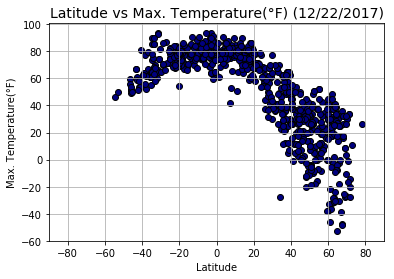
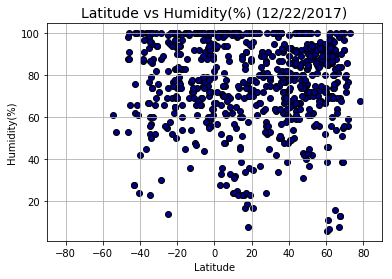
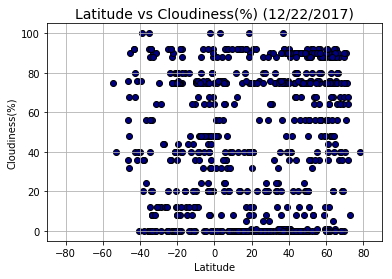
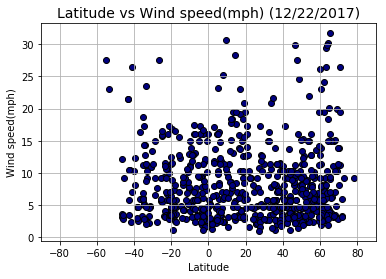

# WeatherPY

### Analysis on WeatherPY
-  The plot on Latitude vs Temperature shows that the temperature is highest at the equator and lowest at the poles.
-  The humidity at the equator is in the range from 50%-100%. Howeever, the trends does not change based on the latitude.
-  There seems to be no co-relation of cloudliness with respect to the latitude.
-  The windspeed for most cities fall under 20mph and there seems to be no trend on the windspeed with respect to the latitude.


```python
# Dependencies
import random
import requests as req

import pandas as pd
import numpy as np

import matplotlib.pyplot as plt

from citipy import citipy
import openweathermapy as owm

#To get the current date
import datetime
now = datetime.datetime.now()
```


```python
# Create a settings object with your API key and preferred units
api_key = "4af76c79df8d11f6295bc8323877e2e5"
# Setting the units to imperial to get Fahrenheit reading
settings = {"units": "imperial", "appid": api_key}
```

## Generate Cities List


```python
# Latitude ranges from -90 to 90 and Longitude ranges from -180 to 180
lat = list(np.arange(-90,90.01,0.01))
long = list(np.arange(-180,180.01,0.01))

# Setting Latitude and Longitude to ramdomly pick co-ordinates.
lat_samples=random.sample(lat,2500)
long_samples=random.sample(long,2500)

# Creating a dataframe from the randomly sample Latitude and Longitude
cities_DF=pd.DataFrame({"Latitude":lat_samples,"Longitude":long_samples})

#Creating new columns City and Country for storing the details corresponding to the co-ordinates
cities_DF["City"]=""
cities_DF["Country"]=""

# Finding the city and the country code corresponding to the Latitude and Longitude
for index,row in cities_DF.iterrows():
    city=citipy.nearest_city(row["Latitude"], row["Longitude"])
    cities_DF.set_value(index, "City", city.city_name)
    cities_DF.set_value(index, "Country", city.country_code)

# Dropping the Latitude and Longitude as they are values of the nearest city and not the excat co-ordinates of the city
cities_DF=cities_DF.drop(cities_DF.columns[[0, 1]], axis=1)

# Deleting duplicate values from the list of cities and keeping only the first
cities_DF=cities_DF.drop_duplicates(['City'], keep='first')

# Randomly sampling a list of 800 cities 
cities_DF=cities_DF.sample(n=800)

# Resetting the index of the cities list
cities_DF=cities_DF.reset_index(drop=True)

cities_DF.head()
```


<div>
<style>
    .dataframe thead tr:only-child th {
        text-align: right;
    }

    .dataframe thead th {
        text-align: left;
    }

    .dataframe tbody tr th {
        vertical-align: top;
    }
</style>
<table border="1" class="dataframe">
  <thead>
    <tr style="text-align: right;">
      <th></th>
      <th>City</th>
      <th>Country</th>
    </tr>
  </thead>
  <tbody>
    <tr>
      <th>0</th>
      <td>zeya</td>
      <td>ru</td>
    </tr>
    <tr>
      <th>1</th>
      <td>vardo</td>
      <td>no</td>
    </tr>
    <tr>
      <th>2</th>
      <td>luangwa</td>
      <td>zm</td>
    </tr>
    <tr>
      <th>3</th>
      <td>nevyansk</td>
      <td>ru</td>
    </tr>
    <tr>
      <th>4</th>
      <td>thai binh</td>
      <td>vn</td>
    </tr>
  </tbody>
</table>
</div>


## Perform API Calls


```python
# Get data for each city in cities_DF
weather_data = []

url="https://api.openweathermap.org/data/2.5/weather?appid=" + api_key + "&units=imperial&q="

print("\nBeginning Data Retrieval\n-----------------------------")
#Get the response from OpenWeatherMapY and storing the response into weather_data if response is found
for index,row in cities_DF.iterrows():  
    print("\nProcessing record %s|%s,%s"%((index+1),row["City"],row["Country"]))
    print("\n"+url+"%s,%s"%(row["City"].replace(" ","+"),row["Country"]))
    try:
        response = owm.get_current("%s,%s"%(row["City"],row["Country"]), **settings)
        # Appending the response to the weather_Data
        weather_data.append(response)
    except:
        print("\n\033[1;31mCity not found. Skipping...\033[1;30m")

print("\n-----------------------------\nData Retrieval Complete\n-----------------------------")
```

    
    Beginning Data Retrieval
    -----------------------------
    
    Processing record 1|zeya,ru
    
    https://api.openweathermap.org/data/2.5/weather?appid=4af76c79df8d11f6295bc8323877e2e5&units=imperial&q=zeya,ru
    
    Processing record 2|vardo,no
    
    https://api.openweathermap.org/data/2.5/weather?appid=4af76c79df8d11f6295bc8323877e2e5&units=imperial&q=vardo,no
    
    Processing record 3|luangwa,zm
    
    https://api.openweathermap.org/data/2.5/weather?appid=4af76c79df8d11f6295bc8323877e2e5&units=imperial&q=luangwa,zm
    
    Processing record 4|nevyansk,ru
    
    https://api.openweathermap.org/data/2.5/weather?appid=4af76c79df8d11f6295bc8323877e2e5&units=imperial&q=nevyansk,ru
    
    Processing record 5|thai binh,vn
    
    https://api.openweathermap.org/data/2.5/weather?appid=4af76c79df8d11f6295bc8323877e2e5&units=imperial&q=thai+binh,vn
    
    Processing record 6|constitucion,cl
    
    https://api.openweathermap.org/data/2.5/weather?appid=4af76c79df8d11f6295bc8323877e2e5&units=imperial&q=constitucion,cl
    
    Processing record 7|wanning,cn
    
    https://api.openweathermap.org/data/2.5/weather?appid=4af76c79df8d11f6295bc8323877e2e5&units=imperial&q=wanning,cn
    
    Processing record 8|zhanaozen,kz
    
    https://api.openweathermap.org/data/2.5/weather?appid=4af76c79df8d11f6295bc8323877e2e5&units=imperial&q=zhanaozen,kz
    
    Processing record 9|taksimo,ru
    
    https://api.openweathermap.org/data/2.5/weather?appid=4af76c79df8d11f6295bc8323877e2e5&units=imperial&q=taksimo,ru
    
    Processing record 10|damghan,ir
    
    https://api.openweathermap.org/data/2.5/weather?appid=4af76c79df8d11f6295bc8323877e2e5&units=imperial&q=damghan,ir
    
    Processing record 11|gornopravdinsk,ru
    
    https://api.openweathermap.org/data/2.5/weather?appid=4af76c79df8d11f6295bc8323877e2e5&units=imperial&q=gornopravdinsk,ru
    
    Processing record 12|la libertad,sv
    
    https://api.openweathermap.org/data/2.5/weather?appid=4af76c79df8d11f6295bc8323877e2e5&units=imperial&q=la+libertad,sv
    
    Processing record 13|orotukan,ru
    
    https://api.openweathermap.org/data/2.5/weather?appid=4af76c79df8d11f6295bc8323877e2e5&units=imperial&q=orotukan,ru
    
    Processing record 14|cockburn town,bs
    
    https://api.openweathermap.org/data/2.5/weather?appid=4af76c79df8d11f6295bc8323877e2e5&units=imperial&q=cockburn+town,bs
    
    Processing record 15|verkhnyaya toyma,ru
    
    https://api.openweathermap.org/data/2.5/weather?appid=4af76c79df8d11f6295bc8323877e2e5&units=imperial&q=verkhnyaya+toyma,ru
    
    Processing record 16|sorland,no
    
    https://api.openweathermap.org/data/2.5/weather?appid=4af76c79df8d11f6295bc8323877e2e5&units=imperial&q=sorland,no
    
    Processing record 17|bamenda,cm
    
    https://api.openweathermap.org/data/2.5/weather?appid=4af76c79df8d11f6295bc8323877e2e5&units=imperial&q=bamenda,cm
    
    Processing record 18|ayni,tj
    
    https://api.openweathermap.org/data/2.5/weather?appid=4af76c79df8d11f6295bc8323877e2e5&units=imperial&q=ayni,tj
    
    Processing record 19|carnarvon,au
    
    https://api.openweathermap.org/data/2.5/weather?appid=4af76c79df8d11f6295bc8323877e2e5&units=imperial&q=carnarvon,au
    
    Processing record 20|ganzhou,cn
    
    https://api.openweathermap.org/data/2.5/weather?appid=4af76c79df8d11f6295bc8323877e2e5&units=imperial&q=ganzhou,cn
    
    Processing record 21|ourossogui,sn
    
    https://api.openweathermap.org/data/2.5/weather?appid=4af76c79df8d11f6295bc8323877e2e5&units=imperial&q=ourossogui,sn
    
    Processing record 22|bluff,nz
    
    https://api.openweathermap.org/data/2.5/weather?appid=4af76c79df8d11f6295bc8323877e2e5&units=imperial&q=bluff,nz
    
    Processing record 23|bubaque,gw
    
    https://api.openweathermap.org/data/2.5/weather?appid=4af76c79df8d11f6295bc8323877e2e5&units=imperial&q=bubaque,gw
    
    Processing record 24|haines junction,ca
    
    https://api.openweathermap.org/data/2.5/weather?appid=4af76c79df8d11f6295bc8323877e2e5&units=imperial&q=haines+junction,ca
    
    Processing record 25|gharo,pk
    
    https://api.openweathermap.org/data/2.5/weather?appid=4af76c79df8d11f6295bc8323877e2e5&units=imperial&q=gharo,pk
    
    Processing record 26|new castle,us
    
    https://api.openweathermap.org/data/2.5/weather?appid=4af76c79df8d11f6295bc8323877e2e5&units=imperial&q=new+castle,us
    
    Processing record 27|nguiu,au
    
    https://api.openweathermap.org/data/2.5/weather?appid=4af76c79df8d11f6295bc8323877e2e5&units=imperial&q=nguiu,au
    
    City not found. Skipping...
    
    Processing record 28|shingu,jp
    
    https://api.openweathermap.org/data/2.5/weather?appid=4af76c79df8d11f6295bc8323877e2e5&units=imperial&q=shingu,jp
    
    Processing record 29|libenge,cd
    
    https://api.openweathermap.org/data/2.5/weather?appid=4af76c79df8d11f6295bc8323877e2e5&units=imperial&q=libenge,cd
    
    Processing record 30|jardim de piranhas,br
    
    https://api.openweathermap.org/data/2.5/weather?appid=4af76c79df8d11f6295bc8323877e2e5&units=imperial&q=jardim+de+piranhas,br
    
    Processing record 31|maues,br
    
    https://api.openweathermap.org/data/2.5/weather?appid=4af76c79df8d11f6295bc8323877e2e5&units=imperial&q=maues,br
    
    Processing record 32|wahpeton,us
    
    https://api.openweathermap.org/data/2.5/weather?appid=4af76c79df8d11f6295bc8323877e2e5&units=imperial&q=wahpeton,us
    
    Processing record 33|isangel,vu
    
    https://api.openweathermap.org/data/2.5/weather?appid=4af76c79df8d11f6295bc8323877e2e5&units=imperial&q=isangel,vu
    
    Processing record 34|kahama,tz
    
    https://api.openweathermap.org/data/2.5/weather?appid=4af76c79df8d11f6295bc8323877e2e5&units=imperial&q=kahama,tz
    
    Processing record 35|nador,ma
    
    https://api.openweathermap.org/data/2.5/weather?appid=4af76c79df8d11f6295bc8323877e2e5&units=imperial&q=nador,ma
    
    Processing record 36|xining,cn
    
    https://api.openweathermap.org/data/2.5/weather?appid=4af76c79df8d11f6295bc8323877e2e5&units=imperial&q=xining,cn
    
    Processing record 37|jamestown,sh
    
    https://api.openweathermap.org/data/2.5/weather?appid=4af76c79df8d11f6295bc8323877e2e5&units=imperial&q=jamestown,sh
    
    Processing record 38|nanortalik,gl
    
    https://api.openweathermap.org/data/2.5/weather?appid=4af76c79df8d11f6295bc8323877e2e5&units=imperial&q=nanortalik,gl
    
    Processing record 39|abashiri,jp
    
    https://api.openweathermap.org/data/2.5/weather?appid=4af76c79df8d11f6295bc8323877e2e5&units=imperial&q=abashiri,jp
    
    Processing record 40|puerto narino,co
    
    https://api.openweathermap.org/data/2.5/weather?appid=4af76c79df8d11f6295bc8323877e2e5&units=imperial&q=puerto+narino,co
    
    Processing record 41|goba,et
    
    https://api.openweathermap.org/data/2.5/weather?appid=4af76c79df8d11f6295bc8323877e2e5&units=imperial&q=goba,et
    
    Processing record 42|allapalli,in
    
    https://api.openweathermap.org/data/2.5/weather?appid=4af76c79df8d11f6295bc8323877e2e5&units=imperial&q=allapalli,in
    
    Processing record 43|novoagansk,ru
    
    https://api.openweathermap.org/data/2.5/weather?appid=4af76c79df8d11f6295bc8323877e2e5&units=imperial&q=novoagansk,ru
    
    Processing record 44|zinder,ne
    
    https://api.openweathermap.org/data/2.5/weather?appid=4af76c79df8d11f6295bc8323877e2e5&units=imperial&q=zinder,ne
    
    Processing record 45|dunedin,nz
    
    https://api.openweathermap.org/data/2.5/weather?appid=4af76c79df8d11f6295bc8323877e2e5&units=imperial&q=dunedin,nz
    
    Processing record 46|koila,gr
    
    https://api.openweathermap.org/data/2.5/weather?appid=4af76c79df8d11f6295bc8323877e2e5&units=imperial&q=koila,gr
    
    Processing record 47|sangolqui,ec
    
    https://api.openweathermap.org/data/2.5/weather?appid=4af76c79df8d11f6295bc8323877e2e5&units=imperial&q=sangolqui,ec
    
    Processing record 48|charters towers,au
    
    https://api.openweathermap.org/data/2.5/weather?appid=4af76c79df8d11f6295bc8323877e2e5&units=imperial&q=charters+towers,au
    
    Processing record 49|emba,kz
    
    https://api.openweathermap.org/data/2.5/weather?appid=4af76c79df8d11f6295bc8323877e2e5&units=imperial&q=emba,kz
    
    City not found. Skipping...
    
    Processing record 50|tuy hoa,vn
    
    https://api.openweathermap.org/data/2.5/weather?appid=4af76c79df8d11f6295bc8323877e2e5&units=imperial&q=tuy+hoa,vn
    
    Processing record 51|camacha,pt
    
    https://api.openweathermap.org/data/2.5/weather?appid=4af76c79df8d11f6295bc8323877e2e5&units=imperial&q=camacha,pt
    
    Processing record 52|voyvozh,ru
    
    https://api.openweathermap.org/data/2.5/weather?appid=4af76c79df8d11f6295bc8323877e2e5&units=imperial&q=voyvozh,ru
    
    Processing record 53|batamshinskiy,kz
    
    https://api.openweathermap.org/data/2.5/weather?appid=4af76c79df8d11f6295bc8323877e2e5&units=imperial&q=batamshinskiy,kz
    
    Processing record 54|albanel,ca
    
    https://api.openweathermap.org/data/2.5/weather?appid=4af76c79df8d11f6295bc8323877e2e5&units=imperial&q=albanel,ca
    
    Processing record 55|piacabucu,br
    
    https://api.openweathermap.org/data/2.5/weather?appid=4af76c79df8d11f6295bc8323877e2e5&units=imperial&q=piacabucu,br
    
    Processing record 56|abu samrah,qa
    
    https://api.openweathermap.org/data/2.5/weather?appid=4af76c79df8d11f6295bc8323877e2e5&units=imperial&q=abu+samrah,qa
    
    City not found. Skipping...
    
    Processing record 57|sibolga,id
    
    https://api.openweathermap.org/data/2.5/weather?appid=4af76c79df8d11f6295bc8323877e2e5&units=imperial&q=sibolga,id
    
    Processing record 58|monterey,us
    
    https://api.openweathermap.org/data/2.5/weather?appid=4af76c79df8d11f6295bc8323877e2e5&units=imperial&q=monterey,us
    
    Processing record 59|gberia fotombu,sl
    
    https://api.openweathermap.org/data/2.5/weather?appid=4af76c79df8d11f6295bc8323877e2e5&units=imperial&q=gberia+fotombu,sl
    
    Processing record 60|butaritari,ki
    
    https://api.openweathermap.org/data/2.5/weather?appid=4af76c79df8d11f6295bc8323877e2e5&units=imperial&q=butaritari,ki
    
    Processing record 61|kapoeta,sd
    
    https://api.openweathermap.org/data/2.5/weather?appid=4af76c79df8d11f6295bc8323877e2e5&units=imperial&q=kapoeta,sd
    
    City not found. Skipping...
    
    Processing record 62|saleaula,ws
    
    https://api.openweathermap.org/data/2.5/weather?appid=4af76c79df8d11f6295bc8323877e2e5&units=imperial&q=saleaula,ws
    
    City not found. Skipping...
    
    Processing record 63|kloulklubed,pw
    
    https://api.openweathermap.org/data/2.5/weather?appid=4af76c79df8d11f6295bc8323877e2e5&units=imperial&q=kloulklubed,pw
    
    Processing record 64|atuona,pf
    
    https://api.openweathermap.org/data/2.5/weather?appid=4af76c79df8d11f6295bc8323877e2e5&units=imperial&q=atuona,pf
    
    Processing record 65|cap malheureux,mu
    
    https://api.openweathermap.org/data/2.5/weather?appid=4af76c79df8d11f6295bc8323877e2e5&units=imperial&q=cap+malheureux,mu
    
    Processing record 66|saint-pierre,pm
    
    https://api.openweathermap.org/data/2.5/weather?appid=4af76c79df8d11f6295bc8323877e2e5&units=imperial&q=saint-pierre,pm
    
    Processing record 67|centralia,us
    
    https://api.openweathermap.org/data/2.5/weather?appid=4af76c79df8d11f6295bc8323877e2e5&units=imperial&q=centralia,us
    
    Processing record 68|hermanus,za
    
    https://api.openweathermap.org/data/2.5/weather?appid=4af76c79df8d11f6295bc8323877e2e5&units=imperial&q=hermanus,za
    
    Processing record 69|nalut,ly
    
    https://api.openweathermap.org/data/2.5/weather?appid=4af76c79df8d11f6295bc8323877e2e5&units=imperial&q=nalut,ly
    
    Processing record 70|rawannawi,ki
    
    https://api.openweathermap.org/data/2.5/weather?appid=4af76c79df8d11f6295bc8323877e2e5&units=imperial&q=rawannawi,ki
    
    City not found. Skipping...
    
    Processing record 71|grants pass,us
    
    https://api.openweathermap.org/data/2.5/weather?appid=4af76c79df8d11f6295bc8323877e2e5&units=imperial&q=grants+pass,us
    
    Processing record 72|klaksvik,fo
    
    https://api.openweathermap.org/data/2.5/weather?appid=4af76c79df8d11f6295bc8323877e2e5&units=imperial&q=klaksvik,fo
    
    Processing record 73|qarqin,af
    
    https://api.openweathermap.org/data/2.5/weather?appid=4af76c79df8d11f6295bc8323877e2e5&units=imperial&q=qarqin,af
    
    Processing record 74|tungkang,tw
    
    https://api.openweathermap.org/data/2.5/weather?appid=4af76c79df8d11f6295bc8323877e2e5&units=imperial&q=tungkang,tw
    
    City not found. Skipping...
    
    Processing record 75|eyl,so
    
    https://api.openweathermap.org/data/2.5/weather?appid=4af76c79df8d11f6295bc8323877e2e5&units=imperial&q=eyl,so
    
    Processing record 76|east london,za
    
    https://api.openweathermap.org/data/2.5/weather?appid=4af76c79df8d11f6295bc8323877e2e5&units=imperial&q=east+london,za
    
    Processing record 77|shestakovo,ru
    
    https://api.openweathermap.org/data/2.5/weather?appid=4af76c79df8d11f6295bc8323877e2e5&units=imperial&q=shestakovo,ru
    
    Processing record 78|louis trichardt,za
    
    https://api.openweathermap.org/data/2.5/weather?appid=4af76c79df8d11f6295bc8323877e2e5&units=imperial&q=louis+trichardt,za
    
    Processing record 79|langsa,id
    
    https://api.openweathermap.org/data/2.5/weather?appid=4af76c79df8d11f6295bc8323877e2e5&units=imperial&q=langsa,id
    
    Processing record 80|whitianga,nz
    
    https://api.openweathermap.org/data/2.5/weather?appid=4af76c79df8d11f6295bc8323877e2e5&units=imperial&q=whitianga,nz
    
    Processing record 81|elsterwerda,de
    
    https://api.openweathermap.org/data/2.5/weather?appid=4af76c79df8d11f6295bc8323877e2e5&units=imperial&q=elsterwerda,de
    
    Processing record 82|hailar,cn
    
    https://api.openweathermap.org/data/2.5/weather?appid=4af76c79df8d11f6295bc8323877e2e5&units=imperial&q=hailar,cn
    
    Processing record 83|narsaq,gl
    
    https://api.openweathermap.org/data/2.5/weather?appid=4af76c79df8d11f6295bc8323877e2e5&units=imperial&q=narsaq,gl
    
    Processing record 84|fernie,ca
    
    https://api.openweathermap.org/data/2.5/weather?appid=4af76c79df8d11f6295bc8323877e2e5&units=imperial&q=fernie,ca
    
    Processing record 85|tokur,ru
    
    https://api.openweathermap.org/data/2.5/weather?appid=4af76c79df8d11f6295bc8323877e2e5&units=imperial&q=tokur,ru
    
    Processing record 86|skagastrond,is
    
    https://api.openweathermap.org/data/2.5/weather?appid=4af76c79df8d11f6295bc8323877e2e5&units=imperial&q=skagastrond,is
    
    City not found. Skipping...
    
    Processing record 87|nome,us
    
    https://api.openweathermap.org/data/2.5/weather?appid=4af76c79df8d11f6295bc8323877e2e5&units=imperial&q=nome,us
    
    Processing record 88|muisne,ec
    
    https://api.openweathermap.org/data/2.5/weather?appid=4af76c79df8d11f6295bc8323877e2e5&units=imperial&q=muisne,ec
    
    Processing record 89|burns lake,ca
    
    https://api.openweathermap.org/data/2.5/weather?appid=4af76c79df8d11f6295bc8323877e2e5&units=imperial&q=burns+lake,ca
    
    Processing record 90|guia de isora,es
    
    https://api.openweathermap.org/data/2.5/weather?appid=4af76c79df8d11f6295bc8323877e2e5&units=imperial&q=guia+de+isora,es
    
    Processing record 91|grenada,us
    
    https://api.openweathermap.org/data/2.5/weather?appid=4af76c79df8d11f6295bc8323877e2e5&units=imperial&q=grenada,us
    
    Processing record 92|remanso,br
    
    https://api.openweathermap.org/data/2.5/weather?appid=4af76c79df8d11f6295bc8323877e2e5&units=imperial&q=remanso,br
    
    Processing record 93|toliary,mg
    
    https://api.openweathermap.org/data/2.5/weather?appid=4af76c79df8d11f6295bc8323877e2e5&units=imperial&q=toliary,mg
    
    City not found. Skipping...
    
    Processing record 94|biak,id
    
    https://api.openweathermap.org/data/2.5/weather?appid=4af76c79df8d11f6295bc8323877e2e5&units=imperial&q=biak,id
    
    Processing record 95|san quintin,mx
    
    https://api.openweathermap.org/data/2.5/weather?appid=4af76c79df8d11f6295bc8323877e2e5&units=imperial&q=san+quintin,mx
    
    City not found. Skipping...
    
    Processing record 96|pozo colorado,py
    
    https://api.openweathermap.org/data/2.5/weather?appid=4af76c79df8d11f6295bc8323877e2e5&units=imperial&q=pozo+colorado,py
    
    Processing record 97|pisco,pe
    
    https://api.openweathermap.org/data/2.5/weather?appid=4af76c79df8d11f6295bc8323877e2e5&units=imperial&q=pisco,pe
    
    Processing record 98|caravelas,br
    
    https://api.openweathermap.org/data/2.5/weather?appid=4af76c79df8d11f6295bc8323877e2e5&units=imperial&q=caravelas,br
    
    Processing record 99|adrar,dz
    
    https://api.openweathermap.org/data/2.5/weather?appid=4af76c79df8d11f6295bc8323877e2e5&units=imperial&q=adrar,dz
    
    Processing record 100|hilo,us
    
    https://api.openweathermap.org/data/2.5/weather?appid=4af76c79df8d11f6295bc8323877e2e5&units=imperial&q=hilo,us
    
    Processing record 101|port alfred,za
    
    https://api.openweathermap.org/data/2.5/weather?appid=4af76c79df8d11f6295bc8323877e2e5&units=imperial&q=port+alfred,za
    
    Processing record 102|egvekinot,ru
    
    https://api.openweathermap.org/data/2.5/weather?appid=4af76c79df8d11f6295bc8323877e2e5&units=imperial&q=egvekinot,ru
    
    Processing record 103|magnitogorsk,ru
    
    https://api.openweathermap.org/data/2.5/weather?appid=4af76c79df8d11f6295bc8323877e2e5&units=imperial&q=magnitogorsk,ru
    
    Processing record 104|uyuni,bo
    
    https://api.openweathermap.org/data/2.5/weather?appid=4af76c79df8d11f6295bc8323877e2e5&units=imperial&q=uyuni,bo
    
    Processing record 105|samandag,tr
    
    https://api.openweathermap.org/data/2.5/weather?appid=4af76c79df8d11f6295bc8323877e2e5&units=imperial&q=samandag,tr
    
    City not found. Skipping...
    
    Processing record 106|beringovskiy,ru
    
    https://api.openweathermap.org/data/2.5/weather?appid=4af76c79df8d11f6295bc8323877e2e5&units=imperial&q=beringovskiy,ru
    
    Processing record 107|lavrentiya,ru
    
    https://api.openweathermap.org/data/2.5/weather?appid=4af76c79df8d11f6295bc8323877e2e5&units=imperial&q=lavrentiya,ru
    
    Processing record 108|sao filipe,cv
    
    https://api.openweathermap.org/data/2.5/weather?appid=4af76c79df8d11f6295bc8323877e2e5&units=imperial&q=sao+filipe,cv
    
    Processing record 109|samarai,pg
    
    https://api.openweathermap.org/data/2.5/weather?appid=4af76c79df8d11f6295bc8323877e2e5&units=imperial&q=samarai,pg
    
    Processing record 110|anshun,cn
    
    https://api.openweathermap.org/data/2.5/weather?appid=4af76c79df8d11f6295bc8323877e2e5&units=imperial&q=anshun,cn
    
    Processing record 111|kobojango,bw
    
    https://api.openweathermap.org/data/2.5/weather?appid=4af76c79df8d11f6295bc8323877e2e5&units=imperial&q=kobojango,bw
    
    City not found. Skipping...
    
    Processing record 112|nemuro,jp
    
    https://api.openweathermap.org/data/2.5/weather?appid=4af76c79df8d11f6295bc8323877e2e5&units=imperial&q=nemuro,jp
    
    Processing record 113|letterkenny,ie
    
    https://api.openweathermap.org/data/2.5/weather?appid=4af76c79df8d11f6295bc8323877e2e5&units=imperial&q=letterkenny,ie
    
    Processing record 114|hangu,cn
    
    https://api.openweathermap.org/data/2.5/weather?appid=4af76c79df8d11f6295bc8323877e2e5&units=imperial&q=hangu,cn
    
    Processing record 115|navalmoral de la mata,es
    
    https://api.openweathermap.org/data/2.5/weather?appid=4af76c79df8d11f6295bc8323877e2e5&units=imperial&q=navalmoral+de+la+mata,es
    
    Processing record 116|mackenzie,ca
    
    https://api.openweathermap.org/data/2.5/weather?appid=4af76c79df8d11f6295bc8323877e2e5&units=imperial&q=mackenzie,ca
    
    Processing record 117|longyearbyen,sj
    
    https://api.openweathermap.org/data/2.5/weather?appid=4af76c79df8d11f6295bc8323877e2e5&units=imperial&q=longyearbyen,sj
    
    Processing record 118|san vicente,ph
    
    https://api.openweathermap.org/data/2.5/weather?appid=4af76c79df8d11f6295bc8323877e2e5&units=imperial&q=san+vicente,ph
    
    Processing record 119|grand-santi,gf
    
    https://api.openweathermap.org/data/2.5/weather?appid=4af76c79df8d11f6295bc8323877e2e5&units=imperial&q=grand-santi,gf
    
    Processing record 120|ilhabela,br
    
    https://api.openweathermap.org/data/2.5/weather?appid=4af76c79df8d11f6295bc8323877e2e5&units=imperial&q=ilhabela,br
    
    Processing record 121|pelym,ru
    
    https://api.openweathermap.org/data/2.5/weather?appid=4af76c79df8d11f6295bc8323877e2e5&units=imperial&q=pelym,ru
    
    Processing record 122|meulaboh,id
    
    https://api.openweathermap.org/data/2.5/weather?appid=4af76c79df8d11f6295bc8323877e2e5&units=imperial&q=meulaboh,id
    
    Processing record 123|vaini,to
    
    https://api.openweathermap.org/data/2.5/weather?appid=4af76c79df8d11f6295bc8323877e2e5&units=imperial&q=vaini,to
    
    Processing record 124|kilifi,ke
    
    https://api.openweathermap.org/data/2.5/weather?appid=4af76c79df8d11f6295bc8323877e2e5&units=imperial&q=kilifi,ke
    
    Processing record 125|lima,pe
    
    https://api.openweathermap.org/data/2.5/weather?appid=4af76c79df8d11f6295bc8323877e2e5&units=imperial&q=lima,pe
    
    Processing record 126|kempele,fi
    
    https://api.openweathermap.org/data/2.5/weather?appid=4af76c79df8d11f6295bc8323877e2e5&units=imperial&q=kempele,fi
    
    Processing record 127|katsuura,jp
    
    https://api.openweathermap.org/data/2.5/weather?appid=4af76c79df8d11f6295bc8323877e2e5&units=imperial&q=katsuura,jp
    
    Processing record 128|birin,dz
    
    https://api.openweathermap.org/data/2.5/weather?appid=4af76c79df8d11f6295bc8323877e2e5&units=imperial&q=birin,dz
    
    City not found. Skipping...
    
    Processing record 129|warri,ng
    
    https://api.openweathermap.org/data/2.5/weather?appid=4af76c79df8d11f6295bc8323877e2e5&units=imperial&q=warri,ng
    
    Processing record 130|halalo,wf
    
    https://api.openweathermap.org/data/2.5/weather?appid=4af76c79df8d11f6295bc8323877e2e5&units=imperial&q=halalo,wf
    
    City not found. Skipping...
    
    Processing record 131|homer,us
    
    https://api.openweathermap.org/data/2.5/weather?appid=4af76c79df8d11f6295bc8323877e2e5&units=imperial&q=homer,us
    
    Processing record 132|mount gambier,au
    
    https://api.openweathermap.org/data/2.5/weather?appid=4af76c79df8d11f6295bc8323877e2e5&units=imperial&q=mount+gambier,au
    
    Processing record 133|verkhoyansk,ru
    
    https://api.openweathermap.org/data/2.5/weather?appid=4af76c79df8d11f6295bc8323877e2e5&units=imperial&q=verkhoyansk,ru
    
    Processing record 134|slantsy,ru
    
    https://api.openweathermap.org/data/2.5/weather?appid=4af76c79df8d11f6295bc8323877e2e5&units=imperial&q=slantsy,ru
    
    Processing record 135|pevek,ru
    
    https://api.openweathermap.org/data/2.5/weather?appid=4af76c79df8d11f6295bc8323877e2e5&units=imperial&q=pevek,ru
    
    Processing record 136|benemerito de las americas,mx
    
    https://api.openweathermap.org/data/2.5/weather?appid=4af76c79df8d11f6295bc8323877e2e5&units=imperial&q=benemerito+de+las+americas,mx
    
    Processing record 137|mar del plata,ar
    
    https://api.openweathermap.org/data/2.5/weather?appid=4af76c79df8d11f6295bc8323877e2e5&units=imperial&q=mar+del+plata,ar
    
    Processing record 138|la plata,ar
    
    https://api.openweathermap.org/data/2.5/weather?appid=4af76c79df8d11f6295bc8323877e2e5&units=imperial&q=la+plata,ar
    
    Processing record 139|acurenam,gq
    
    https://api.openweathermap.org/data/2.5/weather?appid=4af76c79df8d11f6295bc8323877e2e5&units=imperial&q=acurenam,gq
    
    Processing record 140|yulara,au
    
    https://api.openweathermap.org/data/2.5/weather?appid=4af76c79df8d11f6295bc8323877e2e5&units=imperial&q=yulara,au
    
    Processing record 141|trebic,cz
    
    https://api.openweathermap.org/data/2.5/weather?appid=4af76c79df8d11f6295bc8323877e2e5&units=imperial&q=trebic,cz
    
    Processing record 142|kaitangata,nz
    
    https://api.openweathermap.org/data/2.5/weather?appid=4af76c79df8d11f6295bc8323877e2e5&units=imperial&q=kaitangata,nz
    
    Processing record 143|salalah,om
    
    https://api.openweathermap.org/data/2.5/weather?appid=4af76c79df8d11f6295bc8323877e2e5&units=imperial&q=salalah,om
    
    Processing record 144|tautira,pf
    
    https://api.openweathermap.org/data/2.5/weather?appid=4af76c79df8d11f6295bc8323877e2e5&units=imperial&q=tautira,pf
    
    Processing record 145|tiarei,pf
    
    https://api.openweathermap.org/data/2.5/weather?appid=4af76c79df8d11f6295bc8323877e2e5&units=imperial&q=tiarei,pf
    
    Processing record 146|mombetsu,jp
    
    https://api.openweathermap.org/data/2.5/weather?appid=4af76c79df8d11f6295bc8323877e2e5&units=imperial&q=mombetsu,jp
    
    Processing record 147|ancud,cl
    
    https://api.openweathermap.org/data/2.5/weather?appid=4af76c79df8d11f6295bc8323877e2e5&units=imperial&q=ancud,cl
    
    Processing record 148|paamiut,gl
    
    https://api.openweathermap.org/data/2.5/weather?appid=4af76c79df8d11f6295bc8323877e2e5&units=imperial&q=paamiut,gl
    
    Processing record 149|qasigiannguit,gl
    
    https://api.openweathermap.org/data/2.5/weather?appid=4af76c79df8d11f6295bc8323877e2e5&units=imperial&q=qasigiannguit,gl
    
    Processing record 150|krasnoselkup,ru
    
    https://api.openweathermap.org/data/2.5/weather?appid=4af76c79df8d11f6295bc8323877e2e5&units=imperial&q=krasnoselkup,ru
    
    City not found. Skipping...
    
    Processing record 151|rabo de peixe,pt
    
    https://api.openweathermap.org/data/2.5/weather?appid=4af76c79df8d11f6295bc8323877e2e5&units=imperial&q=rabo+de+peixe,pt
    
    Processing record 152|cam ranh,vn
    
    https://api.openweathermap.org/data/2.5/weather?appid=4af76c79df8d11f6295bc8323877e2e5&units=imperial&q=cam+ranh,vn
    
    Processing record 153|baculin,ph
    
    https://api.openweathermap.org/data/2.5/weather?appid=4af76c79df8d11f6295bc8323877e2e5&units=imperial&q=baculin,ph
    
    Processing record 154|faya,td
    
    https://api.openweathermap.org/data/2.5/weather?appid=4af76c79df8d11f6295bc8323877e2e5&units=imperial&q=faya,td
    
    City not found. Skipping...
    
    Processing record 155|kitgum,ug
    
    https://api.openweathermap.org/data/2.5/weather?appid=4af76c79df8d11f6295bc8323877e2e5&units=imperial&q=kitgum,ug
    
    Processing record 156|markivka,ua
    
    https://api.openweathermap.org/data/2.5/weather?appid=4af76c79df8d11f6295bc8323877e2e5&units=imperial&q=markivka,ua
    
    Processing record 157|nurota,uz
    
    https://api.openweathermap.org/data/2.5/weather?appid=4af76c79df8d11f6295bc8323877e2e5&units=imperial&q=nurota,uz
    
    Processing record 158|norman wells,ca
    
    https://api.openweathermap.org/data/2.5/weather?appid=4af76c79df8d11f6295bc8323877e2e5&units=imperial&q=norman+wells,ca
    
    Processing record 159|jardim,br
    
    https://api.openweathermap.org/data/2.5/weather?appid=4af76c79df8d11f6295bc8323877e2e5&units=imperial&q=jardim,br
    
    Processing record 160|pilar,ph
    
    https://api.openweathermap.org/data/2.5/weather?appid=4af76c79df8d11f6295bc8323877e2e5&units=imperial&q=pilar,ph
    
    Processing record 161|bud,no
    
    https://api.openweathermap.org/data/2.5/weather?appid=4af76c79df8d11f6295bc8323877e2e5&units=imperial&q=bud,no
    
    Processing record 162|kaa-khem,ru
    
    https://api.openweathermap.org/data/2.5/weather?appid=4af76c79df8d11f6295bc8323877e2e5&units=imperial&q=kaa-khem,ru
    
    Processing record 163|le mars,us
    
    https://api.openweathermap.org/data/2.5/weather?appid=4af76c79df8d11f6295bc8323877e2e5&units=imperial&q=le+mars,us
    
    Processing record 164|northam,au
    
    https://api.openweathermap.org/data/2.5/weather?appid=4af76c79df8d11f6295bc8323877e2e5&units=imperial&q=northam,au
    
    Processing record 165|nyurba,ru
    
    https://api.openweathermap.org/data/2.5/weather?appid=4af76c79df8d11f6295bc8323877e2e5&units=imperial&q=nyurba,ru
    
    Processing record 166|aklavik,ca
    
    https://api.openweathermap.org/data/2.5/weather?appid=4af76c79df8d11f6295bc8323877e2e5&units=imperial&q=aklavik,ca
    
    Processing record 167|palmer,us
    
    https://api.openweathermap.org/data/2.5/weather?appid=4af76c79df8d11f6295bc8323877e2e5&units=imperial&q=palmer,us
    
    Processing record 168|salacgriva,lv
    
    https://api.openweathermap.org/data/2.5/weather?appid=4af76c79df8d11f6295bc8323877e2e5&units=imperial&q=salacgriva,lv
    
    Processing record 169|plettenberg bay,za
    
    https://api.openweathermap.org/data/2.5/weather?appid=4af76c79df8d11f6295bc8323877e2e5&units=imperial&q=plettenberg+bay,za
    
    Processing record 170|dingle,ie
    
    https://api.openweathermap.org/data/2.5/weather?appid=4af76c79df8d11f6295bc8323877e2e5&units=imperial&q=dingle,ie
    
    Processing record 171|san rafael,ar
    
    https://api.openweathermap.org/data/2.5/weather?appid=4af76c79df8d11f6295bc8323877e2e5&units=imperial&q=san+rafael,ar
    
    Processing record 172|taolanaro,mg
    
    https://api.openweathermap.org/data/2.5/weather?appid=4af76c79df8d11f6295bc8323877e2e5&units=imperial&q=taolanaro,mg
    
    City not found. Skipping...
    
    Processing record 173|ugoofaaru,mv
    
    https://api.openweathermap.org/data/2.5/weather?appid=4af76c79df8d11f6295bc8323877e2e5&units=imperial&q=ugoofaaru,mv
    
    Processing record 174|winton,nz
    
    https://api.openweathermap.org/data/2.5/weather?appid=4af76c79df8d11f6295bc8323877e2e5&units=imperial&q=winton,nz
    
    Processing record 175|college place,us
    
    https://api.openweathermap.org/data/2.5/weather?appid=4af76c79df8d11f6295bc8323877e2e5&units=imperial&q=college+place,us
    
    Processing record 176|tateyama,jp
    
    https://api.openweathermap.org/data/2.5/weather?appid=4af76c79df8d11f6295bc8323877e2e5&units=imperial&q=tateyama,jp
    
    Processing record 177|paso del toro,mx
    
    https://api.openweathermap.org/data/2.5/weather?appid=4af76c79df8d11f6295bc8323877e2e5&units=imperial&q=paso+del+toro,mx
    
    Processing record 178|harboore,dk
    
    https://api.openweathermap.org/data/2.5/weather?appid=4af76c79df8d11f6295bc8323877e2e5&units=imperial&q=harboore,dk
    
    Processing record 179|palembang,id
    
    https://api.openweathermap.org/data/2.5/weather?appid=4af76c79df8d11f6295bc8323877e2e5&units=imperial&q=palembang,id
    
    Processing record 180|tiksi,ru
    
    https://api.openweathermap.org/data/2.5/weather?appid=4af76c79df8d11f6295bc8323877e2e5&units=imperial&q=tiksi,ru
    
    Processing record 181|moa,cu
    
    https://api.openweathermap.org/data/2.5/weather?appid=4af76c79df8d11f6295bc8323877e2e5&units=imperial&q=moa,cu
    
    Processing record 182|maceio,br
    
    https://api.openweathermap.org/data/2.5/weather?appid=4af76c79df8d11f6295bc8323877e2e5&units=imperial&q=maceio,br
    
    Processing record 183|great bend,us
    
    https://api.openweathermap.org/data/2.5/weather?appid=4af76c79df8d11f6295bc8323877e2e5&units=imperial&q=great+bend,us
    
    Processing record 184|superior,us
    
    https://api.openweathermap.org/data/2.5/weather?appid=4af76c79df8d11f6295bc8323877e2e5&units=imperial&q=superior,us
    
    Processing record 185|jieshou,cn
    
    https://api.openweathermap.org/data/2.5/weather?appid=4af76c79df8d11f6295bc8323877e2e5&units=imperial&q=jieshou,cn
    
    Processing record 186|diapaga,bf
    
    https://api.openweathermap.org/data/2.5/weather?appid=4af76c79df8d11f6295bc8323877e2e5&units=imperial&q=diapaga,bf
    
    Processing record 187|kahului,us
    
    https://api.openweathermap.org/data/2.5/weather?appid=4af76c79df8d11f6295bc8323877e2e5&units=imperial&q=kahului,us
    
    Processing record 188|gat,ly
    
    https://api.openweathermap.org/data/2.5/weather?appid=4af76c79df8d11f6295bc8323877e2e5&units=imperial&q=gat,ly
    
    City not found. Skipping...
    
    Processing record 189|lukiv,ua
    
    https://api.openweathermap.org/data/2.5/weather?appid=4af76c79df8d11f6295bc8323877e2e5&units=imperial&q=lukiv,ua
    
    Processing record 190|mahanoro,mg
    
    https://api.openweathermap.org/data/2.5/weather?appid=4af76c79df8d11f6295bc8323877e2e5&units=imperial&q=mahanoro,mg
    
    Processing record 191|pitimbu,br
    
    https://api.openweathermap.org/data/2.5/weather?appid=4af76c79df8d11f6295bc8323877e2e5&units=imperial&q=pitimbu,br
    
    Processing record 192|hokitika,nz
    
    https://api.openweathermap.org/data/2.5/weather?appid=4af76c79df8d11f6295bc8323877e2e5&units=imperial&q=hokitika,nz
    
    Processing record 193|bokovskaya,ru
    
    https://api.openweathermap.org/data/2.5/weather?appid=4af76c79df8d11f6295bc8323877e2e5&units=imperial&q=bokovskaya,ru
    
    Processing record 194|vila franca do campo,pt
    
    https://api.openweathermap.org/data/2.5/weather?appid=4af76c79df8d11f6295bc8323877e2e5&units=imperial&q=vila+franca+do+campo,pt
    
    Processing record 195|piro,in
    
    https://api.openweathermap.org/data/2.5/weather?appid=4af76c79df8d11f6295bc8323877e2e5&units=imperial&q=piro,in
    
    Processing record 196|olhao,pt
    
    https://api.openweathermap.org/data/2.5/weather?appid=4af76c79df8d11f6295bc8323877e2e5&units=imperial&q=olhao,pt
    
    Processing record 197|maswa,tz
    
    https://api.openweathermap.org/data/2.5/weather?appid=4af76c79df8d11f6295bc8323877e2e5&units=imperial&q=maswa,tz
    
    Processing record 198|cidreira,br
    
    https://api.openweathermap.org/data/2.5/weather?appid=4af76c79df8d11f6295bc8323877e2e5&units=imperial&q=cidreira,br
    
    Processing record 199|lukovetskiy,ru
    
    https://api.openweathermap.org/data/2.5/weather?appid=4af76c79df8d11f6295bc8323877e2e5&units=imperial&q=lukovetskiy,ru
    
    Processing record 200|cochabamba,bo
    
    https://api.openweathermap.org/data/2.5/weather?appid=4af76c79df8d11f6295bc8323877e2e5&units=imperial&q=cochabamba,bo
    
    Processing record 201|dabaca,ro
    
    https://api.openweathermap.org/data/2.5/weather?appid=4af76c79df8d11f6295bc8323877e2e5&units=imperial&q=dabaca,ro
    
    Processing record 202|monrovia,lr
    
    https://api.openweathermap.org/data/2.5/weather?appid=4af76c79df8d11f6295bc8323877e2e5&units=imperial&q=monrovia,lr
    
    Processing record 203|kavieng,pg
    
    https://api.openweathermap.org/data/2.5/weather?appid=4af76c79df8d11f6295bc8323877e2e5&units=imperial&q=kavieng,pg
    
    Processing record 204|roura,gf
    
    https://api.openweathermap.org/data/2.5/weather?appid=4af76c79df8d11f6295bc8323877e2e5&units=imperial&q=roura,gf
    
    Processing record 205|susanville,us
    
    https://api.openweathermap.org/data/2.5/weather?appid=4af76c79df8d11f6295bc8323877e2e5&units=imperial&q=susanville,us
    
    Processing record 206|olga,ru
    
    https://api.openweathermap.org/data/2.5/weather?appid=4af76c79df8d11f6295bc8323877e2e5&units=imperial&q=olga,ru
    
    Processing record 207|chumikan,ru
    
    https://api.openweathermap.org/data/2.5/weather?appid=4af76c79df8d11f6295bc8323877e2e5&units=imperial&q=chumikan,ru
    
    Processing record 208|pirapemas,br
    
    https://api.openweathermap.org/data/2.5/weather?appid=4af76c79df8d11f6295bc8323877e2e5&units=imperial&q=pirapemas,br
    
    Processing record 209|itoman,jp
    
    https://api.openweathermap.org/data/2.5/weather?appid=4af76c79df8d11f6295bc8323877e2e5&units=imperial&q=itoman,jp
    
    Processing record 210|kazalinsk,kz
    
    https://api.openweathermap.org/data/2.5/weather?appid=4af76c79df8d11f6295bc8323877e2e5&units=imperial&q=kazalinsk,kz
    
    City not found. Skipping...
    
    Processing record 211|fortuna,us
    
    https://api.openweathermap.org/data/2.5/weather?appid=4af76c79df8d11f6295bc8323877e2e5&units=imperial&q=fortuna,us
    
    Processing record 212|charleston,us
    
    https://api.openweathermap.org/data/2.5/weather?appid=4af76c79df8d11f6295bc8323877e2e5&units=imperial&q=charleston,us
    
    Processing record 213|luis correia,br
    
    https://api.openweathermap.org/data/2.5/weather?appid=4af76c79df8d11f6295bc8323877e2e5&units=imperial&q=luis+correia,br
    
    Processing record 214|tilichiki,ru
    
    https://api.openweathermap.org/data/2.5/weather?appid=4af76c79df8d11f6295bc8323877e2e5&units=imperial&q=tilichiki,ru
    
    Processing record 215|guerrero negro,mx
    
    https://api.openweathermap.org/data/2.5/weather?appid=4af76c79df8d11f6295bc8323877e2e5&units=imperial&q=guerrero+negro,mx
    
    Processing record 216|abay,kz
    
    https://api.openweathermap.org/data/2.5/weather?appid=4af76c79df8d11f6295bc8323877e2e5&units=imperial&q=abay,kz
    
    Processing record 217|tongzi,cn
    
    https://api.openweathermap.org/data/2.5/weather?appid=4af76c79df8d11f6295bc8323877e2e5&units=imperial&q=tongzi,cn
    
    Processing record 218|pacific grove,us
    
    https://api.openweathermap.org/data/2.5/weather?appid=4af76c79df8d11f6295bc8323877e2e5&units=imperial&q=pacific+grove,us
    
    Processing record 219|turukhansk,ru
    
    https://api.openweathermap.org/data/2.5/weather?appid=4af76c79df8d11f6295bc8323877e2e5&units=imperial&q=turukhansk,ru
    
    Processing record 220|russell,nz
    
    https://api.openweathermap.org/data/2.5/weather?appid=4af76c79df8d11f6295bc8323877e2e5&units=imperial&q=russell,nz
    
    Processing record 221|yar-sale,ru
    
    https://api.openweathermap.org/data/2.5/weather?appid=4af76c79df8d11f6295bc8323877e2e5&units=imperial&q=yar-sale,ru
    
    Processing record 222|ozernovskiy,ru
    
    https://api.openweathermap.org/data/2.5/weather?appid=4af76c79df8d11f6295bc8323877e2e5&units=imperial&q=ozernovskiy,ru
    
    Processing record 223|mosalsk,ru
    
    https://api.openweathermap.org/data/2.5/weather?appid=4af76c79df8d11f6295bc8323877e2e5&units=imperial&q=mosalsk,ru
    
    Processing record 224|altay,cn
    
    https://api.openweathermap.org/data/2.5/weather?appid=4af76c79df8d11f6295bc8323877e2e5&units=imperial&q=altay,cn
    
    Processing record 225|bengkulu,id
    
    https://api.openweathermap.org/data/2.5/weather?appid=4af76c79df8d11f6295bc8323877e2e5&units=imperial&q=bengkulu,id
    
    City not found. Skipping...
    
    Processing record 226|chontalpa,mx
    
    https://api.openweathermap.org/data/2.5/weather?appid=4af76c79df8d11f6295bc8323877e2e5&units=imperial&q=chontalpa,mx
    
    Processing record 227|rochester,us
    
    https://api.openweathermap.org/data/2.5/weather?appid=4af76c79df8d11f6295bc8323877e2e5&units=imperial&q=rochester,us
    
    Processing record 228|gracias,hn
    
    https://api.openweathermap.org/data/2.5/weather?appid=4af76c79df8d11f6295bc8323877e2e5&units=imperial&q=gracias,hn
    
    Processing record 229|tanout,ne
    
    https://api.openweathermap.org/data/2.5/weather?appid=4af76c79df8d11f6295bc8323877e2e5&units=imperial&q=tanout,ne
    
    Processing record 230|attawapiskat,ca
    
    https://api.openweathermap.org/data/2.5/weather?appid=4af76c79df8d11f6295bc8323877e2e5&units=imperial&q=attawapiskat,ca
    
    City not found. Skipping...
    
    Processing record 231|cheremisinovo,ru
    
    https://api.openweathermap.org/data/2.5/weather?appid=4af76c79df8d11f6295bc8323877e2e5&units=imperial&q=cheremisinovo,ru
    
    Processing record 232|rungata,ki
    
    https://api.openweathermap.org/data/2.5/weather?appid=4af76c79df8d11f6295bc8323877e2e5&units=imperial&q=rungata,ki
    
    City not found. Skipping...
    
    Processing record 233|san policarpo,ph
    
    https://api.openweathermap.org/data/2.5/weather?appid=4af76c79df8d11f6295bc8323877e2e5&units=imperial&q=san+policarpo,ph
    
    Processing record 234|necochea,ar
    
    https://api.openweathermap.org/data/2.5/weather?appid=4af76c79df8d11f6295bc8323877e2e5&units=imperial&q=necochea,ar
    
    Processing record 235|neiafu,to
    
    https://api.openweathermap.org/data/2.5/weather?appid=4af76c79df8d11f6295bc8323877e2e5&units=imperial&q=neiafu,to
    
    Processing record 236|chapais,ca
    
    https://api.openweathermap.org/data/2.5/weather?appid=4af76c79df8d11f6295bc8323877e2e5&units=imperial&q=chapais,ca
    
    Processing record 237|jalu,ly
    
    https://api.openweathermap.org/data/2.5/weather?appid=4af76c79df8d11f6295bc8323877e2e5&units=imperial&q=jalu,ly
    
    Processing record 238|tena,ec
    
    https://api.openweathermap.org/data/2.5/weather?appid=4af76c79df8d11f6295bc8323877e2e5&units=imperial&q=tena,ec
    
    Processing record 239|mindelo,cv
    
    https://api.openweathermap.org/data/2.5/weather?appid=4af76c79df8d11f6295bc8323877e2e5&units=imperial&q=mindelo,cv
    
    Processing record 240|lasa,cn
    
    https://api.openweathermap.org/data/2.5/weather?appid=4af76c79df8d11f6295bc8323877e2e5&units=imperial&q=lasa,cn
    
    City not found. Skipping...
    
    Processing record 241|bafoussam,cm
    
    https://api.openweathermap.org/data/2.5/weather?appid=4af76c79df8d11f6295bc8323877e2e5&units=imperial&q=bafoussam,cm
    
    Processing record 242|avera,pf
    
    https://api.openweathermap.org/data/2.5/weather?appid=4af76c79df8d11f6295bc8323877e2e5&units=imperial&q=avera,pf
    
    City not found. Skipping...
    
    Processing record 243|anar darreh,af
    
    https://api.openweathermap.org/data/2.5/weather?appid=4af76c79df8d11f6295bc8323877e2e5&units=imperial&q=anar+darreh,af
    
    City not found. Skipping...
    
    Processing record 244|kologriv,ru
    
    https://api.openweathermap.org/data/2.5/weather?appid=4af76c79df8d11f6295bc8323877e2e5&units=imperial&q=kologriv,ru
    
    Processing record 245|yellowknife,ca
    
    https://api.openweathermap.org/data/2.5/weather?appid=4af76c79df8d11f6295bc8323877e2e5&units=imperial&q=yellowknife,ca
    
    Processing record 246|havre-saint-pierre,ca
    
    https://api.openweathermap.org/data/2.5/weather?appid=4af76c79df8d11f6295bc8323877e2e5&units=imperial&q=havre-saint-pierre,ca
    
    Processing record 247|ozgon,kg
    
    https://api.openweathermap.org/data/2.5/weather?appid=4af76c79df8d11f6295bc8323877e2e5&units=imperial&q=ozgon,kg
    
    City not found. Skipping...
    
    Processing record 248|broken hill,au
    
    https://api.openweathermap.org/data/2.5/weather?appid=4af76c79df8d11f6295bc8323877e2e5&units=imperial&q=broken+hill,au
    
    Processing record 249|thompson,ca
    
    https://api.openweathermap.org/data/2.5/weather?appid=4af76c79df8d11f6295bc8323877e2e5&units=imperial&q=thompson,ca
    
    Processing record 250|borova,ua
    
    https://api.openweathermap.org/data/2.5/weather?appid=4af76c79df8d11f6295bc8323877e2e5&units=imperial&q=borova,ua
    
    Processing record 251|gravdal,no
    
    https://api.openweathermap.org/data/2.5/weather?appid=4af76c79df8d11f6295bc8323877e2e5&units=imperial&q=gravdal,no
    
    Processing record 252|port hedland,au
    
    https://api.openweathermap.org/data/2.5/weather?appid=4af76c79df8d11f6295bc8323877e2e5&units=imperial&q=port+hedland,au
    
    Processing record 253|provideniya,ru
    
    https://api.openweathermap.org/data/2.5/weather?appid=4af76c79df8d11f6295bc8323877e2e5&units=imperial&q=provideniya,ru
    
    Processing record 254|laguna,br
    
    https://api.openweathermap.org/data/2.5/weather?appid=4af76c79df8d11f6295bc8323877e2e5&units=imperial&q=laguna,br
    
    City not found. Skipping...
    
    Processing record 255|fairbanks,us
    
    https://api.openweathermap.org/data/2.5/weather?appid=4af76c79df8d11f6295bc8323877e2e5&units=imperial&q=fairbanks,us
    
    Processing record 256|dubti,et
    
    https://api.openweathermap.org/data/2.5/weather?appid=4af76c79df8d11f6295bc8323877e2e5&units=imperial&q=dubti,et
    
    Processing record 257|victor harbor,au
    
    https://api.openweathermap.org/data/2.5/weather?appid=4af76c79df8d11f6295bc8323877e2e5&units=imperial&q=victor+harbor,au
    
    Processing record 258|kutum,sd
    
    https://api.openweathermap.org/data/2.5/weather?appid=4af76c79df8d11f6295bc8323877e2e5&units=imperial&q=kutum,sd
    
    Processing record 259|odweyne,so
    
    https://api.openweathermap.org/data/2.5/weather?appid=4af76c79df8d11f6295bc8323877e2e5&units=imperial&q=odweyne,so
    
    City not found. Skipping...
    
    Processing record 260|saint-augustin,ca
    
    https://api.openweathermap.org/data/2.5/weather?appid=4af76c79df8d11f6295bc8323877e2e5&units=imperial&q=saint-augustin,ca
    
    Processing record 261|swan river,ca
    
    https://api.openweathermap.org/data/2.5/weather?appid=4af76c79df8d11f6295bc8323877e2e5&units=imperial&q=swan+river,ca
    
    Processing record 262|hailey,us
    
    https://api.openweathermap.org/data/2.5/weather?appid=4af76c79df8d11f6295bc8323877e2e5&units=imperial&q=hailey,us
    
    Processing record 263|tuatapere,nz
    
    https://api.openweathermap.org/data/2.5/weather?appid=4af76c79df8d11f6295bc8323877e2e5&units=imperial&q=tuatapere,nz
    
    Processing record 264|taltal,cl
    
    https://api.openweathermap.org/data/2.5/weather?appid=4af76c79df8d11f6295bc8323877e2e5&units=imperial&q=taltal,cl
    
    Processing record 265|cockburn harbour,tc
    
    https://api.openweathermap.org/data/2.5/weather?appid=4af76c79df8d11f6295bc8323877e2e5&units=imperial&q=cockburn+harbour,tc
    
    City not found. Skipping...
    
    Processing record 266|san francisco,ar
    
    https://api.openweathermap.org/data/2.5/weather?appid=4af76c79df8d11f6295bc8323877e2e5&units=imperial&q=san+francisco,ar
    
    Processing record 267|malwan,in
    
    https://api.openweathermap.org/data/2.5/weather?appid=4af76c79df8d11f6295bc8323877e2e5&units=imperial&q=malwan,in
    
    City not found. Skipping...
    
    Processing record 268|myitkyina,mm
    
    https://api.openweathermap.org/data/2.5/weather?appid=4af76c79df8d11f6295bc8323877e2e5&units=imperial&q=myitkyina,mm
    
    Processing record 269|urdoma,ru
    
    https://api.openweathermap.org/data/2.5/weather?appid=4af76c79df8d11f6295bc8323877e2e5&units=imperial&q=urdoma,ru
    
    Processing record 270|saint-joseph,re
    
    https://api.openweathermap.org/data/2.5/weather?appid=4af76c79df8d11f6295bc8323877e2e5&units=imperial&q=saint-joseph,re
    
    Processing record 271|kalmunai,lk
    
    https://api.openweathermap.org/data/2.5/weather?appid=4af76c79df8d11f6295bc8323877e2e5&units=imperial&q=kalmunai,lk
    
    Processing record 272|veinticinco de mayo,ar
    
    https://api.openweathermap.org/data/2.5/weather?appid=4af76c79df8d11f6295bc8323877e2e5&units=imperial&q=veinticinco+de+mayo,ar
    
    Processing record 273|severo-kurilsk,ru
    
    https://api.openweathermap.org/data/2.5/weather?appid=4af76c79df8d11f6295bc8323877e2e5&units=imperial&q=severo-kurilsk,ru
    
    Processing record 274|the valley,ai
    
    https://api.openweathermap.org/data/2.5/weather?appid=4af76c79df8d11f6295bc8323877e2e5&units=imperial&q=the+valley,ai
    
    Processing record 275|gambela,et
    
    https://api.openweathermap.org/data/2.5/weather?appid=4af76c79df8d11f6295bc8323877e2e5&units=imperial&q=gambela,et
    
    Processing record 276|balkhash,kz
    
    https://api.openweathermap.org/data/2.5/weather?appid=4af76c79df8d11f6295bc8323877e2e5&units=imperial&q=balkhash,kz
    
    Processing record 277|merauke,id
    
    https://api.openweathermap.org/data/2.5/weather?appid=4af76c79df8d11f6295bc8323877e2e5&units=imperial&q=merauke,id
    
    Processing record 278|kirakira,sb
    
    https://api.openweathermap.org/data/2.5/weather?appid=4af76c79df8d11f6295bc8323877e2e5&units=imperial&q=kirakira,sb
    
    Processing record 279|alcains,pt
    
    https://api.openweathermap.org/data/2.5/weather?appid=4af76c79df8d11f6295bc8323877e2e5&units=imperial&q=alcains,pt
    
    Processing record 280|pordim,bg
    
    https://api.openweathermap.org/data/2.5/weather?appid=4af76c79df8d11f6295bc8323877e2e5&units=imperial&q=pordim,bg
    
    Processing record 281|malino,ru
    
    https://api.openweathermap.org/data/2.5/weather?appid=4af76c79df8d11f6295bc8323877e2e5&units=imperial&q=malino,ru
    
    Processing record 282|antalaha,mg
    
    https://api.openweathermap.org/data/2.5/weather?appid=4af76c79df8d11f6295bc8323877e2e5&units=imperial&q=antalaha,mg
    
    Processing record 283|nadym,ru
    
    https://api.openweathermap.org/data/2.5/weather?appid=4af76c79df8d11f6295bc8323877e2e5&units=imperial&q=nadym,ru
    
    Processing record 284|ust-kan,ru
    
    https://api.openweathermap.org/data/2.5/weather?appid=4af76c79df8d11f6295bc8323877e2e5&units=imperial&q=ust-kan,ru
    
    Processing record 285|hovd,mn
    
    https://api.openweathermap.org/data/2.5/weather?appid=4af76c79df8d11f6295bc8323877e2e5&units=imperial&q=hovd,mn
    
    Processing record 286|esperance,au
    
    https://api.openweathermap.org/data/2.5/weather?appid=4af76c79df8d11f6295bc8323877e2e5&units=imperial&q=esperance,au
    
    Processing record 287|boende,cd
    
    https://api.openweathermap.org/data/2.5/weather?appid=4af76c79df8d11f6295bc8323877e2e5&units=imperial&q=boende,cd
    
    Processing record 288|fort wellington,gy
    
    https://api.openweathermap.org/data/2.5/weather?appid=4af76c79df8d11f6295bc8323877e2e5&units=imperial&q=fort+wellington,gy
    
    Processing record 289|ayan,ru
    
    https://api.openweathermap.org/data/2.5/weather?appid=4af76c79df8d11f6295bc8323877e2e5&units=imperial&q=ayan,ru
    
    City not found. Skipping...
    
    Processing record 290|lubana,lv
    
    https://api.openweathermap.org/data/2.5/weather?appid=4af76c79df8d11f6295bc8323877e2e5&units=imperial&q=lubana,lv
    
    Processing record 291|mayo,ca
    
    https://api.openweathermap.org/data/2.5/weather?appid=4af76c79df8d11f6295bc8323877e2e5&units=imperial&q=mayo,ca
    
    Processing record 292|tadepalle,in
    
    https://api.openweathermap.org/data/2.5/weather?appid=4af76c79df8d11f6295bc8323877e2e5&units=imperial&q=tadepalle,in
    
    Processing record 293|la fria,ve
    
    https://api.openweathermap.org/data/2.5/weather?appid=4af76c79df8d11f6295bc8323877e2e5&units=imperial&q=la+fria,ve
    
    Processing record 294|hambantota,lk
    
    https://api.openweathermap.org/data/2.5/weather?appid=4af76c79df8d11f6295bc8323877e2e5&units=imperial&q=hambantota,lk
    
    Processing record 295|sioux lookout,ca
    
    https://api.openweathermap.org/data/2.5/weather?appid=4af76c79df8d11f6295bc8323877e2e5&units=imperial&q=sioux+lookout,ca
    
    Processing record 296|hofn,is
    
    https://api.openweathermap.org/data/2.5/weather?appid=4af76c79df8d11f6295bc8323877e2e5&units=imperial&q=hofn,is
    
    Processing record 297|namibe,ao
    
    https://api.openweathermap.org/data/2.5/weather?appid=4af76c79df8d11f6295bc8323877e2e5&units=imperial&q=namibe,ao
    
    Processing record 298|beidao,cn
    
    https://api.openweathermap.org/data/2.5/weather?appid=4af76c79df8d11f6295bc8323877e2e5&units=imperial&q=beidao,cn
    
    Processing record 299|arcachon,fr
    
    https://api.openweathermap.org/data/2.5/weather?appid=4af76c79df8d11f6295bc8323877e2e5&units=imperial&q=arcachon,fr
    
    Processing record 300|saskylakh,ru
    
    https://api.openweathermap.org/data/2.5/weather?appid=4af76c79df8d11f6295bc8323877e2e5&units=imperial&q=saskylakh,ru
    
    Processing record 301|danilovka,ru
    
    https://api.openweathermap.org/data/2.5/weather?appid=4af76c79df8d11f6295bc8323877e2e5&units=imperial&q=danilovka,ru
    
    Processing record 302|predivinsk,ru
    
    https://api.openweathermap.org/data/2.5/weather?appid=4af76c79df8d11f6295bc8323877e2e5&units=imperial&q=predivinsk,ru
    
    Processing record 303|tornio,fi
    
    https://api.openweathermap.org/data/2.5/weather?appid=4af76c79df8d11f6295bc8323877e2e5&units=imperial&q=tornio,fi
    
    Processing record 304|belushya guba,ru
    
    https://api.openweathermap.org/data/2.5/weather?appid=4af76c79df8d11f6295bc8323877e2e5&units=imperial&q=belushya+guba,ru
    
    City not found. Skipping...
    
    Processing record 305|lata,sb
    
    https://api.openweathermap.org/data/2.5/weather?appid=4af76c79df8d11f6295bc8323877e2e5&units=imperial&q=lata,sb
    
    City not found. Skipping...
    
    Processing record 306|krasnyy bogatyr,ru
    
    https://api.openweathermap.org/data/2.5/weather?appid=4af76c79df8d11f6295bc8323877e2e5&units=imperial&q=krasnyy+bogatyr,ru
    
    Processing record 307|zhaodong,cn
    
    https://api.openweathermap.org/data/2.5/weather?appid=4af76c79df8d11f6295bc8323877e2e5&units=imperial&q=zhaodong,cn
    
    Processing record 308|sept-iles,ca
    
    https://api.openweathermap.org/data/2.5/weather?appid=4af76c79df8d11f6295bc8323877e2e5&units=imperial&q=sept-iles,ca
    
    Processing record 309|ostrovnoy,ru
    
    https://api.openweathermap.org/data/2.5/weather?appid=4af76c79df8d11f6295bc8323877e2e5&units=imperial&q=ostrovnoy,ru
    
    Processing record 310|sao joao da barra,br
    
    https://api.openweathermap.org/data/2.5/weather?appid=4af76c79df8d11f6295bc8323877e2e5&units=imperial&q=sao+joao+da+barra,br
    
    Processing record 311|fuxin,cn
    
    https://api.openweathermap.org/data/2.5/weather?appid=4af76c79df8d11f6295bc8323877e2e5&units=imperial&q=fuxin,cn
    
    Processing record 312|upernavik,gl
    
    https://api.openweathermap.org/data/2.5/weather?appid=4af76c79df8d11f6295bc8323877e2e5&units=imperial&q=upernavik,gl
    
    Processing record 313|seymchan,ru
    
    https://api.openweathermap.org/data/2.5/weather?appid=4af76c79df8d11f6295bc8323877e2e5&units=imperial&q=seymchan,ru
    
    Processing record 314|hobyo,so
    
    https://api.openweathermap.org/data/2.5/weather?appid=4af76c79df8d11f6295bc8323877e2e5&units=imperial&q=hobyo,so
    
    Processing record 315|rakhya,ru
    
    https://api.openweathermap.org/data/2.5/weather?appid=4af76c79df8d11f6295bc8323877e2e5&units=imperial&q=rakhya,ru
    
    City not found. Skipping...
    
    Processing record 316|port macquarie,au
    
    https://api.openweathermap.org/data/2.5/weather?appid=4af76c79df8d11f6295bc8323877e2e5&units=imperial&q=port+macquarie,au
    
    Processing record 317|isla vista,us
    
    https://api.openweathermap.org/data/2.5/weather?appid=4af76c79df8d11f6295bc8323877e2e5&units=imperial&q=isla+vista,us
    
    Processing record 318|pochutla,mx
    
    https://api.openweathermap.org/data/2.5/weather?appid=4af76c79df8d11f6295bc8323877e2e5&units=imperial&q=pochutla,mx
    
    Processing record 319|santa rosa,ar
    
    https://api.openweathermap.org/data/2.5/weather?appid=4af76c79df8d11f6295bc8323877e2e5&units=imperial&q=santa+rosa,ar
    
    Processing record 320|dongli,cn
    
    https://api.openweathermap.org/data/2.5/weather?appid=4af76c79df8d11f6295bc8323877e2e5&units=imperial&q=dongli,cn
    
    Processing record 321|ormara,pk
    
    https://api.openweathermap.org/data/2.5/weather?appid=4af76c79df8d11f6295bc8323877e2e5&units=imperial&q=ormara,pk
    
    Processing record 322|gayny,ru
    
    https://api.openweathermap.org/data/2.5/weather?appid=4af76c79df8d11f6295bc8323877e2e5&units=imperial&q=gayny,ru
    
    Processing record 323|geraldton,au
    
    https://api.openweathermap.org/data/2.5/weather?appid=4af76c79df8d11f6295bc8323877e2e5&units=imperial&q=geraldton,au
    
    Processing record 324|amparafaravola,mg
    
    https://api.openweathermap.org/data/2.5/weather?appid=4af76c79df8d11f6295bc8323877e2e5&units=imperial&q=amparafaravola,mg
    
    Processing record 325|umzimvubu,za
    
    https://api.openweathermap.org/data/2.5/weather?appid=4af76c79df8d11f6295bc8323877e2e5&units=imperial&q=umzimvubu,za
    
    City not found. Skipping...
    
    Processing record 326|kyshtovka,ru
    
    https://api.openweathermap.org/data/2.5/weather?appid=4af76c79df8d11f6295bc8323877e2e5&units=imperial&q=kyshtovka,ru
    
    Processing record 327|nizhneyansk,ru
    
    https://api.openweathermap.org/data/2.5/weather?appid=4af76c79df8d11f6295bc8323877e2e5&units=imperial&q=nizhneyansk,ru
    
    City not found. Skipping...
    
    Processing record 328|fort-shevchenko,kz
    
    https://api.openweathermap.org/data/2.5/weather?appid=4af76c79df8d11f6295bc8323877e2e5&units=imperial&q=fort-shevchenko,kz
    
    Processing record 329|mildura,au
    
    https://api.openweathermap.org/data/2.5/weather?appid=4af76c79df8d11f6295bc8323877e2e5&units=imperial&q=mildura,au
    
    Processing record 330|noumea,nc
    
    https://api.openweathermap.org/data/2.5/weather?appid=4af76c79df8d11f6295bc8323877e2e5&units=imperial&q=noumea,nc
    
    Processing record 331|airai,pw
    
    https://api.openweathermap.org/data/2.5/weather?appid=4af76c79df8d11f6295bc8323877e2e5&units=imperial&q=airai,pw
    
    City not found. Skipping...
    
    Processing record 332|namatanai,pg
    
    https://api.openweathermap.org/data/2.5/weather?appid=4af76c79df8d11f6295bc8323877e2e5&units=imperial&q=namatanai,pg
    
    Processing record 333|bilma,ne
    
    https://api.openweathermap.org/data/2.5/weather?appid=4af76c79df8d11f6295bc8323877e2e5&units=imperial&q=bilma,ne
    
    Processing record 334|aborlan,ph
    
    https://api.openweathermap.org/data/2.5/weather?appid=4af76c79df8d11f6295bc8323877e2e5&units=imperial&q=aborlan,ph
    
    Processing record 335|viransehir,tr
    
    https://api.openweathermap.org/data/2.5/weather?appid=4af76c79df8d11f6295bc8323877e2e5&units=imperial&q=viransehir,tr
    
    Processing record 336|zhanatas,kz
    
    https://api.openweathermap.org/data/2.5/weather?appid=4af76c79df8d11f6295bc8323877e2e5&units=imperial&q=zhanatas,kz
    
    City not found. Skipping...
    
    Processing record 337|mount barker,au
    
    https://api.openweathermap.org/data/2.5/weather?appid=4af76c79df8d11f6295bc8323877e2e5&units=imperial&q=mount+barker,au
    
    Processing record 338|champasak,la
    
    https://api.openweathermap.org/data/2.5/weather?appid=4af76c79df8d11f6295bc8323877e2e5&units=imperial&q=champasak,la
    
    Processing record 339|bur gabo,so
    
    https://api.openweathermap.org/data/2.5/weather?appid=4af76c79df8d11f6295bc8323877e2e5&units=imperial&q=bur+gabo,so
    
    City not found. Skipping...
    
    Processing record 340|shakawe,bw
    
    https://api.openweathermap.org/data/2.5/weather?appid=4af76c79df8d11f6295bc8323877e2e5&units=imperial&q=shakawe,bw
    
    Processing record 341|moville,ie
    
    https://api.openweathermap.org/data/2.5/weather?appid=4af76c79df8d11f6295bc8323877e2e5&units=imperial&q=moville,ie
    
    Processing record 342|oranjestad,aw
    
    https://api.openweathermap.org/data/2.5/weather?appid=4af76c79df8d11f6295bc8323877e2e5&units=imperial&q=oranjestad,aw
    
    Processing record 343|bargal,so
    
    https://api.openweathermap.org/data/2.5/weather?appid=4af76c79df8d11f6295bc8323877e2e5&units=imperial&q=bargal,so
    
    City not found. Skipping...
    
    Processing record 344|maumere,id
    
    https://api.openweathermap.org/data/2.5/weather?appid=4af76c79df8d11f6295bc8323877e2e5&units=imperial&q=maumere,id
    
    Processing record 345|hvolsvollur,is
    
    https://api.openweathermap.org/data/2.5/weather?appid=4af76c79df8d11f6295bc8323877e2e5&units=imperial&q=hvolsvollur,is
    
    City not found. Skipping...
    
    Processing record 346|balatonlelle,hu
    
    https://api.openweathermap.org/data/2.5/weather?appid=4af76c79df8d11f6295bc8323877e2e5&units=imperial&q=balatonlelle,hu
    
    Processing record 347|uhlove,ua
    
    https://api.openweathermap.org/data/2.5/weather?appid=4af76c79df8d11f6295bc8323877e2e5&units=imperial&q=uhlove,ua
    
    Processing record 348|talaya,ru
    
    https://api.openweathermap.org/data/2.5/weather?appid=4af76c79df8d11f6295bc8323877e2e5&units=imperial&q=talaya,ru
    
    Processing record 349|queimadas,br
    
    https://api.openweathermap.org/data/2.5/weather?appid=4af76c79df8d11f6295bc8323877e2e5&units=imperial&q=queimadas,br
    
    Processing record 350|arivonimamo,mg
    
    https://api.openweathermap.org/data/2.5/weather?appid=4af76c79df8d11f6295bc8323877e2e5&units=imperial&q=arivonimamo,mg
    
    Processing record 351|margate,za
    
    https://api.openweathermap.org/data/2.5/weather?appid=4af76c79df8d11f6295bc8323877e2e5&units=imperial&q=margate,za
    
    Processing record 352|saint-leu,re
    
    https://api.openweathermap.org/data/2.5/weather?appid=4af76c79df8d11f6295bc8323877e2e5&units=imperial&q=saint-leu,re
    
    Processing record 353|chipiona,es
    
    https://api.openweathermap.org/data/2.5/weather?appid=4af76c79df8d11f6295bc8323877e2e5&units=imperial&q=chipiona,es
    
    Processing record 354|contai,in
    
    https://api.openweathermap.org/data/2.5/weather?appid=4af76c79df8d11f6295bc8323877e2e5&units=imperial&q=contai,in
    
    Processing record 355|borger,us
    
    https://api.openweathermap.org/data/2.5/weather?appid=4af76c79df8d11f6295bc8323877e2e5&units=imperial&q=borger,us
    
    Processing record 356|birjand,ir
    
    https://api.openweathermap.org/data/2.5/weather?appid=4af76c79df8d11f6295bc8323877e2e5&units=imperial&q=birjand,ir
    
    Processing record 357|twin falls,us
    
    https://api.openweathermap.org/data/2.5/weather?appid=4af76c79df8d11f6295bc8323877e2e5&units=imperial&q=twin+falls,us
    
    Processing record 358|zyryanka,ru
    
    https://api.openweathermap.org/data/2.5/weather?appid=4af76c79df8d11f6295bc8323877e2e5&units=imperial&q=zyryanka,ru
    
    Processing record 359|katobu,id
    
    https://api.openweathermap.org/data/2.5/weather?appid=4af76c79df8d11f6295bc8323877e2e5&units=imperial&q=katobu,id
    
    Processing record 360|eenhana,na
    
    https://api.openweathermap.org/data/2.5/weather?appid=4af76c79df8d11f6295bc8323877e2e5&units=imperial&q=eenhana,na
    
    Processing record 361|omboue,ga
    
    https://api.openweathermap.org/data/2.5/weather?appid=4af76c79df8d11f6295bc8323877e2e5&units=imperial&q=omboue,ga
    
    Processing record 362|new norfolk,au
    
    https://api.openweathermap.org/data/2.5/weather?appid=4af76c79df8d11f6295bc8323877e2e5&units=imperial&q=new+norfolk,au
    
    Processing record 363|khudumelapye,bw
    
    https://api.openweathermap.org/data/2.5/weather?appid=4af76c79df8d11f6295bc8323877e2e5&units=imperial&q=khudumelapye,bw
    
    Processing record 364|narimanov,ru
    
    https://api.openweathermap.org/data/2.5/weather?appid=4af76c79df8d11f6295bc8323877e2e5&units=imperial&q=narimanov,ru
    
    Processing record 365|umm kaddadah,sd
    
    https://api.openweathermap.org/data/2.5/weather?appid=4af76c79df8d11f6295bc8323877e2e5&units=imperial&q=umm+kaddadah,sd
    
    Processing record 366|puerto quijarro,bo
    
    https://api.openweathermap.org/data/2.5/weather?appid=4af76c79df8d11f6295bc8323877e2e5&units=imperial&q=puerto+quijarro,bo
    
    Processing record 367|goundam,ml
    
    https://api.openweathermap.org/data/2.5/weather?appid=4af76c79df8d11f6295bc8323877e2e5&units=imperial&q=goundam,ml
    
    Processing record 368|musoma,tz
    
    https://api.openweathermap.org/data/2.5/weather?appid=4af76c79df8d11f6295bc8323877e2e5&units=imperial&q=musoma,tz
    
    Processing record 369|ulaanbaatar,mn
    
    https://api.openweathermap.org/data/2.5/weather?appid=4af76c79df8d11f6295bc8323877e2e5&units=imperial&q=ulaanbaatar,mn
    
    Processing record 370|podgornoye,ru
    
    https://api.openweathermap.org/data/2.5/weather?appid=4af76c79df8d11f6295bc8323877e2e5&units=imperial&q=podgornoye,ru
    
    Processing record 371|viedma,ar
    
    https://api.openweathermap.org/data/2.5/weather?appid=4af76c79df8d11f6295bc8323877e2e5&units=imperial&q=viedma,ar
    
    Processing record 372|olinda,br
    
    https://api.openweathermap.org/data/2.5/weather?appid=4af76c79df8d11f6295bc8323877e2e5&units=imperial&q=olinda,br
    
    Processing record 373|souillac,mu
    
    https://api.openweathermap.org/data/2.5/weather?appid=4af76c79df8d11f6295bc8323877e2e5&units=imperial&q=souillac,mu
    
    Processing record 374|japura,br
    
    https://api.openweathermap.org/data/2.5/weather?appid=4af76c79df8d11f6295bc8323877e2e5&units=imperial&q=japura,br
    
    City not found. Skipping...
    
    Processing record 375|naze,jp
    
    https://api.openweathermap.org/data/2.5/weather?appid=4af76c79df8d11f6295bc8323877e2e5&units=imperial&q=naze,jp
    
    Processing record 376|vestmannaeyjar,is
    
    https://api.openweathermap.org/data/2.5/weather?appid=4af76c79df8d11f6295bc8323877e2e5&units=imperial&q=vestmannaeyjar,is
    
    Processing record 377|zhigansk,ru
    
    https://api.openweathermap.org/data/2.5/weather?appid=4af76c79df8d11f6295bc8323877e2e5&units=imperial&q=zhigansk,ru
    
    Processing record 378|redding,us
    
    https://api.openweathermap.org/data/2.5/weather?appid=4af76c79df8d11f6295bc8323877e2e5&units=imperial&q=redding,us
    
    Processing record 379|kieta,pg
    
    https://api.openweathermap.org/data/2.5/weather?appid=4af76c79df8d11f6295bc8323877e2e5&units=imperial&q=kieta,pg
    
    Processing record 380|linxia,cn
    
    https://api.openweathermap.org/data/2.5/weather?appid=4af76c79df8d11f6295bc8323877e2e5&units=imperial&q=linxia,cn
    
    Processing record 381|santa fe,cu
    
    https://api.openweathermap.org/data/2.5/weather?appid=4af76c79df8d11f6295bc8323877e2e5&units=imperial&q=santa+fe,cu
    
    Processing record 382|chokurdakh,ru
    
    https://api.openweathermap.org/data/2.5/weather?appid=4af76c79df8d11f6295bc8323877e2e5&units=imperial&q=chokurdakh,ru
    
    Processing record 383|palu,id
    
    https://api.openweathermap.org/data/2.5/weather?appid=4af76c79df8d11f6295bc8323877e2e5&units=imperial&q=palu,id
    
    Processing record 384|yumen,cn
    
    https://api.openweathermap.org/data/2.5/weather?appid=4af76c79df8d11f6295bc8323877e2e5&units=imperial&q=yumen,cn
    
    Processing record 385|washington,us
    
    https://api.openweathermap.org/data/2.5/weather?appid=4af76c79df8d11f6295bc8323877e2e5&units=imperial&q=washington,us
    
    Processing record 386|bethel,us
    
    https://api.openweathermap.org/data/2.5/weather?appid=4af76c79df8d11f6295bc8323877e2e5&units=imperial&q=bethel,us
    
    Processing record 387|finote selam,et
    
    https://api.openweathermap.org/data/2.5/weather?appid=4af76c79df8d11f6295bc8323877e2e5&units=imperial&q=finote+selam,et
    
    Processing record 388|hasaki,jp
    
    https://api.openweathermap.org/data/2.5/weather?appid=4af76c79df8d11f6295bc8323877e2e5&units=imperial&q=hasaki,jp
    
    Processing record 389|sitka,us
    
    https://api.openweathermap.org/data/2.5/weather?appid=4af76c79df8d11f6295bc8323877e2e5&units=imperial&q=sitka,us
    
    Processing record 390|oyo,ng
    
    https://api.openweathermap.org/data/2.5/weather?appid=4af76c79df8d11f6295bc8323877e2e5&units=imperial&q=oyo,ng
    
    Processing record 391|petropavlovsk-kamchatskiy,ru
    
    https://api.openweathermap.org/data/2.5/weather?appid=4af76c79df8d11f6295bc8323877e2e5&units=imperial&q=petropavlovsk-kamchatskiy,ru
    
    Processing record 392|hay river,ca
    
    https://api.openweathermap.org/data/2.5/weather?appid=4af76c79df8d11f6295bc8323877e2e5&units=imperial&q=hay+river,ca
    
    Processing record 393|padang,id
    
    https://api.openweathermap.org/data/2.5/weather?appid=4af76c79df8d11f6295bc8323877e2e5&units=imperial&q=padang,id
    
    Processing record 394|barawe,so
    
    https://api.openweathermap.org/data/2.5/weather?appid=4af76c79df8d11f6295bc8323877e2e5&units=imperial&q=barawe,so
    
    City not found. Skipping...
    
    Processing record 395|pangnirtung,ca
    
    https://api.openweathermap.org/data/2.5/weather?appid=4af76c79df8d11f6295bc8323877e2e5&units=imperial&q=pangnirtung,ca
    
    Processing record 396|road town,vg
    
    https://api.openweathermap.org/data/2.5/weather?appid=4af76c79df8d11f6295bc8323877e2e5&units=imperial&q=road+town,vg
    
    Processing record 397|hamilton,bm
    
    https://api.openweathermap.org/data/2.5/weather?appid=4af76c79df8d11f6295bc8323877e2e5&units=imperial&q=hamilton,bm
    
    Processing record 398|kushima,jp
    
    https://api.openweathermap.org/data/2.5/weather?appid=4af76c79df8d11f6295bc8323877e2e5&units=imperial&q=kushima,jp
    
    Processing record 399|vangaindrano,mg
    
    https://api.openweathermap.org/data/2.5/weather?appid=4af76c79df8d11f6295bc8323877e2e5&units=imperial&q=vangaindrano,mg
    
    Processing record 400|lisakovsk,kz
    
    https://api.openweathermap.org/data/2.5/weather?appid=4af76c79df8d11f6295bc8323877e2e5&units=imperial&q=lisakovsk,kz
    
    Processing record 401|serik,tr
    
    https://api.openweathermap.org/data/2.5/weather?appid=4af76c79df8d11f6295bc8323877e2e5&units=imperial&q=serik,tr
    
    Processing record 402|poronaysk,ru
    
    https://api.openweathermap.org/data/2.5/weather?appid=4af76c79df8d11f6295bc8323877e2e5&units=imperial&q=poronaysk,ru
    
    Processing record 403|victoria,sc
    
    https://api.openweathermap.org/data/2.5/weather?appid=4af76c79df8d11f6295bc8323877e2e5&units=imperial&q=victoria,sc
    
    Processing record 404|ulladulla,au
    
    https://api.openweathermap.org/data/2.5/weather?appid=4af76c79df8d11f6295bc8323877e2e5&units=imperial&q=ulladulla,au
    
    Processing record 405|bandarbeyla,so
    
    https://api.openweathermap.org/data/2.5/weather?appid=4af76c79df8d11f6295bc8323877e2e5&units=imperial&q=bandarbeyla,so
    
    Processing record 406|sedro-woolley,us
    
    https://api.openweathermap.org/data/2.5/weather?appid=4af76c79df8d11f6295bc8323877e2e5&units=imperial&q=sedro-woolley,us
    
    Processing record 407|tabiauea,ki
    
    https://api.openweathermap.org/data/2.5/weather?appid=4af76c79df8d11f6295bc8323877e2e5&units=imperial&q=tabiauea,ki
    
    City not found. Skipping...
    
    Processing record 408|rantepao,id
    
    https://api.openweathermap.org/data/2.5/weather?appid=4af76c79df8d11f6295bc8323877e2e5&units=imperial&q=rantepao,id
    
    Processing record 409|csavoly,hu
    
    https://api.openweathermap.org/data/2.5/weather?appid=4af76c79df8d11f6295bc8323877e2e5&units=imperial&q=csavoly,hu
    
    Processing record 410|grand river south east,mu
    
    https://api.openweathermap.org/data/2.5/weather?appid=4af76c79df8d11f6295bc8323877e2e5&units=imperial&q=grand+river+south+east,mu
    
    City not found. Skipping...
    
    Processing record 411|gwanda,zw
    
    https://api.openweathermap.org/data/2.5/weather?appid=4af76c79df8d11f6295bc8323877e2e5&units=imperial&q=gwanda,zw
    
    Processing record 412|aykhal,ru
    
    https://api.openweathermap.org/data/2.5/weather?appid=4af76c79df8d11f6295bc8323877e2e5&units=imperial&q=aykhal,ru
    
    Processing record 413|igrim,ru
    
    https://api.openweathermap.org/data/2.5/weather?appid=4af76c79df8d11f6295bc8323877e2e5&units=imperial&q=igrim,ru
    
    Processing record 414|takoradi,gh
    
    https://api.openweathermap.org/data/2.5/weather?appid=4af76c79df8d11f6295bc8323877e2e5&units=imperial&q=takoradi,gh
    
    Processing record 415|banepa,np
    
    https://api.openweathermap.org/data/2.5/weather?appid=4af76c79df8d11f6295bc8323877e2e5&units=imperial&q=banepa,np
    
    Processing record 416|ushuaia,ar
    
    https://api.openweathermap.org/data/2.5/weather?appid=4af76c79df8d11f6295bc8323877e2e5&units=imperial&q=ushuaia,ar
    
    Processing record 417|muli,mv
    
    https://api.openweathermap.org/data/2.5/weather?appid=4af76c79df8d11f6295bc8323877e2e5&units=imperial&q=muli,mv
    
    Processing record 418|pinega,ru
    
    https://api.openweathermap.org/data/2.5/weather?appid=4af76c79df8d11f6295bc8323877e2e5&units=imperial&q=pinega,ru
    
    Processing record 419|huilong,cn
    
    https://api.openweathermap.org/data/2.5/weather?appid=4af76c79df8d11f6295bc8323877e2e5&units=imperial&q=huilong,cn
    
    Processing record 420|vao,nc
    
    https://api.openweathermap.org/data/2.5/weather?appid=4af76c79df8d11f6295bc8323877e2e5&units=imperial&q=vao,nc
    
    Processing record 421|cururupu,br
    
    https://api.openweathermap.org/data/2.5/weather?appid=4af76c79df8d11f6295bc8323877e2e5&units=imperial&q=cururupu,br
    
    Processing record 422|curup,id
    
    https://api.openweathermap.org/data/2.5/weather?appid=4af76c79df8d11f6295bc8323877e2e5&units=imperial&q=curup,id
    
    Processing record 423|maraa,br
    
    https://api.openweathermap.org/data/2.5/weather?appid=4af76c79df8d11f6295bc8323877e2e5&units=imperial&q=maraa,br
    
    Processing record 424|muros,es
    
    https://api.openweathermap.org/data/2.5/weather?appid=4af76c79df8d11f6295bc8323877e2e5&units=imperial&q=muros,es
    
    Processing record 425|manama,bh
    
    https://api.openweathermap.org/data/2.5/weather?appid=4af76c79df8d11f6295bc8323877e2e5&units=imperial&q=manama,bh
    
    Processing record 426|taos,us
    
    https://api.openweathermap.org/data/2.5/weather?appid=4af76c79df8d11f6295bc8323877e2e5&units=imperial&q=taos,us
    
    Processing record 427|ambodifototra,mg
    
    https://api.openweathermap.org/data/2.5/weather?appid=4af76c79df8d11f6295bc8323877e2e5&units=imperial&q=ambodifototra,mg
    
    City not found. Skipping...
    
    Processing record 428|kavaratti,in
    
    https://api.openweathermap.org/data/2.5/weather?appid=4af76c79df8d11f6295bc8323877e2e5&units=imperial&q=kavaratti,in
    
    Processing record 429|coihaique,cl
    
    https://api.openweathermap.org/data/2.5/weather?appid=4af76c79df8d11f6295bc8323877e2e5&units=imperial&q=coihaique,cl
    
    Processing record 430|beneditinos,br
    
    https://api.openweathermap.org/data/2.5/weather?appid=4af76c79df8d11f6295bc8323877e2e5&units=imperial&q=beneditinos,br
    
    Processing record 431|sistranda,no
    
    https://api.openweathermap.org/data/2.5/weather?appid=4af76c79df8d11f6295bc8323877e2e5&units=imperial&q=sistranda,no
    
    Processing record 432|tartagal,ar
    
    https://api.openweathermap.org/data/2.5/weather?appid=4af76c79df8d11f6295bc8323877e2e5&units=imperial&q=tartagal,ar
    
    Processing record 433|namikupa,tz
    
    https://api.openweathermap.org/data/2.5/weather?appid=4af76c79df8d11f6295bc8323877e2e5&units=imperial&q=namikupa,tz
    
    Processing record 434|sunndalsora,no
    
    https://api.openweathermap.org/data/2.5/weather?appid=4af76c79df8d11f6295bc8323877e2e5&units=imperial&q=sunndalsora,no
    
    Processing record 435|luderitz,na
    
    https://api.openweathermap.org/data/2.5/weather?appid=4af76c79df8d11f6295bc8323877e2e5&units=imperial&q=luderitz,na
    
    Processing record 436|kismayo,so
    
    https://api.openweathermap.org/data/2.5/weather?appid=4af76c79df8d11f6295bc8323877e2e5&units=imperial&q=kismayo,so
    
    City not found. Skipping...
    
    Processing record 437|bathsheba,bb
    
    https://api.openweathermap.org/data/2.5/weather?appid=4af76c79df8d11f6295bc8323877e2e5&units=imperial&q=bathsheba,bb
    
    Processing record 438|onega,ru
    
    https://api.openweathermap.org/data/2.5/weather?appid=4af76c79df8d11f6295bc8323877e2e5&units=imperial&q=onega,ru
    
    Processing record 439|tsuruga,jp
    
    https://api.openweathermap.org/data/2.5/weather?appid=4af76c79df8d11f6295bc8323877e2e5&units=imperial&q=tsuruga,jp
    
    Processing record 440|bodden town,ky
    
    https://api.openweathermap.org/data/2.5/weather?appid=4af76c79df8d11f6295bc8323877e2e5&units=imperial&q=bodden+town,ky
    
    Processing record 441|saint george,bm
    
    https://api.openweathermap.org/data/2.5/weather?appid=4af76c79df8d11f6295bc8323877e2e5&units=imperial&q=saint+george,bm
    
    Processing record 442|balimo,pg
    
    https://api.openweathermap.org/data/2.5/weather?appid=4af76c79df8d11f6295bc8323877e2e5&units=imperial&q=balimo,pg
    
    City not found. Skipping...
    
    Processing record 443|vanimo,pg
    
    https://api.openweathermap.org/data/2.5/weather?appid=4af76c79df8d11f6295bc8323877e2e5&units=imperial&q=vanimo,pg
    
    Processing record 444|tsumeb,na
    
    https://api.openweathermap.org/data/2.5/weather?appid=4af76c79df8d11f6295bc8323877e2e5&units=imperial&q=tsumeb,na
    
    Processing record 445|korla,cn
    
    https://api.openweathermap.org/data/2.5/weather?appid=4af76c79df8d11f6295bc8323877e2e5&units=imperial&q=korla,cn
    
    Processing record 446|deputatskiy,ru
    
    https://api.openweathermap.org/data/2.5/weather?appid=4af76c79df8d11f6295bc8323877e2e5&units=imperial&q=deputatskiy,ru
    
    Processing record 447|nam tha,la
    
    https://api.openweathermap.org/data/2.5/weather?appid=4af76c79df8d11f6295bc8323877e2e5&units=imperial&q=nam+tha,la
    
    City not found. Skipping...
    
    Processing record 448|solnechnyy,ru
    
    https://api.openweathermap.org/data/2.5/weather?appid=4af76c79df8d11f6295bc8323877e2e5&units=imperial&q=solnechnyy,ru
    
    Processing record 449|lucea,jm
    
    https://api.openweathermap.org/data/2.5/weather?appid=4af76c79df8d11f6295bc8323877e2e5&units=imperial&q=lucea,jm
    
    Processing record 450|bartica,gy
    
    https://api.openweathermap.org/data/2.5/weather?appid=4af76c79df8d11f6295bc8323877e2e5&units=imperial&q=bartica,gy
    
    Processing record 451|samfya,zm
    
    https://api.openweathermap.org/data/2.5/weather?appid=4af76c79df8d11f6295bc8323877e2e5&units=imperial&q=samfya,zm
    
    Processing record 452|lethem,gy
    
    https://api.openweathermap.org/data/2.5/weather?appid=4af76c79df8d11f6295bc8323877e2e5&units=imperial&q=lethem,gy
    
    Processing record 453|kenai,us
    
    https://api.openweathermap.org/data/2.5/weather?appid=4af76c79df8d11f6295bc8323877e2e5&units=imperial&q=kenai,us
    
    Processing record 454|nakamura,jp
    
    https://api.openweathermap.org/data/2.5/weather?appid=4af76c79df8d11f6295bc8323877e2e5&units=imperial&q=nakamura,jp
    
    Processing record 455|amderma,ru
    
    https://api.openweathermap.org/data/2.5/weather?appid=4af76c79df8d11f6295bc8323877e2e5&units=imperial&q=amderma,ru
    
    City not found. Skipping...
    
    Processing record 456|ndjole,ga
    
    https://api.openweathermap.org/data/2.5/weather?appid=4af76c79df8d11f6295bc8323877e2e5&units=imperial&q=ndjole,ga
    
    Processing record 457|presidente olegario,br
    
    https://api.openweathermap.org/data/2.5/weather?appid=4af76c79df8d11f6295bc8323877e2e5&units=imperial&q=presidente+olegario,br
    
    Processing record 458|agaro,et
    
    https://api.openweathermap.org/data/2.5/weather?appid=4af76c79df8d11f6295bc8323877e2e5&units=imperial&q=agaro,et
    
    Processing record 459|mazyr,by
    
    https://api.openweathermap.org/data/2.5/weather?appid=4af76c79df8d11f6295bc8323877e2e5&units=imperial&q=mazyr,by
    
    Processing record 460|zlatoustovsk,ru
    
    https://api.openweathermap.org/data/2.5/weather?appid=4af76c79df8d11f6295bc8323877e2e5&units=imperial&q=zlatoustovsk,ru
    
    City not found. Skipping...
    
    Processing record 461|eurajoki,fi
    
    https://api.openweathermap.org/data/2.5/weather?appid=4af76c79df8d11f6295bc8323877e2e5&units=imperial&q=eurajoki,fi
    
    Processing record 462|klyuchi,ru
    
    https://api.openweathermap.org/data/2.5/weather?appid=4af76c79df8d11f6295bc8323877e2e5&units=imperial&q=klyuchi,ru
    
    Processing record 463|kolobrzeg,pl
    
    https://api.openweathermap.org/data/2.5/weather?appid=4af76c79df8d11f6295bc8323877e2e5&units=imperial&q=kolobrzeg,pl
    
    Processing record 464|okato,nz
    
    https://api.openweathermap.org/data/2.5/weather?appid=4af76c79df8d11f6295bc8323877e2e5&units=imperial&q=okato,nz
    
    Processing record 465|chuy,uy
    
    https://api.openweathermap.org/data/2.5/weather?appid=4af76c79df8d11f6295bc8323877e2e5&units=imperial&q=chuy,uy
    
    Processing record 466|kimberley,za
    
    https://api.openweathermap.org/data/2.5/weather?appid=4af76c79df8d11f6295bc8323877e2e5&units=imperial&q=kimberley,za
    
    Processing record 467|mahajanga,mg
    
    https://api.openweathermap.org/data/2.5/weather?appid=4af76c79df8d11f6295bc8323877e2e5&units=imperial&q=mahajanga,mg
    
    Processing record 468|bundaberg,au
    
    https://api.openweathermap.org/data/2.5/weather?appid=4af76c79df8d11f6295bc8323877e2e5&units=imperial&q=bundaberg,au
    
    Processing record 469|lyuban,by
    
    https://api.openweathermap.org/data/2.5/weather?appid=4af76c79df8d11f6295bc8323877e2e5&units=imperial&q=lyuban,by
    
    Processing record 470|gulu,ug
    
    https://api.openweathermap.org/data/2.5/weather?appid=4af76c79df8d11f6295bc8323877e2e5&units=imperial&q=gulu,ug
    
    Processing record 471|ndioum,sn
    
    https://api.openweathermap.org/data/2.5/weather?appid=4af76c79df8d11f6295bc8323877e2e5&units=imperial&q=ndioum,sn
    
    Processing record 472|tando ghulam ali,pk
    
    https://api.openweathermap.org/data/2.5/weather?appid=4af76c79df8d11f6295bc8323877e2e5&units=imperial&q=tando+ghulam+ali,pk
    
    Processing record 473|puerto ayora,ec
    
    https://api.openweathermap.org/data/2.5/weather?appid=4af76c79df8d11f6295bc8323877e2e5&units=imperial&q=puerto+ayora,ec
    
    Processing record 474|maniitsoq,gl
    
    https://api.openweathermap.org/data/2.5/weather?appid=4af76c79df8d11f6295bc8323877e2e5&units=imperial&q=maniitsoq,gl
    
    Processing record 475|dharchula,in
    
    https://api.openweathermap.org/data/2.5/weather?appid=4af76c79df8d11f6295bc8323877e2e5&units=imperial&q=dharchula,in
    
    Processing record 476|sao bernardo,br
    
    https://api.openweathermap.org/data/2.5/weather?appid=4af76c79df8d11f6295bc8323877e2e5&units=imperial&q=sao+bernardo,br
    
    Processing record 477|sikar,in
    
    https://api.openweathermap.org/data/2.5/weather?appid=4af76c79df8d11f6295bc8323877e2e5&units=imperial&q=sikar,in
    
    Processing record 478|auki,sb
    
    https://api.openweathermap.org/data/2.5/weather?appid=4af76c79df8d11f6295bc8323877e2e5&units=imperial&q=auki,sb
    
    Processing record 479|banda aceh,id
    
    https://api.openweathermap.org/data/2.5/weather?appid=4af76c79df8d11f6295bc8323877e2e5&units=imperial&q=banda+aceh,id
    
    Processing record 480|karkaralinsk,kz
    
    https://api.openweathermap.org/data/2.5/weather?appid=4af76c79df8d11f6295bc8323877e2e5&units=imperial&q=karkaralinsk,kz
    
    City not found. Skipping...
    
    Processing record 481|shimoda,jp
    
    https://api.openweathermap.org/data/2.5/weather?appid=4af76c79df8d11f6295bc8323877e2e5&units=imperial&q=shimoda,jp
    
    Processing record 482|talnakh,ru
    
    https://api.openweathermap.org/data/2.5/weather?appid=4af76c79df8d11f6295bc8323877e2e5&units=imperial&q=talnakh,ru
    
    Processing record 483|sechura,pe
    
    https://api.openweathermap.org/data/2.5/weather?appid=4af76c79df8d11f6295bc8323877e2e5&units=imperial&q=sechura,pe
    
    Processing record 484|mys shmidta,ru
    
    https://api.openweathermap.org/data/2.5/weather?appid=4af76c79df8d11f6295bc8323877e2e5&units=imperial&q=mys+shmidta,ru
    
    City not found. Skipping...
    
    Processing record 485|trelew,ar
    
    https://api.openweathermap.org/data/2.5/weather?appid=4af76c79df8d11f6295bc8323877e2e5&units=imperial&q=trelew,ar
    
    Processing record 486|sigmaringen,de
    
    https://api.openweathermap.org/data/2.5/weather?appid=4af76c79df8d11f6295bc8323877e2e5&units=imperial&q=sigmaringen,de
    
    Processing record 487|winneba,gh
    
    https://api.openweathermap.org/data/2.5/weather?appid=4af76c79df8d11f6295bc8323877e2e5&units=imperial&q=winneba,gh
    
    Processing record 488|saint anthony,ca
    
    https://api.openweathermap.org/data/2.5/weather?appid=4af76c79df8d11f6295bc8323877e2e5&units=imperial&q=saint+anthony,ca
    
    City not found. Skipping...
    
    Processing record 489|yozgat,tr
    
    https://api.openweathermap.org/data/2.5/weather?appid=4af76c79df8d11f6295bc8323877e2e5&units=imperial&q=yozgat,tr
    
    Processing record 490|corrente,br
    
    https://api.openweathermap.org/data/2.5/weather?appid=4af76c79df8d11f6295bc8323877e2e5&units=imperial&q=corrente,br
    
    Processing record 491|honningsvag,no
    
    https://api.openweathermap.org/data/2.5/weather?appid=4af76c79df8d11f6295bc8323877e2e5&units=imperial&q=honningsvag,no
    
    Processing record 492|monster,nl
    
    https://api.openweathermap.org/data/2.5/weather?appid=4af76c79df8d11f6295bc8323877e2e5&units=imperial&q=monster,nl
    
    Processing record 493|singaraja,id
    
    https://api.openweathermap.org/data/2.5/weather?appid=4af76c79df8d11f6295bc8323877e2e5&units=imperial&q=singaraja,id
    
    Processing record 494|sredec,bg
    
    https://api.openweathermap.org/data/2.5/weather?appid=4af76c79df8d11f6295bc8323877e2e5&units=imperial&q=sredec,bg
    
    City not found. Skipping...
    
    Processing record 495|shahr-e babak,ir
    
    https://api.openweathermap.org/data/2.5/weather?appid=4af76c79df8d11f6295bc8323877e2e5&units=imperial&q=shahr-e+babak,ir
    
    Processing record 496|ahipara,nz
    
    https://api.openweathermap.org/data/2.5/weather?appid=4af76c79df8d11f6295bc8323877e2e5&units=imperial&q=ahipara,nz
    
    Processing record 497|tawnat,ma
    
    https://api.openweathermap.org/data/2.5/weather?appid=4af76c79df8d11f6295bc8323877e2e5&units=imperial&q=tawnat,ma
    
    City not found. Skipping...
    
    Processing record 498|peniche,pt
    
    https://api.openweathermap.org/data/2.5/weather?appid=4af76c79df8d11f6295bc8323877e2e5&units=imperial&q=peniche,pt
    
    Processing record 499|hosangadi,in
    
    https://api.openweathermap.org/data/2.5/weather?appid=4af76c79df8d11f6295bc8323877e2e5&units=imperial&q=hosangadi,in
    
    Processing record 500|tongliao,cn
    
    https://api.openweathermap.org/data/2.5/weather?appid=4af76c79df8d11f6295bc8323877e2e5&units=imperial&q=tongliao,cn
    
    Processing record 501|barentsburg,sj
    
    https://api.openweathermap.org/data/2.5/weather?appid=4af76c79df8d11f6295bc8323877e2e5&units=imperial&q=barentsburg,sj
    
    City not found. Skipping...
    
    Processing record 502|nipawin,ca
    
    https://api.openweathermap.org/data/2.5/weather?appid=4af76c79df8d11f6295bc8323877e2e5&units=imperial&q=nipawin,ca
    
    Processing record 503|sumbawa,id
    
    https://api.openweathermap.org/data/2.5/weather?appid=4af76c79df8d11f6295bc8323877e2e5&units=imperial&q=sumbawa,id
    
    City not found. Skipping...
    
    Processing record 504|khambhaliya,in
    
    https://api.openweathermap.org/data/2.5/weather?appid=4af76c79df8d11f6295bc8323877e2e5&units=imperial&q=khambhaliya,in
    
    Processing record 505|malanje,ao
    
    https://api.openweathermap.org/data/2.5/weather?appid=4af76c79df8d11f6295bc8323877e2e5&units=imperial&q=malanje,ao
    
    Processing record 506|albany,au
    
    https://api.openweathermap.org/data/2.5/weather?appid=4af76c79df8d11f6295bc8323877e2e5&units=imperial&q=albany,au
    
    Processing record 507|bafia,cm
    
    https://api.openweathermap.org/data/2.5/weather?appid=4af76c79df8d11f6295bc8323877e2e5&units=imperial&q=bafia,cm
    
    Processing record 508|ilulissat,gl
    
    https://api.openweathermap.org/data/2.5/weather?appid=4af76c79df8d11f6295bc8323877e2e5&units=imperial&q=ilulissat,gl
    
    Processing record 509|mikumi,tz
    
    https://api.openweathermap.org/data/2.5/weather?appid=4af76c79df8d11f6295bc8323877e2e5&units=imperial&q=mikumi,tz
    
    Processing record 510|chunoyar,ru
    
    https://api.openweathermap.org/data/2.5/weather?appid=4af76c79df8d11f6295bc8323877e2e5&units=imperial&q=chunoyar,ru
    
    Processing record 511|fagersta,se
    
    https://api.openweathermap.org/data/2.5/weather?appid=4af76c79df8d11f6295bc8323877e2e5&units=imperial&q=fagersta,se
    
    Processing record 512|pavda,ru
    
    https://api.openweathermap.org/data/2.5/weather?appid=4af76c79df8d11f6295bc8323877e2e5&units=imperial&q=pavda,ru
    
    City not found. Skipping...
    
    Processing record 513|khuzdar,pk
    
    https://api.openweathermap.org/data/2.5/weather?appid=4af76c79df8d11f6295bc8323877e2e5&units=imperial&q=khuzdar,pk
    
    Processing record 514|azimur,ma
    
    https://api.openweathermap.org/data/2.5/weather?appid=4af76c79df8d11f6295bc8323877e2e5&units=imperial&q=azimur,ma
    
    City not found. Skipping...
    
    Processing record 515|lorengau,pg
    
    https://api.openweathermap.org/data/2.5/weather?appid=4af76c79df8d11f6295bc8323877e2e5&units=imperial&q=lorengau,pg
    
    Processing record 516|olafsvik,is
    
    https://api.openweathermap.org/data/2.5/weather?appid=4af76c79df8d11f6295bc8323877e2e5&units=imperial&q=olafsvik,is
    
    City not found. Skipping...
    
    Processing record 517|salisbury,us
    
    https://api.openweathermap.org/data/2.5/weather?appid=4af76c79df8d11f6295bc8323877e2e5&units=imperial&q=salisbury,us
    
    Processing record 518|marienburg,sr
    
    https://api.openweathermap.org/data/2.5/weather?appid=4af76c79df8d11f6295bc8323877e2e5&units=imperial&q=marienburg,sr
    
    Processing record 519|sinnamary,gf
    
    https://api.openweathermap.org/data/2.5/weather?appid=4af76c79df8d11f6295bc8323877e2e5&units=imperial&q=sinnamary,gf
    
    Processing record 520|nagua,do
    
    https://api.openweathermap.org/data/2.5/weather?appid=4af76c79df8d11f6295bc8323877e2e5&units=imperial&q=nagua,do
    
    Processing record 521|bolshaya orlovka,ru
    
    https://api.openweathermap.org/data/2.5/weather?appid=4af76c79df8d11f6295bc8323877e2e5&units=imperial&q=bolshaya+orlovka,ru
    
    City not found. Skipping...
    
    Processing record 522|kiruna,se
    
    https://api.openweathermap.org/data/2.5/weather?appid=4af76c79df8d11f6295bc8323877e2e5&units=imperial&q=kiruna,se
    
    Processing record 523|kashmor,pk
    
    https://api.openweathermap.org/data/2.5/weather?appid=4af76c79df8d11f6295bc8323877e2e5&units=imperial&q=kashmor,pk
    
    Processing record 524|tumannyy,ru
    
    https://api.openweathermap.org/data/2.5/weather?appid=4af76c79df8d11f6295bc8323877e2e5&units=imperial&q=tumannyy,ru
    
    City not found. Skipping...
    
    Processing record 525|westport,nz
    
    https://api.openweathermap.org/data/2.5/weather?appid=4af76c79df8d11f6295bc8323877e2e5&units=imperial&q=westport,nz
    
    Processing record 526|xai-xai,mz
    
    https://api.openweathermap.org/data/2.5/weather?appid=4af76c79df8d11f6295bc8323877e2e5&units=imperial&q=xai-xai,mz
    
    Processing record 527|santa vitoria do palmar,br
    
    https://api.openweathermap.org/data/2.5/weather?appid=4af76c79df8d11f6295bc8323877e2e5&units=imperial&q=santa+vitoria+do+palmar,br
    
    Processing record 528|mandera,ke
    
    https://api.openweathermap.org/data/2.5/weather?appid=4af76c79df8d11f6295bc8323877e2e5&units=imperial&q=mandera,ke
    
    Processing record 529|lakes entrance,au
    
    https://api.openweathermap.org/data/2.5/weather?appid=4af76c79df8d11f6295bc8323877e2e5&units=imperial&q=lakes+entrance,au
    
    Processing record 530|elizabeth city,us
    
    https://api.openweathermap.org/data/2.5/weather?appid=4af76c79df8d11f6295bc8323877e2e5&units=imperial&q=elizabeth+city,us
    
    Processing record 531|hithadhoo,mv
    
    https://api.openweathermap.org/data/2.5/weather?appid=4af76c79df8d11f6295bc8323877e2e5&units=imperial&q=hithadhoo,mv
    
    Processing record 532|corn island,ni
    
    https://api.openweathermap.org/data/2.5/weather?appid=4af76c79df8d11f6295bc8323877e2e5&units=imperial&q=corn+island,ni
    
    Processing record 533|port keats,au
    
    https://api.openweathermap.org/data/2.5/weather?appid=4af76c79df8d11f6295bc8323877e2e5&units=imperial&q=port+keats,au
    
    Processing record 534|atar,mr
    
    https://api.openweathermap.org/data/2.5/weather?appid=4af76c79df8d11f6295bc8323877e2e5&units=imperial&q=atar,mr
    
    Processing record 535|huarmey,pe
    
    https://api.openweathermap.org/data/2.5/weather?appid=4af76c79df8d11f6295bc8323877e2e5&units=imperial&q=huarmey,pe
    
    Processing record 536|mount vernon,us
    
    https://api.openweathermap.org/data/2.5/weather?appid=4af76c79df8d11f6295bc8323877e2e5&units=imperial&q=mount+vernon,us
    
    Processing record 537|cabedelo,br
    
    https://api.openweathermap.org/data/2.5/weather?appid=4af76c79df8d11f6295bc8323877e2e5&units=imperial&q=cabedelo,br
    
    Processing record 538|khani,ru
    
    https://api.openweathermap.org/data/2.5/weather?appid=4af76c79df8d11f6295bc8323877e2e5&units=imperial&q=khani,ru
    
    City not found. Skipping...
    
    Processing record 539|vaitupu,wf
    
    https://api.openweathermap.org/data/2.5/weather?appid=4af76c79df8d11f6295bc8323877e2e5&units=imperial&q=vaitupu,wf
    
    City not found. Skipping...
    
    Processing record 540|ondorhaan,mn
    
    https://api.openweathermap.org/data/2.5/weather?appid=4af76c79df8d11f6295bc8323877e2e5&units=imperial&q=ondorhaan,mn
    
    City not found. Skipping...
    
    Processing record 541|rawson,ar
    
    https://api.openweathermap.org/data/2.5/weather?appid=4af76c79df8d11f6295bc8323877e2e5&units=imperial&q=rawson,ar
    
    Processing record 542|omsukchan,ru
    
    https://api.openweathermap.org/data/2.5/weather?appid=4af76c79df8d11f6295bc8323877e2e5&units=imperial&q=omsukchan,ru
    
    Processing record 543|otjimbingwe,na
    
    https://api.openweathermap.org/data/2.5/weather?appid=4af76c79df8d11f6295bc8323877e2e5&units=imperial&q=otjimbingwe,na
    
    City not found. Skipping...
    
    Processing record 544|breves,br
    
    https://api.openweathermap.org/data/2.5/weather?appid=4af76c79df8d11f6295bc8323877e2e5&units=imperial&q=breves,br
    
    Processing record 545|arman,ru
    
    https://api.openweathermap.org/data/2.5/weather?appid=4af76c79df8d11f6295bc8323877e2e5&units=imperial&q=arman,ru
    
    Processing record 546|mokhsogollokh,ru
    
    https://api.openweathermap.org/data/2.5/weather?appid=4af76c79df8d11f6295bc8323877e2e5&units=imperial&q=mokhsogollokh,ru
    
    Processing record 547|nuuk,gl
    
    https://api.openweathermap.org/data/2.5/weather?appid=4af76c79df8d11f6295bc8323877e2e5&units=imperial&q=nuuk,gl
    
    Processing record 548|suez,eg
    
    https://api.openweathermap.org/data/2.5/weather?appid=4af76c79df8d11f6295bc8323877e2e5&units=imperial&q=suez,eg
    
    Processing record 549|novikovo,ru
    
    https://api.openweathermap.org/data/2.5/weather?appid=4af76c79df8d11f6295bc8323877e2e5&units=imperial&q=novikovo,ru
    
    Processing record 550|meyungs,pw
    
    https://api.openweathermap.org/data/2.5/weather?appid=4af76c79df8d11f6295bc8323877e2e5&units=imperial&q=meyungs,pw
    
    City not found. Skipping...
    
    Processing record 551|praia,cv
    
    https://api.openweathermap.org/data/2.5/weather?appid=4af76c79df8d11f6295bc8323877e2e5&units=imperial&q=praia,cv
    
    Processing record 552|terrace bay,ca
    
    https://api.openweathermap.org/data/2.5/weather?appid=4af76c79df8d11f6295bc8323877e2e5&units=imperial&q=terrace+bay,ca
    
    Processing record 553|port shepstone,za
    
    https://api.openweathermap.org/data/2.5/weather?appid=4af76c79df8d11f6295bc8323877e2e5&units=imperial&q=port+shepstone,za
    
    Processing record 554|witu,ke
    
    https://api.openweathermap.org/data/2.5/weather?appid=4af76c79df8d11f6295bc8323877e2e5&units=imperial&q=witu,ke
    
    Processing record 555|kondinskoye,ru
    
    https://api.openweathermap.org/data/2.5/weather?appid=4af76c79df8d11f6295bc8323877e2e5&units=imperial&q=kondinskoye,ru
    
    Processing record 556|bansgaon,in
    
    https://api.openweathermap.org/data/2.5/weather?appid=4af76c79df8d11f6295bc8323877e2e5&units=imperial&q=bansgaon,in
    
    Processing record 557|sabha,ly
    
    https://api.openweathermap.org/data/2.5/weather?appid=4af76c79df8d11f6295bc8323877e2e5&units=imperial&q=sabha,ly
    
    Processing record 558|xiamen,cn
    
    https://api.openweathermap.org/data/2.5/weather?appid=4af76c79df8d11f6295bc8323877e2e5&units=imperial&q=xiamen,cn
    
    Processing record 559|aksu,cn
    
    https://api.openweathermap.org/data/2.5/weather?appid=4af76c79df8d11f6295bc8323877e2e5&units=imperial&q=aksu,cn
    
    Processing record 560|angoram,pg
    
    https://api.openweathermap.org/data/2.5/weather?appid=4af76c79df8d11f6295bc8323877e2e5&units=imperial&q=angoram,pg
    
    Processing record 561|torbay,ca
    
    https://api.openweathermap.org/data/2.5/weather?appid=4af76c79df8d11f6295bc8323877e2e5&units=imperial&q=torbay,ca
    
    Processing record 562|lolua,tv
    
    https://api.openweathermap.org/data/2.5/weather?appid=4af76c79df8d11f6295bc8323877e2e5&units=imperial&q=lolua,tv
    
    City not found. Skipping...
    
    Processing record 563|touros,br
    
    https://api.openweathermap.org/data/2.5/weather?appid=4af76c79df8d11f6295bc8323877e2e5&units=imperial&q=touros,br
    
    Processing record 564|mackay,au
    
    https://api.openweathermap.org/data/2.5/weather?appid=4af76c79df8d11f6295bc8323877e2e5&units=imperial&q=mackay,au
    
    Processing record 565|ust-omchug,ru
    
    https://api.openweathermap.org/data/2.5/weather?appid=4af76c79df8d11f6295bc8323877e2e5&units=imperial&q=ust-omchug,ru
    
    Processing record 566|emmett,us
    
    https://api.openweathermap.org/data/2.5/weather?appid=4af76c79df8d11f6295bc8323877e2e5&units=imperial&q=emmett,us
    
    Processing record 567|koryazhma,ru
    
    https://api.openweathermap.org/data/2.5/weather?appid=4af76c79df8d11f6295bc8323877e2e5&units=imperial&q=koryazhma,ru
    
    Processing record 568|leningradskiy,ru
    
    https://api.openweathermap.org/data/2.5/weather?appid=4af76c79df8d11f6295bc8323877e2e5&units=imperial&q=leningradskiy,ru
    
    Processing record 569|tezu,in
    
    https://api.openweathermap.org/data/2.5/weather?appid=4af76c79df8d11f6295bc8323877e2e5&units=imperial&q=tezu,in
    
    Processing record 570|guanica,us
    
    https://api.openweathermap.org/data/2.5/weather?appid=4af76c79df8d11f6295bc8323877e2e5&units=imperial&q=guanica,us
    
    City not found. Skipping...
    
    Processing record 571|misratah,ly
    
    https://api.openweathermap.org/data/2.5/weather?appid=4af76c79df8d11f6295bc8323877e2e5&units=imperial&q=misratah,ly
    
    Processing record 572|mafinga,tz
    
    https://api.openweathermap.org/data/2.5/weather?appid=4af76c79df8d11f6295bc8323877e2e5&units=imperial&q=mafinga,tz
    
    City not found. Skipping...
    
    Processing record 573|lahaina,us
    
    https://api.openweathermap.org/data/2.5/weather?appid=4af76c79df8d11f6295bc8323877e2e5&units=imperial&q=lahaina,us
    
    Processing record 574|atlantic city,us
    
    https://api.openweathermap.org/data/2.5/weather?appid=4af76c79df8d11f6295bc8323877e2e5&units=imperial&q=atlantic+city,us
    
    City not found. Skipping...
    
    Processing record 575|stara synyava,ua
    
    https://api.openweathermap.org/data/2.5/weather?appid=4af76c79df8d11f6295bc8323877e2e5&units=imperial&q=stara+synyava,ua
    
    Processing record 576|portobelo,pa
    
    https://api.openweathermap.org/data/2.5/weather?appid=4af76c79df8d11f6295bc8323877e2e5&units=imperial&q=portobelo,pa
    
    Processing record 577|fairview,ca
    
    https://api.openweathermap.org/data/2.5/weather?appid=4af76c79df8d11f6295bc8323877e2e5&units=imperial&q=fairview,ca
    
    Processing record 578|mataura,pf
    
    https://api.openweathermap.org/data/2.5/weather?appid=4af76c79df8d11f6295bc8323877e2e5&units=imperial&q=mataura,pf
    
    City not found. Skipping...
    
    Processing record 579|abha,sa
    
    https://api.openweathermap.org/data/2.5/weather?appid=4af76c79df8d11f6295bc8323877e2e5&units=imperial&q=abha,sa
    
    Processing record 580|acapulco,mx
    
    https://api.openweathermap.org/data/2.5/weather?appid=4af76c79df8d11f6295bc8323877e2e5&units=imperial&q=acapulco,mx
    
    Processing record 581|bolzano,it
    
    https://api.openweathermap.org/data/2.5/weather?appid=4af76c79df8d11f6295bc8323877e2e5&units=imperial&q=bolzano,it
    
    Processing record 582|port-cartier,ca
    
    https://api.openweathermap.org/data/2.5/weather?appid=4af76c79df8d11f6295bc8323877e2e5&units=imperial&q=port-cartier,ca
    
    Processing record 583|baracoa,cu
    
    https://api.openweathermap.org/data/2.5/weather?appid=4af76c79df8d11f6295bc8323877e2e5&units=imperial&q=baracoa,cu
    
    Processing record 584|illoqqortoormiut,gl
    
    https://api.openweathermap.org/data/2.5/weather?appid=4af76c79df8d11f6295bc8323877e2e5&units=imperial&q=illoqqortoormiut,gl
    
    City not found. Skipping...
    
    Processing record 585|san jeronimo,mx
    
    https://api.openweathermap.org/data/2.5/weather?appid=4af76c79df8d11f6295bc8323877e2e5&units=imperial&q=san+jeronimo,mx
    
    Processing record 586|praia da vitoria,pt
    
    https://api.openweathermap.org/data/2.5/weather?appid=4af76c79df8d11f6295bc8323877e2e5&units=imperial&q=praia+da+vitoria,pt
    
    Processing record 587|nikolskoye,ru
    
    https://api.openweathermap.org/data/2.5/weather?appid=4af76c79df8d11f6295bc8323877e2e5&units=imperial&q=nikolskoye,ru
    
    Processing record 588|vitim,ru
    
    https://api.openweathermap.org/data/2.5/weather?appid=4af76c79df8d11f6295bc8323877e2e5&units=imperial&q=vitim,ru
    
    Processing record 589|bowen,au
    
    https://api.openweathermap.org/data/2.5/weather?appid=4af76c79df8d11f6295bc8323877e2e5&units=imperial&q=bowen,au
    
    Processing record 590|cherdyn,ru
    
    https://api.openweathermap.org/data/2.5/weather?appid=4af76c79df8d11f6295bc8323877e2e5&units=imperial&q=cherdyn,ru
    
    Processing record 591|altamira,br
    
    https://api.openweathermap.org/data/2.5/weather?appid=4af76c79df8d11f6295bc8323877e2e5&units=imperial&q=altamira,br
    
    Processing record 592|notse,tg
    
    https://api.openweathermap.org/data/2.5/weather?appid=4af76c79df8d11f6295bc8323877e2e5&units=imperial&q=notse,tg
    
    Processing record 593|san cristobal,ec
    
    https://api.openweathermap.org/data/2.5/weather?appid=4af76c79df8d11f6295bc8323877e2e5&units=imperial&q=san+cristobal,ec
    
    Processing record 594|barranca,pe
    
    https://api.openweathermap.org/data/2.5/weather?appid=4af76c79df8d11f6295bc8323877e2e5&units=imperial&q=barranca,pe
    
    Processing record 595|zhezkazgan,kz
    
    https://api.openweathermap.org/data/2.5/weather?appid=4af76c79df8d11f6295bc8323877e2e5&units=imperial&q=zhezkazgan,kz
    
    Processing record 596|anadyr,ru
    
    https://api.openweathermap.org/data/2.5/weather?appid=4af76c79df8d11f6295bc8323877e2e5&units=imperial&q=anadyr,ru
    
    Processing record 597|pula,hr
    
    https://api.openweathermap.org/data/2.5/weather?appid=4af76c79df8d11f6295bc8323877e2e5&units=imperial&q=pula,hr
    
    Processing record 598|lincoln,us
    
    https://api.openweathermap.org/data/2.5/weather?appid=4af76c79df8d11f6295bc8323877e2e5&units=imperial&q=lincoln,us
    
    Processing record 599|turinsk,ru
    
    https://api.openweathermap.org/data/2.5/weather?appid=4af76c79df8d11f6295bc8323877e2e5&units=imperial&q=turinsk,ru
    
    Processing record 600|najran,sa
    
    https://api.openweathermap.org/data/2.5/weather?appid=4af76c79df8d11f6295bc8323877e2e5&units=imperial&q=najran,sa
    
    Processing record 601|ndele,cf
    
    https://api.openweathermap.org/data/2.5/weather?appid=4af76c79df8d11f6295bc8323877e2e5&units=imperial&q=ndele,cf
    
    Processing record 602|newcastleton,gb
    
    https://api.openweathermap.org/data/2.5/weather?appid=4af76c79df8d11f6295bc8323877e2e5&units=imperial&q=newcastleton,gb
    
    Processing record 603|beloha,mg
    
    https://api.openweathermap.org/data/2.5/weather?appid=4af76c79df8d11f6295bc8323877e2e5&units=imperial&q=beloha,mg
    
    Processing record 604|chato,tz
    
    https://api.openweathermap.org/data/2.5/weather?appid=4af76c79df8d11f6295bc8323877e2e5&units=imperial&q=chato,tz
    
    Processing record 605|tocopilla,cl
    
    https://api.openweathermap.org/data/2.5/weather?appid=4af76c79df8d11f6295bc8323877e2e5&units=imperial&q=tocopilla,cl
    
    Processing record 606|maralal,ke
    
    https://api.openweathermap.org/data/2.5/weather?appid=4af76c79df8d11f6295bc8323877e2e5&units=imperial&q=maralal,ke
    
    Processing record 607|hualmay,pe
    
    https://api.openweathermap.org/data/2.5/weather?appid=4af76c79df8d11f6295bc8323877e2e5&units=imperial&q=hualmay,pe
    
    Processing record 608|livramento,br
    
    https://api.openweathermap.org/data/2.5/weather?appid=4af76c79df8d11f6295bc8323877e2e5&units=imperial&q=livramento,br
    
    Processing record 609|mandiana,gn
    
    https://api.openweathermap.org/data/2.5/weather?appid=4af76c79df8d11f6295bc8323877e2e5&units=imperial&q=mandiana,gn
    
    Processing record 610|golovchino,ru
    
    https://api.openweathermap.org/data/2.5/weather?appid=4af76c79df8d11f6295bc8323877e2e5&units=imperial&q=golovchino,ru
    
    Processing record 611|ucluelet,ca
    
    https://api.openweathermap.org/data/2.5/weather?appid=4af76c79df8d11f6295bc8323877e2e5&units=imperial&q=ucluelet,ca
    
    Processing record 612|morwell,au
    
    https://api.openweathermap.org/data/2.5/weather?appid=4af76c79df8d11f6295bc8323877e2e5&units=imperial&q=morwell,au
    
    Processing record 613|patharia,in
    
    https://api.openweathermap.org/data/2.5/weather?appid=4af76c79df8d11f6295bc8323877e2e5&units=imperial&q=patharia,in
    
    Processing record 614|svarstad,no
    
    https://api.openweathermap.org/data/2.5/weather?appid=4af76c79df8d11f6295bc8323877e2e5&units=imperial&q=svarstad,no
    
    Processing record 615|alofi,nu
    
    https://api.openweathermap.org/data/2.5/weather?appid=4af76c79df8d11f6295bc8323877e2e5&units=imperial&q=alofi,nu
    
    Processing record 616|benguela,ao
    
    https://api.openweathermap.org/data/2.5/weather?appid=4af76c79df8d11f6295bc8323877e2e5&units=imperial&q=benguela,ao
    
    Processing record 617|muhos,fi
    
    https://api.openweathermap.org/data/2.5/weather?appid=4af76c79df8d11f6295bc8323877e2e5&units=imperial&q=muhos,fi
    
    Processing record 618|grindavik,is
    
    https://api.openweathermap.org/data/2.5/weather?appid=4af76c79df8d11f6295bc8323877e2e5&units=imperial&q=grindavik,is
    
    Processing record 619|jiazi,cn
    
    https://api.openweathermap.org/data/2.5/weather?appid=4af76c79df8d11f6295bc8323877e2e5&units=imperial&q=jiazi,cn
    
    Processing record 620|tasiilaq,gl
    
    https://api.openweathermap.org/data/2.5/weather?appid=4af76c79df8d11f6295bc8323877e2e5&units=imperial&q=tasiilaq,gl
    
    Processing record 621|jackson,us
    
    https://api.openweathermap.org/data/2.5/weather?appid=4af76c79df8d11f6295bc8323877e2e5&units=imperial&q=jackson,us
    
    Processing record 622|ratnagiri,in
    
    https://api.openweathermap.org/data/2.5/weather?appid=4af76c79df8d11f6295bc8323877e2e5&units=imperial&q=ratnagiri,in
    
    Processing record 623|morondava,mg
    
    https://api.openweathermap.org/data/2.5/weather?appid=4af76c79df8d11f6295bc8323877e2e5&units=imperial&q=morondava,mg
    
    Processing record 624|buala,sb
    
    https://api.openweathermap.org/data/2.5/weather?appid=4af76c79df8d11f6295bc8323877e2e5&units=imperial&q=buala,sb
    
    Processing record 625|valdivia,cl
    
    https://api.openweathermap.org/data/2.5/weather?appid=4af76c79df8d11f6295bc8323877e2e5&units=imperial&q=valdivia,cl
    
    Processing record 626|balaipungut,id
    
    https://api.openweathermap.org/data/2.5/weather?appid=4af76c79df8d11f6295bc8323877e2e5&units=imperial&q=balaipungut,id
    
    Processing record 627|marquette,us
    
    https://api.openweathermap.org/data/2.5/weather?appid=4af76c79df8d11f6295bc8323877e2e5&units=imperial&q=marquette,us
    
    Processing record 628|kuytun,cn
    
    https://api.openweathermap.org/data/2.5/weather?appid=4af76c79df8d11f6295bc8323877e2e5&units=imperial&q=kuytun,cn
    
    City not found. Skipping...
    
    Processing record 629|alyangula,au
    
    https://api.openweathermap.org/data/2.5/weather?appid=4af76c79df8d11f6295bc8323877e2e5&units=imperial&q=alyangula,au
    
    Processing record 630|khatanga,ru
    
    https://api.openweathermap.org/data/2.5/weather?appid=4af76c79df8d11f6295bc8323877e2e5&units=imperial&q=khatanga,ru
    
    Processing record 631|punta arenas,cl
    
    https://api.openweathermap.org/data/2.5/weather?appid=4af76c79df8d11f6295bc8323877e2e5&units=imperial&q=punta+arenas,cl
    
    Processing record 632|half moon bay,us
    
    https://api.openweathermap.org/data/2.5/weather?appid=4af76c79df8d11f6295bc8323877e2e5&units=imperial&q=half+moon+bay,us
    
    Processing record 633|verkhnevilyuysk,ru
    
    https://api.openweathermap.org/data/2.5/weather?appid=4af76c79df8d11f6295bc8323877e2e5&units=imperial&q=verkhnevilyuysk,ru
    
    Processing record 634|georgetown,sh
    
    https://api.openweathermap.org/data/2.5/weather?appid=4af76c79df8d11f6295bc8323877e2e5&units=imperial&q=georgetown,sh
    
    Processing record 635|biryusinsk,ru
    
    https://api.openweathermap.org/data/2.5/weather?appid=4af76c79df8d11f6295bc8323877e2e5&units=imperial&q=biryusinsk,ru
    
    Processing record 636|lubin,pl
    
    https://api.openweathermap.org/data/2.5/weather?appid=4af76c79df8d11f6295bc8323877e2e5&units=imperial&q=lubin,pl
    
    Processing record 637|camden,us
    
    https://api.openweathermap.org/data/2.5/weather?appid=4af76c79df8d11f6295bc8323877e2e5&units=imperial&q=camden,us
    
    Processing record 638|leh,in
    
    https://api.openweathermap.org/data/2.5/weather?appid=4af76c79df8d11f6295bc8323877e2e5&units=imperial&q=leh,in
    
    Processing record 639|maragogi,br
    
    https://api.openweathermap.org/data/2.5/weather?appid=4af76c79df8d11f6295bc8323877e2e5&units=imperial&q=maragogi,br
    
    Processing record 640|zavodouspenskoye,ru
    
    https://api.openweathermap.org/data/2.5/weather?appid=4af76c79df8d11f6295bc8323877e2e5&units=imperial&q=zavodouspenskoye,ru
    
    Processing record 641|san patricio,mx
    
    https://api.openweathermap.org/data/2.5/weather?appid=4af76c79df8d11f6295bc8323877e2e5&units=imperial&q=san+patricio,mx
    
    Processing record 642|rikitea,pf
    
    https://api.openweathermap.org/data/2.5/weather?appid=4af76c79df8d11f6295bc8323877e2e5&units=imperial&q=rikitea,pf
    
    Processing record 643|tres lagoas,br
    
    https://api.openweathermap.org/data/2.5/weather?appid=4af76c79df8d11f6295bc8323877e2e5&units=imperial&q=tres+lagoas,br
    
    City not found. Skipping...
    
    Processing record 644|la romana,do
    
    https://api.openweathermap.org/data/2.5/weather?appid=4af76c79df8d11f6295bc8323877e2e5&units=imperial&q=la+romana,do
    
    Processing record 645|branca,pt
    
    https://api.openweathermap.org/data/2.5/weather?appid=4af76c79df8d11f6295bc8323877e2e5&units=imperial&q=branca,pt
    
    Processing record 646|didao,cn
    
    https://api.openweathermap.org/data/2.5/weather?appid=4af76c79df8d11f6295bc8323877e2e5&units=imperial&q=didao,cn
    
    Processing record 647|parana,ar
    
    https://api.openweathermap.org/data/2.5/weather?appid=4af76c79df8d11f6295bc8323877e2e5&units=imperial&q=parana,ar
    
    Processing record 648|jacareacanga,br
    
    https://api.openweathermap.org/data/2.5/weather?appid=4af76c79df8d11f6295bc8323877e2e5&units=imperial&q=jacareacanga,br
    
    Processing record 649|tura,ru
    
    https://api.openweathermap.org/data/2.5/weather?appid=4af76c79df8d11f6295bc8323877e2e5&units=imperial&q=tura,ru
    
    Processing record 650|ahuimanu,us
    
    https://api.openweathermap.org/data/2.5/weather?appid=4af76c79df8d11f6295bc8323877e2e5&units=imperial&q=ahuimanu,us
    
    Processing record 651|marcona,pe
    
    https://api.openweathermap.org/data/2.5/weather?appid=4af76c79df8d11f6295bc8323877e2e5&units=imperial&q=marcona,pe
    
    City not found. Skipping...
    
    Processing record 652|birao,cf
    
    https://api.openweathermap.org/data/2.5/weather?appid=4af76c79df8d11f6295bc8323877e2e5&units=imperial&q=birao,cf
    
    Processing record 653|broome,au
    
    https://api.openweathermap.org/data/2.5/weather?appid=4af76c79df8d11f6295bc8323877e2e5&units=imperial&q=broome,au
    
    Processing record 654|lluta,pe
    
    https://api.openweathermap.org/data/2.5/weather?appid=4af76c79df8d11f6295bc8323877e2e5&units=imperial&q=lluta,pe
    
    Processing record 655|sur,om
    
    https://api.openweathermap.org/data/2.5/weather?appid=4af76c79df8d11f6295bc8323877e2e5&units=imperial&q=sur,om
    
    Processing record 656|codrington,ag
    
    https://api.openweathermap.org/data/2.5/weather?appid=4af76c79df8d11f6295bc8323877e2e5&units=imperial&q=codrington,ag
    
    City not found. Skipping...
    
    Processing record 657|tsihombe,mg
    
    https://api.openweathermap.org/data/2.5/weather?appid=4af76c79df8d11f6295bc8323877e2e5&units=imperial&q=tsihombe,mg
    
    City not found. Skipping...
    
    Processing record 658|mount isa,au
    
    https://api.openweathermap.org/data/2.5/weather?appid=4af76c79df8d11f6295bc8323877e2e5&units=imperial&q=mount+isa,au
    
    Processing record 659|manta,ec
    
    https://api.openweathermap.org/data/2.5/weather?appid=4af76c79df8d11f6295bc8323877e2e5&units=imperial&q=manta,ec
    
    Processing record 660|nevel,ru
    
    https://api.openweathermap.org/data/2.5/weather?appid=4af76c79df8d11f6295bc8323877e2e5&units=imperial&q=nevel,ru
    
    Processing record 661|kodiak,us
    
    https://api.openweathermap.org/data/2.5/weather?appid=4af76c79df8d11f6295bc8323877e2e5&units=imperial&q=kodiak,us
    
    Processing record 662|ust-nera,ru
    
    https://api.openweathermap.org/data/2.5/weather?appid=4af76c79df8d11f6295bc8323877e2e5&units=imperial&q=ust-nera,ru
    
    Processing record 663|goma,cd
    
    https://api.openweathermap.org/data/2.5/weather?appid=4af76c79df8d11f6295bc8323877e2e5&units=imperial&q=goma,cd
    
    Processing record 664|kargopol,ru
    
    https://api.openweathermap.org/data/2.5/weather?appid=4af76c79df8d11f6295bc8323877e2e5&units=imperial&q=kargopol,ru
    
    Processing record 665|berga,es
    
    https://api.openweathermap.org/data/2.5/weather?appid=4af76c79df8d11f6295bc8323877e2e5&units=imperial&q=berga,es
    
    Processing record 666|borovoy,ru
    
    https://api.openweathermap.org/data/2.5/weather?appid=4af76c79df8d11f6295bc8323877e2e5&units=imperial&q=borovoy,ru
    
    Processing record 667|vanino,ru
    
    https://api.openweathermap.org/data/2.5/weather?appid=4af76c79df8d11f6295bc8323877e2e5&units=imperial&q=vanino,ru
    
    Processing record 668|kjopsvik,no
    
    https://api.openweathermap.org/data/2.5/weather?appid=4af76c79df8d11f6295bc8323877e2e5&units=imperial&q=kjopsvik,no
    
    Processing record 669|sola,vu
    
    https://api.openweathermap.org/data/2.5/weather?appid=4af76c79df8d11f6295bc8323877e2e5&units=imperial&q=sola,vu
    
    Processing record 670|brookhaven,us
    
    https://api.openweathermap.org/data/2.5/weather?appid=4af76c79df8d11f6295bc8323877e2e5&units=imperial&q=brookhaven,us
    
    Processing record 671|santa isabel do rio negro,br
    
    https://api.openweathermap.org/data/2.5/weather?appid=4af76c79df8d11f6295bc8323877e2e5&units=imperial&q=santa+isabel+do+rio+negro,br
    
    Processing record 672|sumenep,id
    
    https://api.openweathermap.org/data/2.5/weather?appid=4af76c79df8d11f6295bc8323877e2e5&units=imperial&q=sumenep,id
    
    Processing record 673|beruwala,lk
    
    https://api.openweathermap.org/data/2.5/weather?appid=4af76c79df8d11f6295bc8323877e2e5&units=imperial&q=beruwala,lk
    
    Processing record 674|yerbogachen,ru
    
    https://api.openweathermap.org/data/2.5/weather?appid=4af76c79df8d11f6295bc8323877e2e5&units=imperial&q=yerbogachen,ru
    
    Processing record 675|ribeira grande,pt
    
    https://api.openweathermap.org/data/2.5/weather?appid=4af76c79df8d11f6295bc8323877e2e5&units=imperial&q=ribeira+grande,pt
    
    Processing record 676|raudeberg,no
    
    https://api.openweathermap.org/data/2.5/weather?appid=4af76c79df8d11f6295bc8323877e2e5&units=imperial&q=raudeberg,no
    
    Processing record 677|saint-philippe,re
    
    https://api.openweathermap.org/data/2.5/weather?appid=4af76c79df8d11f6295bc8323877e2e5&units=imperial&q=saint-philippe,re
    
    Processing record 678|bratsk,ru
    
    https://api.openweathermap.org/data/2.5/weather?appid=4af76c79df8d11f6295bc8323877e2e5&units=imperial&q=bratsk,ru
    
    Processing record 679|portland,au
    
    https://api.openweathermap.org/data/2.5/weather?appid=4af76c79df8d11f6295bc8323877e2e5&units=imperial&q=portland,au
    
    Processing record 680|san carlos de bariloche,ar
    
    https://api.openweathermap.org/data/2.5/weather?appid=4af76c79df8d11f6295bc8323877e2e5&units=imperial&q=san+carlos+de+bariloche,ar
    
    Processing record 681|independencia,br
    
    https://api.openweathermap.org/data/2.5/weather?appid=4af76c79df8d11f6295bc8323877e2e5&units=imperial&q=independencia,br
    
    City not found. Skipping...
    
    Processing record 682|kualakapuas,id
    
    https://api.openweathermap.org/data/2.5/weather?appid=4af76c79df8d11f6295bc8323877e2e5&units=imperial&q=kualakapuas,id
    
    Processing record 683|kapaa,us
    
    https://api.openweathermap.org/data/2.5/weather?appid=4af76c79df8d11f6295bc8323877e2e5&units=imperial&q=kapaa,us
    
    Processing record 684|morro bay,us
    
    https://api.openweathermap.org/data/2.5/weather?appid=4af76c79df8d11f6295bc8323877e2e5&units=imperial&q=morro+bay,us
    
    Processing record 685|karratha,au
    
    https://api.openweathermap.org/data/2.5/weather?appid=4af76c79df8d11f6295bc8323877e2e5&units=imperial&q=karratha,au
    
    Processing record 686|pangai,to
    
    https://api.openweathermap.org/data/2.5/weather?appid=4af76c79df8d11f6295bc8323877e2e5&units=imperial&q=pangai,to
    
    Processing record 687|bredasdorp,za
    
    https://api.openweathermap.org/data/2.5/weather?appid=4af76c79df8d11f6295bc8323877e2e5&units=imperial&q=bredasdorp,za
    
    Processing record 688|yinchuan,cn
    
    https://api.openweathermap.org/data/2.5/weather?appid=4af76c79df8d11f6295bc8323877e2e5&units=imperial&q=yinchuan,cn
    
    Processing record 689|mehamn,no
    
    https://api.openweathermap.org/data/2.5/weather?appid=4af76c79df8d11f6295bc8323877e2e5&units=imperial&q=mehamn,no
    
    Processing record 690|asahikawa,jp
    
    https://api.openweathermap.org/data/2.5/weather?appid=4af76c79df8d11f6295bc8323877e2e5&units=imperial&q=asahikawa,jp
    
    Processing record 691|vostok,ru
    
    https://api.openweathermap.org/data/2.5/weather?appid=4af76c79df8d11f6295bc8323877e2e5&units=imperial&q=vostok,ru
    
    Processing record 692|nuevo progreso,mx
    
    https://api.openweathermap.org/data/2.5/weather?appid=4af76c79df8d11f6295bc8323877e2e5&units=imperial&q=nuevo+progreso,mx
    
    Processing record 693|cherskiy,ru
    
    https://api.openweathermap.org/data/2.5/weather?appid=4af76c79df8d11f6295bc8323877e2e5&units=imperial&q=cherskiy,ru
    
    Processing record 694|clyde river,ca
    
    https://api.openweathermap.org/data/2.5/weather?appid=4af76c79df8d11f6295bc8323877e2e5&units=imperial&q=clyde+river,ca
    
    Processing record 695|tuktoyaktuk,ca
    
    https://api.openweathermap.org/data/2.5/weather?appid=4af76c79df8d11f6295bc8323877e2e5&units=imperial&q=tuktoyaktuk,ca
    
    Processing record 696|rawah,iq
    
    https://api.openweathermap.org/data/2.5/weather?appid=4af76c79df8d11f6295bc8323877e2e5&units=imperial&q=rawah,iq
    
    City not found. Skipping...
    
    Processing record 697|iracemapolis,br
    
    https://api.openweathermap.org/data/2.5/weather?appid=4af76c79df8d11f6295bc8323877e2e5&units=imperial&q=iracemapolis,br
    
    Processing record 698|masuda,jp
    
    https://api.openweathermap.org/data/2.5/weather?appid=4af76c79df8d11f6295bc8323877e2e5&units=imperial&q=masuda,jp
    
    Processing record 699|ola,ru
    
    https://api.openweathermap.org/data/2.5/weather?appid=4af76c79df8d11f6295bc8323877e2e5&units=imperial&q=ola,ru
    
    Processing record 700|bonavista,ca
    
    https://api.openweathermap.org/data/2.5/weather?appid=4af76c79df8d11f6295bc8323877e2e5&units=imperial&q=bonavista,ca
    
    Processing record 701|ketchikan,us
    
    https://api.openweathermap.org/data/2.5/weather?appid=4af76c79df8d11f6295bc8323877e2e5&units=imperial&q=ketchikan,us
    
    Processing record 702|kembe,cf
    
    https://api.openweathermap.org/data/2.5/weather?appid=4af76c79df8d11f6295bc8323877e2e5&units=imperial&q=kembe,cf
    
    Processing record 703|waterford,ie
    
    https://api.openweathermap.org/data/2.5/weather?appid=4af76c79df8d11f6295bc8323877e2e5&units=imperial&q=waterford,ie
    
    Processing record 704|dong xoai,vn
    
    https://api.openweathermap.org/data/2.5/weather?appid=4af76c79df8d11f6295bc8323877e2e5&units=imperial&q=dong+xoai,vn
    
    Processing record 705|tchibanga,ga
    
    https://api.openweathermap.org/data/2.5/weather?appid=4af76c79df8d11f6295bc8323877e2e5&units=imperial&q=tchibanga,ga
    
    Processing record 706|qaqortoq,gl
    
    https://api.openweathermap.org/data/2.5/weather?appid=4af76c79df8d11f6295bc8323877e2e5&units=imperial&q=qaqortoq,gl
    
    Processing record 707|talara,pe
    
    https://api.openweathermap.org/data/2.5/weather?appid=4af76c79df8d11f6295bc8323877e2e5&units=imperial&q=talara,pe
    
    Processing record 708|port lincoln,au
    
    https://api.openweathermap.org/data/2.5/weather?appid=4af76c79df8d11f6295bc8323877e2e5&units=imperial&q=port+lincoln,au
    
    Processing record 709|shache,cn
    
    https://api.openweathermap.org/data/2.5/weather?appid=4af76c79df8d11f6295bc8323877e2e5&units=imperial&q=shache,cn
    
    Processing record 710|ponta do sol,cv
    
    https://api.openweathermap.org/data/2.5/weather?appid=4af76c79df8d11f6295bc8323877e2e5&units=imperial&q=ponta+do+sol,cv
    
    Processing record 711|asilah,ma
    
    https://api.openweathermap.org/data/2.5/weather?appid=4af76c79df8d11f6295bc8323877e2e5&units=imperial&q=asilah,ma
    
    Processing record 712|manono,cd
    
    https://api.openweathermap.org/data/2.5/weather?appid=4af76c79df8d11f6295bc8323877e2e5&units=imperial&q=manono,cd
    
    Processing record 713|hami,cn
    
    https://api.openweathermap.org/data/2.5/weather?appid=4af76c79df8d11f6295bc8323877e2e5&units=imperial&q=hami,cn
    
    Processing record 714|wilmington,us
    
    https://api.openweathermap.org/data/2.5/weather?appid=4af76c79df8d11f6295bc8323877e2e5&units=imperial&q=wilmington,us
    
    Processing record 715|liverpool,ca
    
    https://api.openweathermap.org/data/2.5/weather?appid=4af76c79df8d11f6295bc8323877e2e5&units=imperial&q=liverpool,ca
    
    Processing record 716|lagoa,pt
    
    https://api.openweathermap.org/data/2.5/weather?appid=4af76c79df8d11f6295bc8323877e2e5&units=imperial&q=lagoa,pt
    
    Processing record 717|nhulunbuy,au
    
    https://api.openweathermap.org/data/2.5/weather?appid=4af76c79df8d11f6295bc8323877e2e5&units=imperial&q=nhulunbuy,au
    
    Processing record 718|batagay,ru
    
    https://api.openweathermap.org/data/2.5/weather?appid=4af76c79df8d11f6295bc8323877e2e5&units=imperial&q=batagay,ru
    
    Processing record 719|maloshuyka,ru
    
    https://api.openweathermap.org/data/2.5/weather?appid=4af76c79df8d11f6295bc8323877e2e5&units=imperial&q=maloshuyka,ru
    
    City not found. Skipping...
    
    Processing record 720|coquimbo,cl
    
    https://api.openweathermap.org/data/2.5/weather?appid=4af76c79df8d11f6295bc8323877e2e5&units=imperial&q=coquimbo,cl
    
    Processing record 721|castro,cl
    
    https://api.openweathermap.org/data/2.5/weather?appid=4af76c79df8d11f6295bc8323877e2e5&units=imperial&q=castro,cl
    
    Processing record 722|denpasar,id
    
    https://api.openweathermap.org/data/2.5/weather?appid=4af76c79df8d11f6295bc8323877e2e5&units=imperial&q=denpasar,id
    
    Processing record 723|komatipoort,za
    
    https://api.openweathermap.org/data/2.5/weather?appid=4af76c79df8d11f6295bc8323877e2e5&units=imperial&q=komatipoort,za
    
    Processing record 724|coroieni,ro
    
    https://api.openweathermap.org/data/2.5/weather?appid=4af76c79df8d11f6295bc8323877e2e5&units=imperial&q=coroieni,ro
    
    Processing record 725|satitoa,ws
    
    https://api.openweathermap.org/data/2.5/weather?appid=4af76c79df8d11f6295bc8323877e2e5&units=imperial&q=satitoa,ws
    
    City not found. Skipping...
    
    Processing record 726|chany,ru
    
    https://api.openweathermap.org/data/2.5/weather?appid=4af76c79df8d11f6295bc8323877e2e5&units=imperial&q=chany,ru
    
    Processing record 727|sinkat,sd
    
    https://api.openweathermap.org/data/2.5/weather?appid=4af76c79df8d11f6295bc8323877e2e5&units=imperial&q=sinkat,sd
    
    City not found. Skipping...
    
    Processing record 728|aguimes,es
    
    https://api.openweathermap.org/data/2.5/weather?appid=4af76c79df8d11f6295bc8323877e2e5&units=imperial&q=aguimes,es
    
    Processing record 729|kungurtug,ru
    
    https://api.openweathermap.org/data/2.5/weather?appid=4af76c79df8d11f6295bc8323877e2e5&units=imperial&q=kungurtug,ru
    
    Processing record 730|poum,nc
    
    https://api.openweathermap.org/data/2.5/weather?appid=4af76c79df8d11f6295bc8323877e2e5&units=imperial&q=poum,nc
    
    Processing record 731|nouadhibou,mr
    
    https://api.openweathermap.org/data/2.5/weather?appid=4af76c79df8d11f6295bc8323877e2e5&units=imperial&q=nouadhibou,mr
    
    Processing record 732|tual,id
    
    https://api.openweathermap.org/data/2.5/weather?appid=4af76c79df8d11f6295bc8323877e2e5&units=imperial&q=tual,id
    
    Processing record 733|tukrah,ly
    
    https://api.openweathermap.org/data/2.5/weather?appid=4af76c79df8d11f6295bc8323877e2e5&units=imperial&q=tukrah,ly
    
    City not found. Skipping...
    
    Processing record 734|yunyang,cn
    
    https://api.openweathermap.org/data/2.5/weather?appid=4af76c79df8d11f6295bc8323877e2e5&units=imperial&q=yunyang,cn
    
    Processing record 735|kabinda,cd
    
    https://api.openweathermap.org/data/2.5/weather?appid=4af76c79df8d11f6295bc8323877e2e5&units=imperial&q=kabinda,cd
    
    Processing record 736|soyo,ao
    
    https://api.openweathermap.org/data/2.5/weather?appid=4af76c79df8d11f6295bc8323877e2e5&units=imperial&q=soyo,ao
    
    Processing record 737|saldanha,za
    
    https://api.openweathermap.org/data/2.5/weather?appid=4af76c79df8d11f6295bc8323877e2e5&units=imperial&q=saldanha,za
    
    Processing record 738|cayenne,gf
    
    https://api.openweathermap.org/data/2.5/weather?appid=4af76c79df8d11f6295bc8323877e2e5&units=imperial&q=cayenne,gf
    
    Processing record 739|lompoc,us
    
    https://api.openweathermap.org/data/2.5/weather?appid=4af76c79df8d11f6295bc8323877e2e5&units=imperial&q=lompoc,us
    
    Processing record 740|zhelyabovka,ua
    
    https://api.openweathermap.org/data/2.5/weather?appid=4af76c79df8d11f6295bc8323877e2e5&units=imperial&q=zhelyabovka,ua
    
    Processing record 741|tutrakan,bg
    
    https://api.openweathermap.org/data/2.5/weather?appid=4af76c79df8d11f6295bc8323877e2e5&units=imperial&q=tutrakan,bg
    
    Processing record 742|cape town,za
    
    https://api.openweathermap.org/data/2.5/weather?appid=4af76c79df8d11f6295bc8323877e2e5&units=imperial&q=cape+town,za
    
    Processing record 743|bolungarvik,is
    
    https://api.openweathermap.org/data/2.5/weather?appid=4af76c79df8d11f6295bc8323877e2e5&units=imperial&q=bolungarvik,is
    
    City not found. Skipping...
    
    Processing record 744|karaul,ru
    
    https://api.openweathermap.org/data/2.5/weather?appid=4af76c79df8d11f6295bc8323877e2e5&units=imperial&q=karaul,ru
    
    City not found. Skipping...
    
    Processing record 745|pervomayskoye,ua
    
    https://api.openweathermap.org/data/2.5/weather?appid=4af76c79df8d11f6295bc8323877e2e5&units=imperial&q=pervomayskoye,ua
    
    City not found. Skipping...
    
    Processing record 746|temaraia,ki
    
    https://api.openweathermap.org/data/2.5/weather?appid=4af76c79df8d11f6295bc8323877e2e5&units=imperial&q=temaraia,ki
    
    City not found. Skipping...
    
    Processing record 747|kadykchan,ru
    
    https://api.openweathermap.org/data/2.5/weather?appid=4af76c79df8d11f6295bc8323877e2e5&units=imperial&q=kadykchan,ru
    
    City not found. Skipping...
    
    Processing record 748|peleduy,ru
    
    https://api.openweathermap.org/data/2.5/weather?appid=4af76c79df8d11f6295bc8323877e2e5&units=imperial&q=peleduy,ru
    
    Processing record 749|mrirt,ma
    
    https://api.openweathermap.org/data/2.5/weather?appid=4af76c79df8d11f6295bc8323877e2e5&units=imperial&q=mrirt,ma
    
    City not found. Skipping...
    
    Processing record 750|nioro,ml
    
    https://api.openweathermap.org/data/2.5/weather?appid=4af76c79df8d11f6295bc8323877e2e5&units=imperial&q=nioro,ml
    
    City not found. Skipping...
    
    Processing record 751|yialos,gr
    
    https://api.openweathermap.org/data/2.5/weather?appid=4af76c79df8d11f6295bc8323877e2e5&units=imperial&q=yialos,gr
    
    City not found. Skipping...
    
    Processing record 752|tazmalt,dz
    
    https://api.openweathermap.org/data/2.5/weather?appid=4af76c79df8d11f6295bc8323877e2e5&units=imperial&q=tazmalt,dz
    
    Processing record 753|grand gaube,mu
    
    https://api.openweathermap.org/data/2.5/weather?appid=4af76c79df8d11f6295bc8323877e2e5&units=imperial&q=grand+gaube,mu
    
    Processing record 754|khandagayty,ru
    
    https://api.openweathermap.org/data/2.5/weather?appid=4af76c79df8d11f6295bc8323877e2e5&units=imperial&q=khandagayty,ru
    
    Processing record 755|busselton,au
    
    https://api.openweathermap.org/data/2.5/weather?appid=4af76c79df8d11f6295bc8323877e2e5&units=imperial&q=busselton,au
    
    Processing record 756|vinh,vn
    
    https://api.openweathermap.org/data/2.5/weather?appid=4af76c79df8d11f6295bc8323877e2e5&units=imperial&q=vinh,vn
    
    Processing record 757|venado tuerto,ar
    
    https://api.openweathermap.org/data/2.5/weather?appid=4af76c79df8d11f6295bc8323877e2e5&units=imperial&q=venado+tuerto,ar
    
    Processing record 758|lagos,pt
    
    https://api.openweathermap.org/data/2.5/weather?appid=4af76c79df8d11f6295bc8323877e2e5&units=imperial&q=lagos,pt
    
    Processing record 759|phibun mangsahan,th
    
    https://api.openweathermap.org/data/2.5/weather?appid=4af76c79df8d11f6295bc8323877e2e5&units=imperial&q=phibun+mangsahan,th
    
    Processing record 760|rodrigues alves,br
    
    https://api.openweathermap.org/data/2.5/weather?appid=4af76c79df8d11f6295bc8323877e2e5&units=imperial&q=rodrigues+alves,br
    
    Processing record 761|tidore,id
    
    https://api.openweathermap.org/data/2.5/weather?appid=4af76c79df8d11f6295bc8323877e2e5&units=imperial&q=tidore,id
    
    City not found. Skipping...
    
    Processing record 762|mitsamiouli,km
    
    https://api.openweathermap.org/data/2.5/weather?appid=4af76c79df8d11f6295bc8323877e2e5&units=imperial&q=mitsamiouli,km
    
    Processing record 763|sri aman,my
    
    https://api.openweathermap.org/data/2.5/weather?appid=4af76c79df8d11f6295bc8323877e2e5&units=imperial&q=sri+aman,my
    
    Processing record 764|opunake,nz
    
    https://api.openweathermap.org/data/2.5/weather?appid=4af76c79df8d11f6295bc8323877e2e5&units=imperial&q=opunake,nz
    
    Processing record 765|avarua,ck
    
    https://api.openweathermap.org/data/2.5/weather?appid=4af76c79df8d11f6295bc8323877e2e5&units=imperial&q=avarua,ck
    
    Processing record 766|higuey,do
    
    https://api.openweathermap.org/data/2.5/weather?appid=4af76c79df8d11f6295bc8323877e2e5&units=imperial&q=higuey,do
    
    City not found. Skipping...
    
    Processing record 767|gdansk,pl
    
    https://api.openweathermap.org/data/2.5/weather?appid=4af76c79df8d11f6295bc8323877e2e5&units=imperial&q=gdansk,pl
    
    Processing record 768|pingzhuang,cn
    
    https://api.openweathermap.org/data/2.5/weather?appid=4af76c79df8d11f6295bc8323877e2e5&units=imperial&q=pingzhuang,cn
    
    City not found. Skipping...
    
    Processing record 769|linhares,br
    
    https://api.openweathermap.org/data/2.5/weather?appid=4af76c79df8d11f6295bc8323877e2e5&units=imperial&q=linhares,br
    
    Processing record 770|iqaluit,ca
    
    https://api.openweathermap.org/data/2.5/weather?appid=4af76c79df8d11f6295bc8323877e2e5&units=imperial&q=iqaluit,ca
    
    Processing record 771|kudahuvadhoo,mv
    
    https://api.openweathermap.org/data/2.5/weather?appid=4af76c79df8d11f6295bc8323877e2e5&units=imperial&q=kudahuvadhoo,mv
    
    Processing record 772|cordoba,ar
    
    https://api.openweathermap.org/data/2.5/weather?appid=4af76c79df8d11f6295bc8323877e2e5&units=imperial&q=cordoba,ar
    
    Processing record 773|dongsheng,cn
    
    https://api.openweathermap.org/data/2.5/weather?appid=4af76c79df8d11f6295bc8323877e2e5&units=imperial&q=dongsheng,cn
    
    Processing record 774|port blair,in
    
    https://api.openweathermap.org/data/2.5/weather?appid=4af76c79df8d11f6295bc8323877e2e5&units=imperial&q=port+blair,in
    
    Processing record 775|samusu,ws
    
    https://api.openweathermap.org/data/2.5/weather?appid=4af76c79df8d11f6295bc8323877e2e5&units=imperial&q=samusu,ws
    
    City not found. Skipping...
    
    Processing record 776|palabuhanratu,id
    
    https://api.openweathermap.org/data/2.5/weather?appid=4af76c79df8d11f6295bc8323877e2e5&units=imperial&q=palabuhanratu,id
    
    City not found. Skipping...
    
    Processing record 777|tokat,tr
    
    https://api.openweathermap.org/data/2.5/weather?appid=4af76c79df8d11f6295bc8323877e2e5&units=imperial&q=tokat,tr
    
    Processing record 778|zhangye,cn
    
    https://api.openweathermap.org/data/2.5/weather?appid=4af76c79df8d11f6295bc8323877e2e5&units=imperial&q=zhangye,cn
    
    Processing record 779|eskasem,af
    
    https://api.openweathermap.org/data/2.5/weather?appid=4af76c79df8d11f6295bc8323877e2e5&units=imperial&q=eskasem,af
    
    City not found. Skipping...
    
    Processing record 780|hattiesburg,us
    
    https://api.openweathermap.org/data/2.5/weather?appid=4af76c79df8d11f6295bc8323877e2e5&units=imperial&q=hattiesburg,us
    
    Processing record 781|araouane,ml
    
    https://api.openweathermap.org/data/2.5/weather?appid=4af76c79df8d11f6295bc8323877e2e5&units=imperial&q=araouane,ml
    
    Processing record 782|rocha,uy
    
    https://api.openweathermap.org/data/2.5/weather?appid=4af76c79df8d11f6295bc8323877e2e5&units=imperial&q=rocha,uy
    
    Processing record 783|grafton,us
    
    https://api.openweathermap.org/data/2.5/weather?appid=4af76c79df8d11f6295bc8323877e2e5&units=imperial&q=grafton,us
    
    Processing record 784|cabo san lucas,mx
    
    https://api.openweathermap.org/data/2.5/weather?appid=4af76c79df8d11f6295bc8323877e2e5&units=imperial&q=cabo+san+lucas,mx
    
    Processing record 785|los llanos de aridane,es
    
    https://api.openweathermap.org/data/2.5/weather?appid=4af76c79df8d11f6295bc8323877e2e5&units=imperial&q=los+llanos+de+aridane,es
    
    Processing record 786|zenzeli,ru
    
    https://api.openweathermap.org/data/2.5/weather?appid=4af76c79df8d11f6295bc8323877e2e5&units=imperial&q=zenzeli,ru
    
    Processing record 787|richards bay,za
    
    https://api.openweathermap.org/data/2.5/weather?appid=4af76c79df8d11f6295bc8323877e2e5&units=imperial&q=richards+bay,za
    
    Processing record 788|solano,co
    
    https://api.openweathermap.org/data/2.5/weather?appid=4af76c79df8d11f6295bc8323877e2e5&units=imperial&q=solano,co
    
    Processing record 789|tromso,no
    
    https://api.openweathermap.org/data/2.5/weather?appid=4af76c79df8d11f6295bc8323877e2e5&units=imperial&q=tromso,no
    
    Processing record 790|yurginskoye,ru
    
    https://api.openweathermap.org/data/2.5/weather?appid=4af76c79df8d11f6295bc8323877e2e5&units=imperial&q=yurginskoye,ru
    
    Processing record 791|kapit,my
    
    https://api.openweathermap.org/data/2.5/weather?appid=4af76c79df8d11f6295bc8323877e2e5&units=imperial&q=kapit,my
    
    Processing record 792|khandbari,np
    
    https://api.openweathermap.org/data/2.5/weather?appid=4af76c79df8d11f6295bc8323877e2e5&units=imperial&q=khandbari,np
    
    Processing record 793|gashua,ng
    
    https://api.openweathermap.org/data/2.5/weather?appid=4af76c79df8d11f6295bc8323877e2e5&units=imperial&q=gashua,ng
    
    Processing record 794|halifax,ca
    
    https://api.openweathermap.org/data/2.5/weather?appid=4af76c79df8d11f6295bc8323877e2e5&units=imperial&q=halifax,ca
    
    Processing record 795|sao domingos,br
    
    https://api.openweathermap.org/data/2.5/weather?appid=4af76c79df8d11f6295bc8323877e2e5&units=imperial&q=sao+domingos,br
    
    Processing record 796|bambous virieux,mu
    
    https://api.openweathermap.org/data/2.5/weather?appid=4af76c79df8d11f6295bc8323877e2e5&units=imperial&q=bambous+virieux,mu
    
    Processing record 797|pingliang,cn
    
    https://api.openweathermap.org/data/2.5/weather?appid=4af76c79df8d11f6295bc8323877e2e5&units=imperial&q=pingliang,cn
    
    Processing record 798|erenhot,cn
    
    https://api.openweathermap.org/data/2.5/weather?appid=4af76c79df8d11f6295bc8323877e2e5&units=imperial&q=erenhot,cn
    
    Processing record 799|itarema,br
    
    https://api.openweathermap.org/data/2.5/weather?appid=4af76c79df8d11f6295bc8323877e2e5&units=imperial&q=itarema,br
    
    Processing record 800|laem sing,th
    
    https://api.openweathermap.org/data/2.5/weather?appid=4af76c79df8d11f6295bc8323877e2e5&units=imperial&q=laem+sing,th
    
    -----------------------------
    Data Retrieval Complete
    -----------------------------
    

## Weather DataFrame 


```python
# Create an "extracts" object to get the various parameter required to form the weather data table
summary = ["name","sys.country","dt","coord.lat", "coord.lon","main.temp_max","main.humidity","wind.speed","clouds.all"]

# Create a Pandas DataFrame with the results
data = [response(*summary) for response in weather_data]
column_names = ["City","Country","Date","Latitude", "Longitude","Temperature","Humidity","Wind speed","Cloudliness"]
weather_data = pd.DataFrame(data, columns=column_names)

weather_data.head()
```


<div>
<style>
    .dataframe thead tr:only-child th {
        text-align: right;
    }

    .dataframe thead th {
        text-align: left;
    }

    .dataframe tbody tr th {
        vertical-align: top;
    }
</style>
<table border="1" class="dataframe">
  <thead>
    <tr style="text-align: right;">
      <th></th>
      <th>City</th>
      <th>Country</th>
      <th>Date</th>
      <th>Latitude</th>
      <th>Longitude</th>
      <th>Temperature</th>
      <th>Humidity</th>
      <th>Wind speed</th>
      <th>Cloudliness</th>
    </tr>
  </thead>
  <tbody>
    <tr>
      <th>0</th>
      <td>Zeya</td>
      <td>RU</td>
      <td>1513961988</td>
      <td>53.74</td>
      <td>127.27</td>
      <td>-15.55</td>
      <td>56</td>
      <td>2.98</td>
      <td>68</td>
    </tr>
    <tr>
      <th>1</th>
      <td>Vardo</td>
      <td>NO</td>
      <td>1513957800</td>
      <td>70.37</td>
      <td>31.11</td>
      <td>30.20</td>
      <td>79</td>
      <td>13.87</td>
      <td>40</td>
    </tr>
    <tr>
      <th>2</th>
      <td>Luangwa</td>
      <td>ZM</td>
      <td>1513961988</td>
      <td>-12.88</td>
      <td>28.25</td>
      <td>71.98</td>
      <td>77</td>
      <td>4.21</td>
      <td>0</td>
    </tr>
    <tr>
      <th>3</th>
      <td>Nevyansk</td>
      <td>RU</td>
      <td>1513961988</td>
      <td>57.49</td>
      <td>60.21</td>
      <td>18.43</td>
      <td>92</td>
      <td>5.61</td>
      <td>48</td>
    </tr>
    <tr>
      <th>4</th>
      <td>Thai Binh</td>
      <td>VN</td>
      <td>1513961989</td>
      <td>20.45</td>
      <td>106.33</td>
      <td>58.21</td>
      <td>96</td>
      <td>4.50</td>
      <td>92</td>
    </tr>
  </tbody>
</table>
</div>


```python
# Save the result to a csv file
weather_data.to_csv("Output/Weather_Data.csv")
# Count of the data in the dataframe
weather_data.count()
```


    City           701
    Country        701
    Date           701
    Latitude       701
    Longitude      701
    Temperature    701
    Humidity       701
    Wind speed     701
    Cloudliness    701
    dtype: int64


## Latitude vs Temperature Plot


```python
# Creating a function to set the properties of the graph
def plotprops(xlabelname,ylabelname,xlimits):
    plt.xlabel(xlabelname)
    plt.ylabel(ylabelname)
    plt.xlim(xlimits)
    plt.title("%s vs %s (%s/%s/%s)"%(xlabelname,ylabelname,now.month,now.day,now.year),fontsize=14)
    plt.grid(True)
```


```python
# Latitude vs Max. Temperature(F)
plt.scatter(x=weather_data["Latitude"],y=weather_data["Temperature"],facecolors="navy",edgecolors="black")
plotprops("Latitude","Max. Temperature(°F)",[-90,90])
plt.savefig("Output/City Latitude vs Temperature.jpeg")
plt.show()
```





## Latitude vs Humidity Plot


```python
# Latitude vs Humidity

plt.scatter(x=weather_data["Latitude"],y=weather_data["Humidity"],facecolors="navy",edgecolors="black")
plotprops("Latitude","Humidity(%)",[-90,90])
plt.savefig("Output/City Latitude vs Humidity.jpeg")
plt.show()
```





## Latitude vs Cloudliness


```python
# Latitude vs Cloudliness  

plt.scatter(x=weather_data["Latitude"],y=weather_data["Cloudliness"],facecolors="navy",edgecolors="black")
plotprops("Latitude","Cloudiness(%)",[-90,90])
plt.savefig("Output/City Latitude vs Cloudiness.jpeg")
plt.show()
```





## Latitude vs Wind Speed  


```python
# Latitude vs Wind Speed  

plt.scatter(x=weather_data["Latitude"],y=weather_data["Wind speed"],facecolors="navy",edgecolors="black")
plotprops("Latitude","Wind speed(mph)",[-90,90])
plt.savefig("Output/City Latitude vs Wind speed.jpeg")
plt.show()
```




